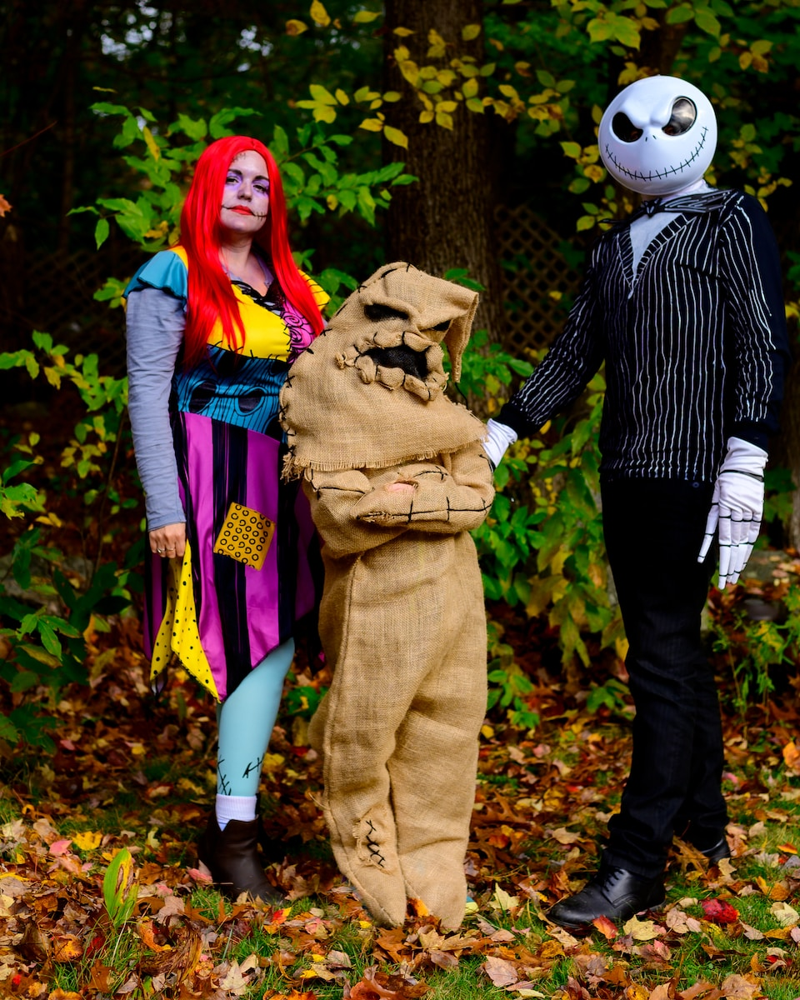

Are you tired of the last-minute scramble to find costumes for the whole family? Do you want to make this Halloween extra special with matching outfits that will have everyone saying "aww" and "wow" at the same time? Well, you're in luck! We've got you covered with 10 adorable matching family Halloween costume ideas that are not only cute but also super easy to put together. Plus, we've found some fantastic options on Amazon to make your life even easier. So, let's dive in!

### 1\. Skeleton Family: Glow-in-the-Dark Spookiness

Imagine walking down the street as a family of skeletons, glowing in the dark and turning heads wherever you go. Sounds fun, right?

**Amazon Find**: Check out the [Little Bitty Skeleton Halloween Costume](https://www.amazon.com/dp/B09DP8N2S3) for kids. It's a glow-in-the-dark hoodie jumpsuit that's perfect for the occasion.

https://www.amazon.com/dp/B09DP8N2S3

### 2\. Witch Family: A Bewitching Night

Who doesn't love a good witch costume? This year, make it a family affair and cast spells together.

https://www.amazon.com/dp/B0CDPL7NMC?

### 3\. Skull Family: Humor Meets Horror

If you're looking for a more humorous take on the classic skeleton theme, why not go for funny skull prints?

https://www.amazon.com/dp/B09D7VQ9JC

### 4\. Shark Family: Dive into Halloween

Sharks may be scary in the ocean, but as Halloween costumes, they're downright adorable.

https://www.amazon.com/dp/B07ZJKGQ7Q

### 5\. Prisoner Family: Break Free from the Norm

This one's a bit unconventional but super fun. Dress up as a family of prisoners and "break free" for the night.

https://www.amazon.com/dp/B0CC1MMGG6

### 6\. Pumpkin Family: Oh My Gourd!

Embrace the spirit of the season by going as a family of pumpkins. It's a classic that never gets old.

https://www.amazon.com/dp/B0CDFFC7MP

### 7\. Crayon Family: Color Your Night

Add a splash of color to Halloween with a crayon-themed family costume. It's a hit with kids and adults alike.

https://www.amazon.com/dp/B0CBNHHCHC

### 8\. Rock, Paper, Scissors: A Classic Game Comes to Life

How about going as the classic game of Rock, Paper, Scissors? It's a fun and interactive idea that's sure to get some laughs.

https://www.amazon.com/dp/B0C9MGYDD1

### 9\. Cozy Skeleton Family: Comfort Meets Spook

If you're looking for something cozy, why not opt for a comfy skeleton jumpsuit?

https://www.amazon.com/dp/B09J2SB4YJ

### 10\. Superhero Family: Save the Day

Last but not least, why not save the day as a family of superheroes? You can mix and match your favorite heroes for a super Halloween night.

https://www.amazon.com/KARAZZO-Superhero-Wristbands-Halloween-Christmas/dp/B0C7TMCY5C/ref=sr\_1\_61?keywords=family+superhero+costumes&qid=1693456274&sprefix=family+super%2Caps%2C199&sr=8-61

So there you have it! Ten adorable matching family Halloween costume ideas that are sure to make this year's celebration unforgettable. Happy Halloween, everyone!
