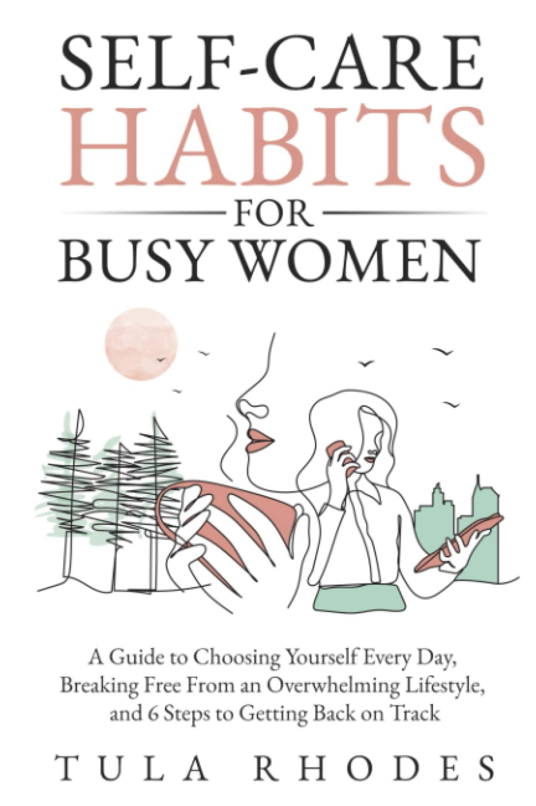
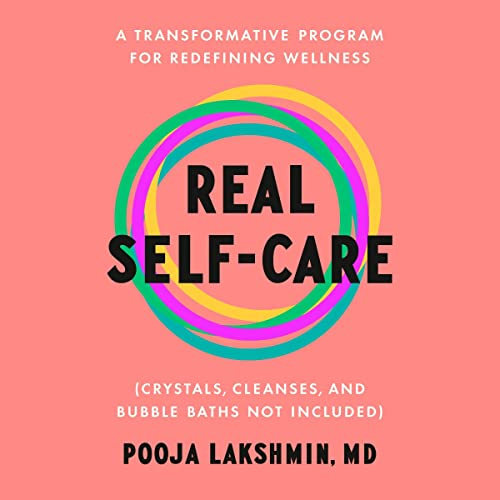
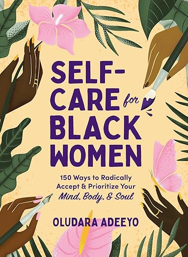

In today's fast-paced world, self-care has become more than just a buzzword; it's a necessary part of life, especially for women who often juggle multiple roles. As we navigate through the complexities of life, it's crucial to take a step back and focus on our well-being. To help you on this journey, I've compiled a list of 10 incredible self-care books that every woman should consider reading. These books are not just guides; they are companions in your journey towards a more fulfilled and balanced life.

### 1\. **Self-Care Habits for Busy Women**

Are you constantly on the go, feeling like there's never enough time for yourself? "[Self-Care Habits for Busy Women](https://www.amazon.com/dp/B0BRLVV9G1)" is your perfect ally. This book offers practical advice on how to choose yourself every day, break free from an overwhelming lifestyle, and get back on track. It's a reminder that even the busiest women can carve out moments for self-care. Priced at $12.99, it's an investment in your well-being.

### 2\. **The Complete Guide to Self Care**

"[The Complete Guide to Self Care](https://www.amazon.com/dp/B08QNK2DJ9)" is exactly what it sounds like – a comprehensive manual for a healthier and happier you. At just $8.17, this book is a treasure trove of best practices that cater to your everyday well-being. It's a guide that speaks to all aspects of self-care, from mental to physical health.

### 3\. **Self-Love Workbook for Women**

Self-love is a journey, and "[Self-Love Workbook for Women](https://www.amazon.com/dp/1647397294)" is the perfect travel companion. Priced at $9.59, this workbook is a hands-on guide to releasing self-doubt, building self-compassion, and embracing who you are. It's more than a book; it's an interactive experience that helps you connect with your inner self.

### 4\. **A Year of Self-Care**

Imagine having a daily dose of self-care inspiration. "[A Year of Self-Care](https://www.amazon.com/dp/1648765092)" offers just that. For $14.39, this book provides daily practices and inspiration for caring for yourself. It's a year-long journey of reflection and self-growth, perfect for those who seek continuous inspiration.

### 5\. **Unfuck Your Brain**

If you're dealing with anxiety, depression, or anger, "[Unfuck Your Brain](https://www.amazon.com/dp/1621063046)" is a must-read. This $13.46 book uses science to help you overcome mental health challenges. It's a no-nonsense, practical guide that offers real solutions for those tough days.

### 6\. **Let That Sh\*t Go**

Need a dose of humor with your self-care? "[Let That Sh\*t Go](https://www.amazon.com/dp/1250181909)" is a journal that helps you leave behind the negativity and create a happy life. At $10.87, it's a fun, irreverent approach to self-care, perfect for those who enjoy a little sass with their self-improvement.

### 7\. **Real Self-Care**

"[Real Self-Care](https://www.amazon.com/dp/B0B5YKV981)" challenges the conventional notion of wellness. For $13.78, this book offers a transformative program that goes beyond crystals and bubble baths. It's about redefining wellness in a way that's authentic to you.

### 8\. **Self-Care for Black Women**

Specifically tailored for Black women, "[Self-Care for Black Women](https://www.amazon.com/dp/1507217315)" offers 150 ways to prioritize your mind, body, and soul. Priced at $10.96, this book is a celebration of self-acceptance and a guide to radical self-care.

### 9\. **You Are a Badass®**

Jen Sincero's "[You Are a Badass®](https://www.amazon.com/dp/B00B3M3VWS)" is an empowering read that encourages you to stop doubting your greatness and start living an awesome life. At just $4.99, it's an inspiring and humorous guide to becoming the badass you were meant to be.

### 10\. **The Self Care Prescription**

Last but not least, "[The Self Care Prescription](https://www.amazon.com/dp/B07SYB6JXC)" offers powerful solutions to manage stress, reduce anxiety, and increase wellbeing. For $6.99, this book is a practical guide to creating a self-care routine that works for you.

## Final words

Self-care is not just a luxury; it's a necessity. These books are more than just reading material; they are tools to help you navigate the complexities of life with grace and resilience. Whether you're looking to unwind, find inspiration, or transform your life, there's a book on this list for you. Remember, investing in your well-being is the best gift you can give yourself. Happy reading!
