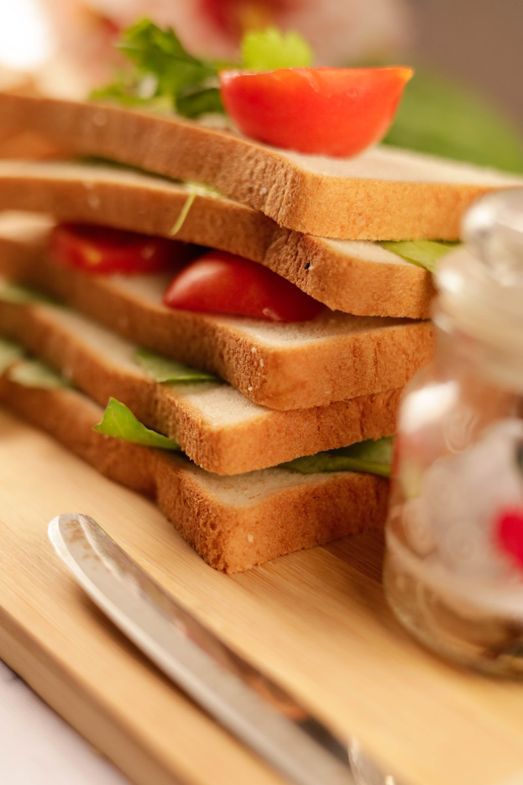
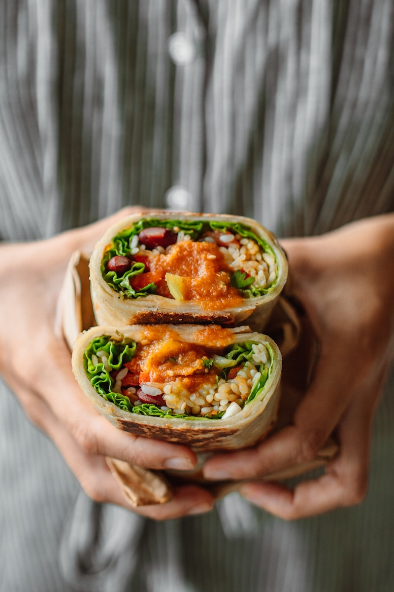
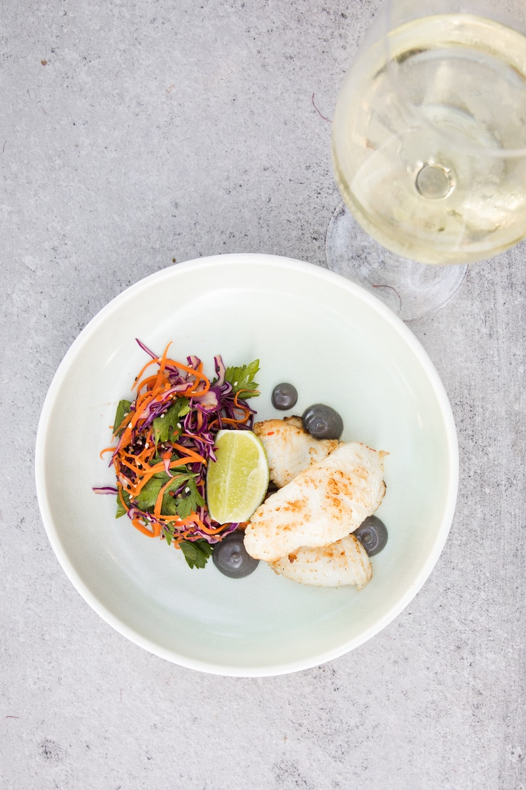
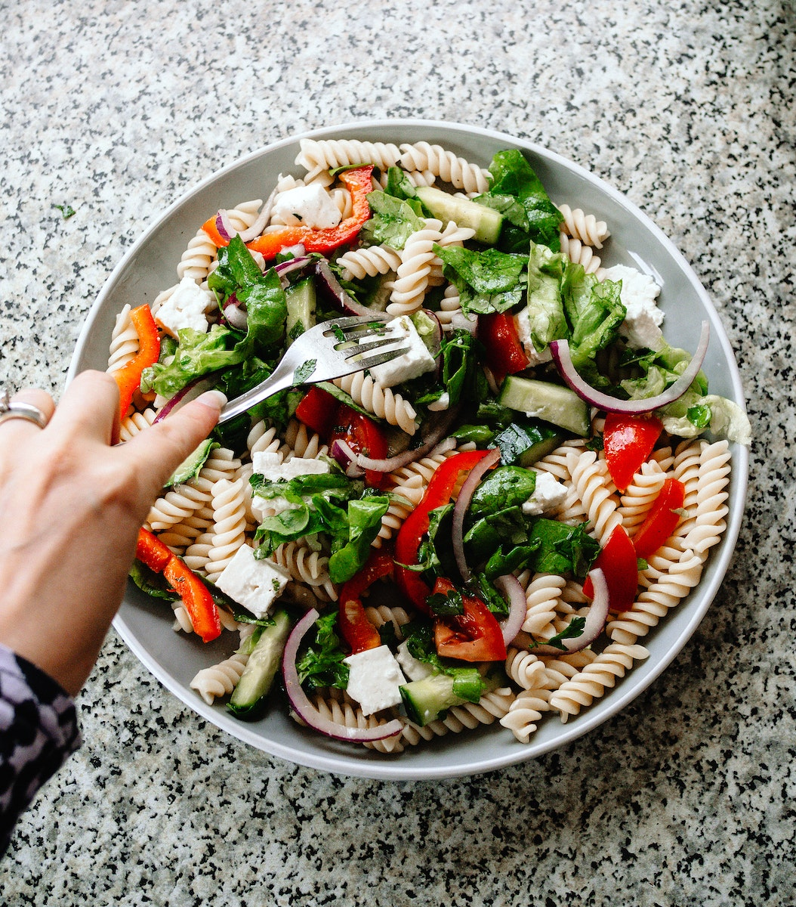
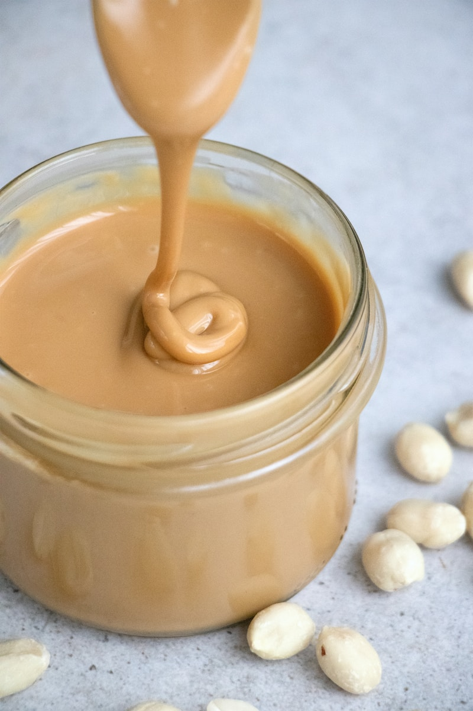
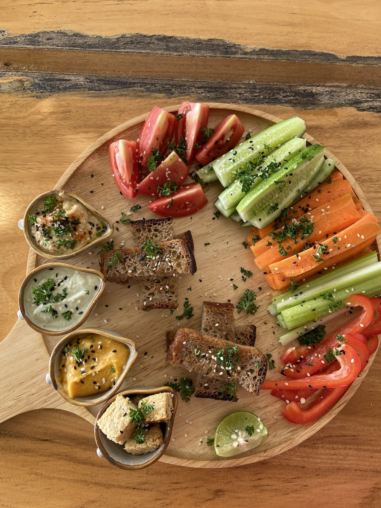
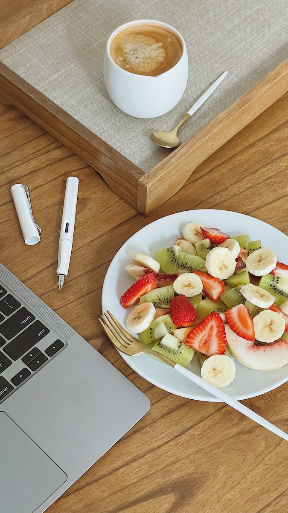
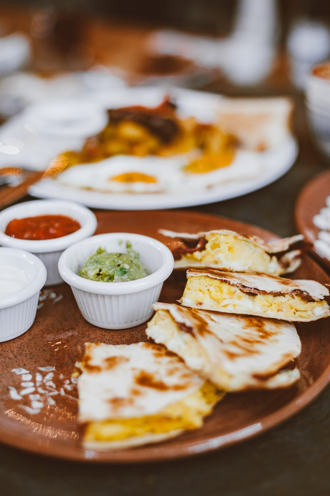
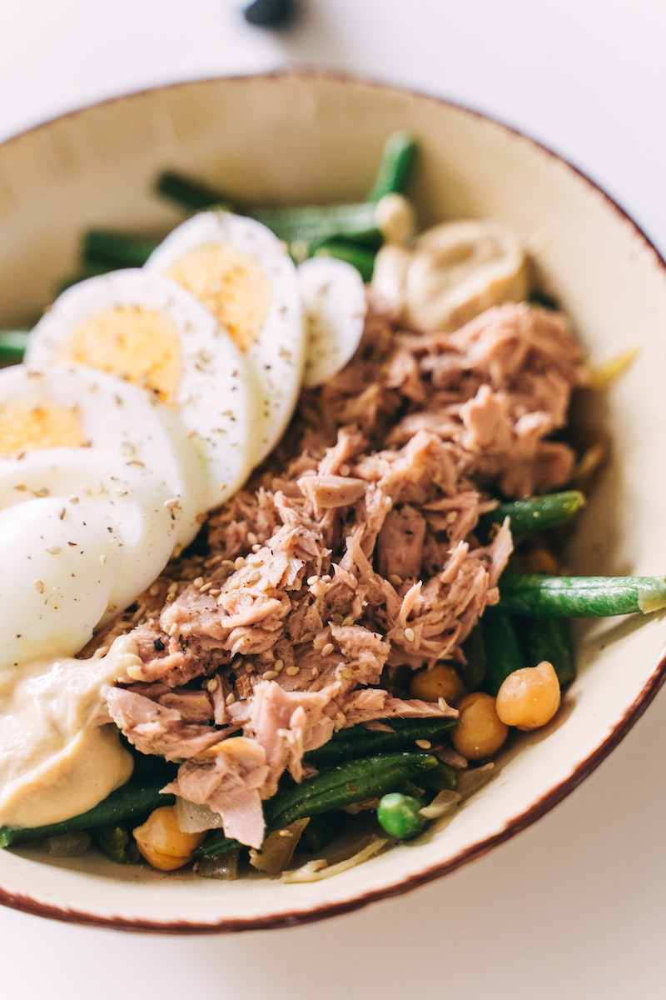
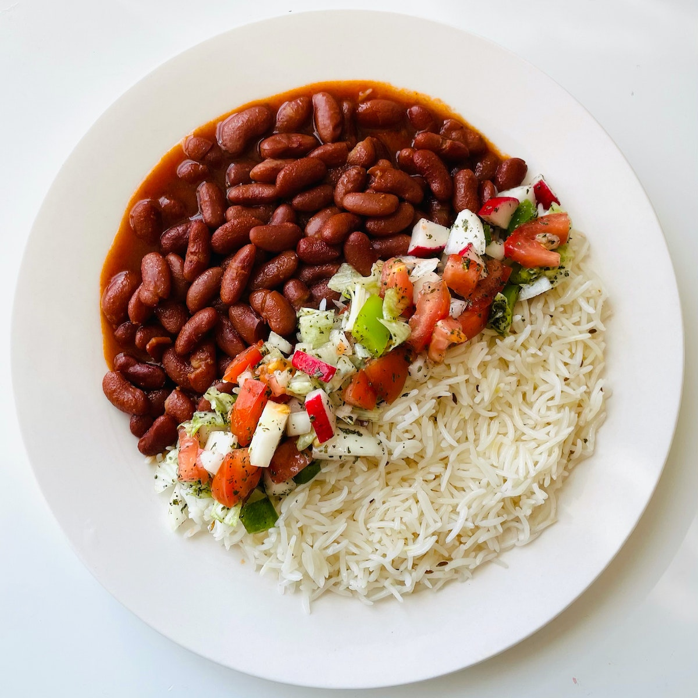

Can you believe it? Summer has flown by, and it's already that time of year again—back-to-school season! Ah, the smell of freshly sharpened pencils, the sound of school buses, and the sight of backpacks filled with new supplies. It's exciting, but let's be real; it's also a bit hectic, isn't it?

Between getting the kiddos ready for school, juggling work, and managing the household, lunchtime can easily become an afterthought. I mean, who has the time to prepare gourmet meals when you're already multitasking like a pro? But don't worry, I've got your back!

I've rounded up **10 Super Easy and Nutritious Back-to-School Lunch Recipes** that are not only quick to make but also kid-approved! Trust me, these recipes are so simple that even on your busiest mornings, you can whip them up in no time. And the best part? They're healthy and delicious, so you won't have to deal with uneaten lunches coming back home.

So, grab your apron (or don't, because these are that easy), and let's dive into making lunchtime the highlight of your child's school day!

### 1\. Turkey and Cheese Sandwich

#### Ingredients:

- 2 slices whole-grain bread

- 4 slices turkey breast

- 2 slices cheddar cheese

- Lettuce

- Mayonnaise or mustard

#### Instructions:

1. Spread mayonnaise or mustard on one side of each bread slice.

3. Layer turkey, cheese, and lettuce.

5. Close the sandwich and pack it in a lunchbox.

* * *

### 2\. Veggie Wrap

#### Ingredients:

- 1 whole-wheat tortilla

- 1/2 cup hummus

- Sliced cucumber, bell pepper, and carrots

#### Instructions:

1. Spread hummus on the tortilla.

3. Add sliced veggies.

5. Roll up the tortilla and cut it in half.

* * *

### 3\. Chicken Salad

#### Ingredients:

- 1 cup cooked chicken (shredded)

- 1/4 cup mayonnaise

- 1/4 cup chopped celery

- Salt and pepper

#### Instructions:

1. Mix all ingredients in a bowl.

3. Serve with crackers or as a sandwich.

* * *

### 4\. Pasta Salad

#### Ingredients:

- 2 cups cooked pasta

- 1 cup cherry tomatoes (halved)

- 1/2 cup mozzarella balls

- 1/4 cup pesto sauce

#### Instructions:

1. Mix all ingredients in a bowl.

3. Chill before packing.

* * *

### 5\. Peanut Butter and Banana Sandwich

#### Ingredients:

- 2 slices whole-grain bread

- Peanut butter

- 1 banana (sliced)

#### Instructions:

1. Spread peanut butter on bread.

3. Add banana slices.

5. Close the sandwich.

* * *

### 6\. Veggie Sticks and Dip

#### Ingredients:

- Carrot sticks

- Cucumber sticks

- Bell pepper slices

- Ranch dip

#### Instructions:

1. Pack veggie sticks in a container.

3. Include a small container of ranch dip.

* * *

### 7\. Fruit Salad

#### Ingredients:

- 1 apple (chopped)

- 1 banana (sliced)

- 1/2 cup grapes

- 1/2 cup yogurt

#### Instructions:

1. Mix fruits in a bowl.

3. Serve with yogurt.

* * *

### 8\. Cheese Quesadilla

#### Ingredients:

- 1 whole-wheat tortilla

- 1/2 cup shredded cheese

#### Instructions:

1. Sprinkle cheese on half of the tortilla.

3. Fold and cook on a skillet until cheese melts.

5. Cut into wedges.

* * *

### 9\. Tuna Salad

#### Ingredients:

- 1 can tuna (drained)

- 1/4 cup mayonnaise

- 1/4 cup chopped celery

- Salt and pepper

#### Instructions:

1. Mix all ingredients in a bowl.

3. Serve with crackers or as a sandwich.

* * *

### 10\. Rice and Beans

#### Ingredients:

- 1 cup cooked rice

- 1/2 cup cooked black beans

- 1/4 cup salsa

#### Instructions:

1. Mix rice and beans in a bowl.

3. Top with salsa.

* * *

I hope these recipes make lunchtime easier and more enjoyable for the back-to-school season!
