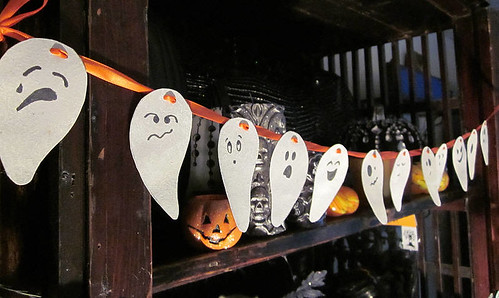
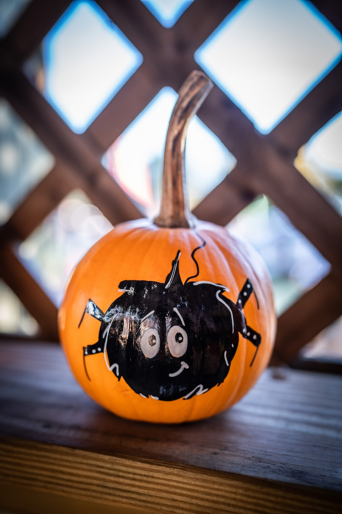
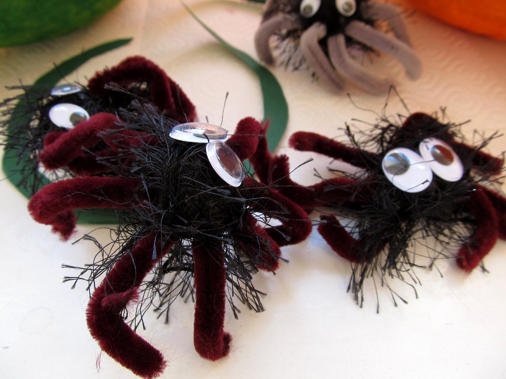
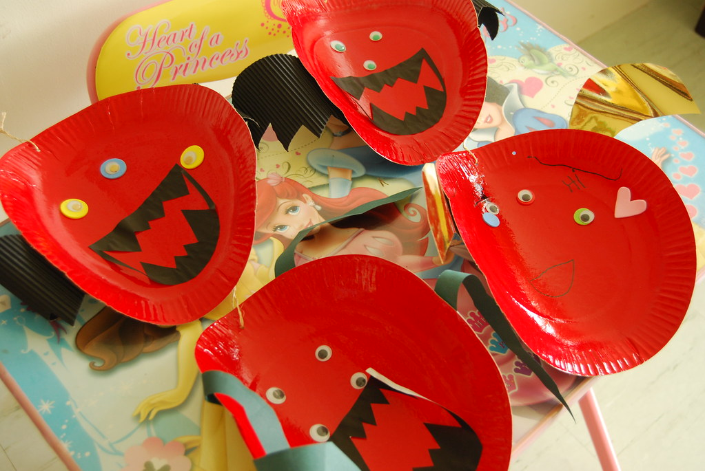
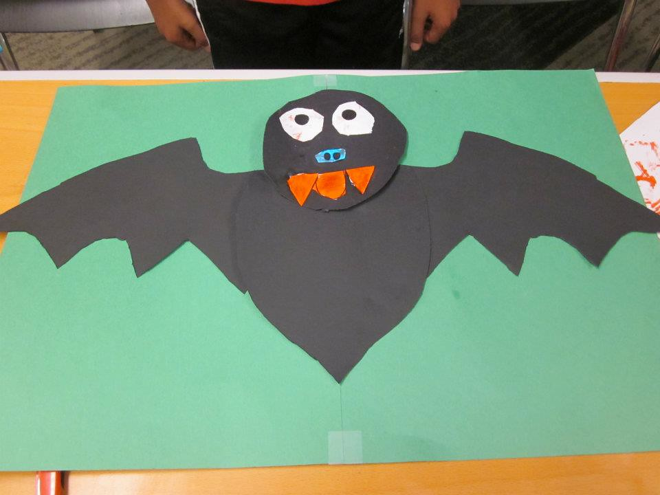
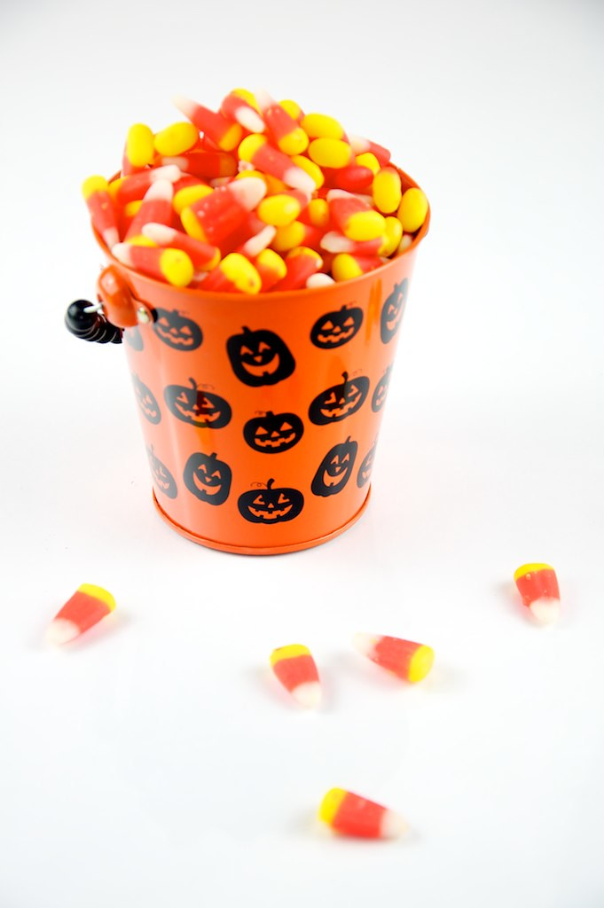
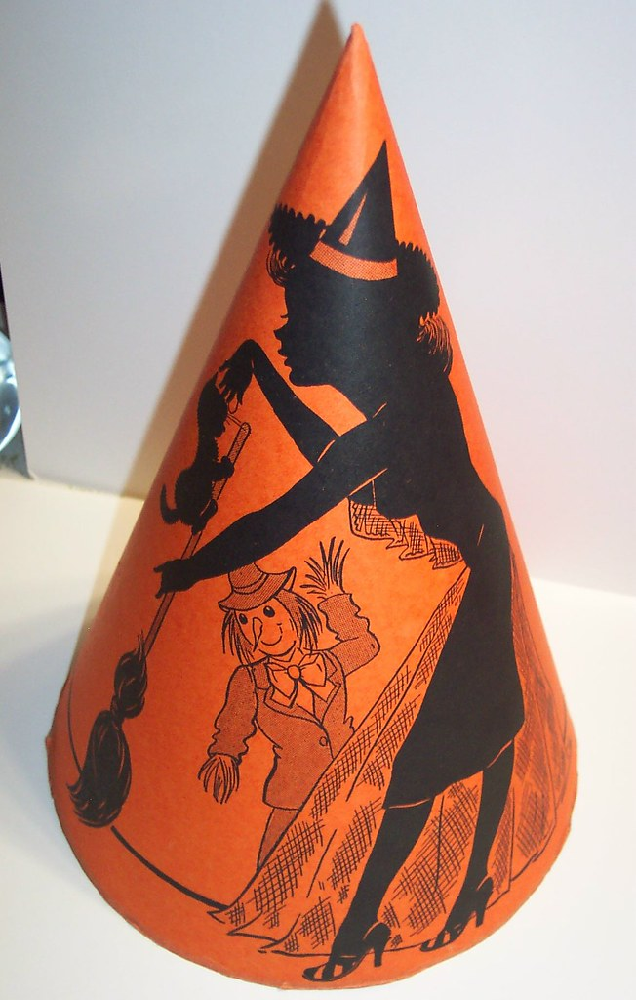

Halloween is just around the corner, and if you're anything like me, you're itching to get your hands on some DIY projects to make your home the spookiest on the block. So, grab your cauldrons and wands, because we're about to dive into 13 Halloween DIY craft ideas that are as fun to make as they are to display!

## 1\. Spooky Ghost Garland

**What You'll Need**:

- Craft Paper ([Brown Packing Paper 15"x450"](https://www.amazon.com/dp/B0C2P7FGFM))

- Craft Glue ([Aleene's All Purpose Tacky Glue](https://www.amazon.com/dp/B00178KLEY))

**How to Make It**:

1. Cut out ghost shapes from the craft paper.

3. Draw spooky faces on them with a black marker.

5. Glue the ghosts onto a string and hang them around your home.

## 2\. Painted Pumpkins

**What You'll Need**:

- Mini Pumpkins

- Craft Paint ([Apple Barrel Acrylic Paint Set](https://www.amazon.com/dp/B076CP6F3))

**How to Make It**:

1. Paint your mini pumpkins in Halloween colors like black, orange, and purple.

3. Let them dry and display them on your porch or inside your home.

## 3\. Pipe Cleaner Spiders

**What You'll Need**:

- Pipe Cleaners ([Pllieay 200pcs Pipe Cleaners](https://www.amazon.com/dp/B0BPX6SGVW))

- Googly Eyes ([450Pcs Black Wiggle Googly Eyes](https://www.amazon.com/dp/B08ML6VTRP))

**How to Make It**:

1. Twist pipe cleaners to form spider legs.

3. Attach the legs to a small ball of black paper for the body.

5. Glue on googly eyes.

## 4\. Paper Plate Monsters

**What You'll Need**:

- Paper Plates

- Craft Paint ([Apple Barrel Acrylic Paint](https://www.amazon.com/dp/B00889Z7AS))

**How to Make It**:

1. Paint the paper plates in bright or dark colors.

3. Add eyes, mouths, and other features using more paint or cut-out paper.

## 5\. Glittery Bats

**What You'll Need**:

- Black Craft Paper ([Brown Wrapping Paper, Craft Paper](https://www.amazon.com/dp/B0BQTYYVZH))

- Glitter

**How to Make It**:

1. Cut out bat shapes from the black paper.

3. Apply a thin layer of glue and sprinkle glitter over it.

5. Let it dry and hang them up.

## 6\. Candy Corn Garland

**What You'll Need**:

- Colored Craft Paper ([Crayola Construction Paper - 480ct](https://www.amazon.com/dp/B00MJ8JSFE))

**How to Make It**:

1. Cut out candy corn shapes from yellow, orange, and white paper.

3. Glue them onto a string in a repeating pattern.

5. Hang the garland around your home.

## 7\. Witch Hat Ring Toss

**What You'll Need**:

- Craft Paper ([Brown Kraft Paper Roll - 18" x 1,200"](https://www.amazon.com/dp/B082KHMC2Z))

**How to Make It**:

1. Create witch hats using black and green paper.

3. Set them up in your yard and use rings for a fun game of ring toss.

## 8\. Mummy Jars

**What You'll Need**:

- Mason Jars

- Googly Eyes ([DECORA 500 Pieces 6mm -12mm Black Wiggle Googly Eyes](https://www.amazon.com/dp/B01LWIYJH3))

**How to Make It**:

1. Wrap the jars in white paper or fabric.

3. Glue on googly eyes.

5. Place a tealight inside for a spooky glow.

## 9\. Ghost Lollipops

**What You'll Need**:

- Lollipops

- White Tissue Paper

- Craft Glue ([Mod Podge CS11301 Waterbase Sealer, Glue and Finish](https://www.amazon.com/dp/B000HWY6EM))

**How to Make It**:

1. Wrap the lollipops in white tissue paper.

3. Secure with a ribbon and draw ghost faces using a black marker.

## 10\. Halloween Masks

**What You'll Need**:

- Craft Paper ([NEENAH Creative Collection Classics Specialty Cardstock Starter Kit](https://www.amazon.com/dp/B003A2I4V2))

- Craft Paint ([Apple Barrel Acrylic Craft Paint Set](https://www.amazon.com/dp/B08WHP8FX1))

**How to Make It**:

1. Cut out mask shapes from the cardstock.

3. Paint them in Halloween colors and add features like eyes and mouths.

## 11\. Spooky Eyes

**What You'll Need**:

- White Craft Paper ([White Wrapping Paper Craft Paper Kraft Paper Roll 15" x 450"](https://www.amazon.com/dp/B0C743LQ3M))

**How to Make It**:

1. Cut out eye shapes from the white paper.

3. Place them in bushes or windows for a creepy effect.

## 12\. Halloween Bookmarks

**What You'll Need**:

- Craft Paper ([NEENAH Creative Collection Classics Specialty Cardstock Starter Kit](https://www.amazon.com/dp/B003A2I4V2))

**How to Make It**:

1. Cut out bookmark shapes from the cardstock.

3. Decorate them with Halloween characters like witches, ghosts, and pumpkins.

## 13\. Halloween Wreath

**What You'll Need**:

- Craft Supplies (ribbons, paper, etc.)

- Craft Glue ([E6000 5510310 Craft Adhesive Mini](https://www.amazon.com/dp/B00CB3BZBW))

**How to Make It**:

1. Create a wreath using craft supplies like ribbons, paper, and small Halloween decorations.

3. Glue everything onto a wreath form and hang it on your door.

That's it! 13 DIY Halloween crafts that are sure to make your home the talk of the town—or at least the talk of the trick-or-treaters! So, what are you waiting for? Get crafting and have a spooktacular Halloween!
