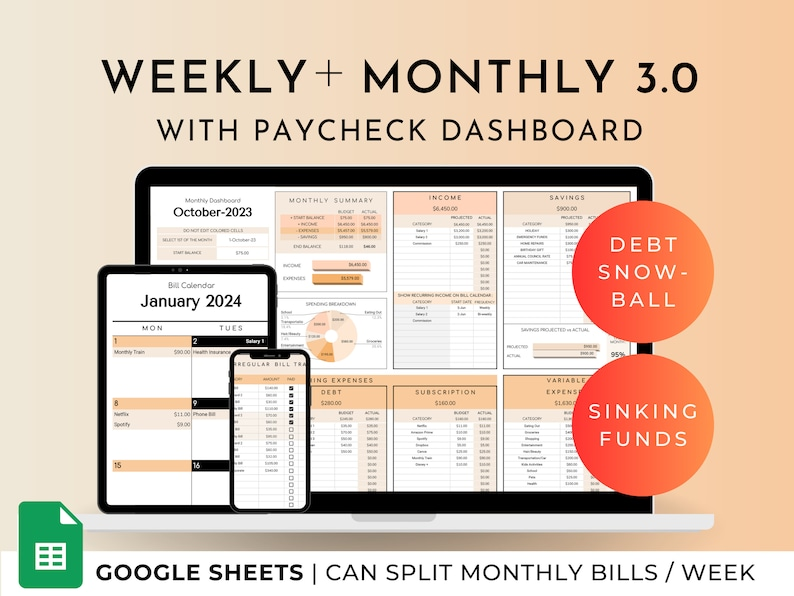

It's an exciting time to be alive, isn't it? With the world embracing digital products more than ever, I've been brainstorming some amazing ideas that you can use to kickstart or revamp your Etsy shop. So, grab a cup of coffee, settle in, and let's dive into this treasure trove of digital product ideas that could be your next big hit!

[Start your Etsy Shop with 40 FREE listings!](https://thebeigejournal.com/etsyfreelistings)

#### [1\. Customizable Planner Templates](https://www.etsy.com/ca/listing/1588347097/weekly-and-monthly-budget-spreadsheet?ga_order=most_relevant&ga_search_type=all&ga_view_type=gallery&ga_search_query=planner+templates&ref=sc_gallery-1-15&pro=1&bes=1&sts=1&dd=1&plkey=7ee0599c94456f874588a7b534ecb37acba8f892%3A1588347097)

We all love a bit of organization in our lives, don't we? Offer a variety of planner templates tailored for different needs like daily schedules, goal setting, and project planning. They're not just practical; they're lifesavers!

#### [2\. **E-Books on Personal Development**](https://www.etsy.com/ca/listing/1412549361/250-digital-products-ideas-that-sell-for?ga_order=most_relevant&ga_search_type=all&ga_view_type=gallery&ga_search_query=ebooks&ref=sr_gallery-1-7&pro=1&bes=1&sts=1&dd=1&organic_search_click=1)

Share your wisdom through e-books on time management, productivity, and motivation. There's always someone out there looking for that little nudge to get them moving in the right direction.

#### [3\. **Online Course Materials**](https://www.etsy.com/ca/listing/1258970186/ultimate-blogging-guide-how-to-start-a?ga_order=most_relevant&ga_search_type=all&ga_view_type=gallery&ga_search_query=blogging+course&ref=sc_gallery-1-2&pro=1&dd=1&plkey=8b7026217b3cdac1e72a7ee27caf9a9622e8af1c%3A1258970186)

Why not create courses on side hustling, personal branding, or skill development? Include video content, workbooks, and interactive exercises. It's like building a small online university, and you're the dean!

#### [4\. Motivational Quote Graphics](https://www.etsy.com/ca/listing/758763565/some-people-want-it-to-happen-some-wish?ga_order=most_relevant&ga_search_type=all&ga_view_type=gallery&ga_search_query=motivational+quote+printable&ref=sr_gallery-1-1&sts=1&dd=1&organic_search_click=1)

A little motivation goes a long way. Design inspirational quotes in beautiful graphics that customers can print and display. These little gems can brighten up someone's day in an instant.

#### [5\. **Interactive Budgeting Spreadsheets**](https://www.etsy.com/ca/listing/1278818711/ultimate-paycheck-budget-spreadsheet-for?ga_order=most_relevant&ga_search_type=all&ga_view_type=gallery&ga_search_query=budget+spreadsheet&ref=sc_gallery-1-1&pro=1&bes=1&sts=1&dd=1&plkey=c147542785a122a3fc2ef25db594110c75990e2f%3A1278818711)

Money management can be tricky. Offer downloadable spreadsheets with built-in formulas to help users manage their finances more effectively. It's like being a financial guru, minus the suit and tie.

#### [6\. **Resume and Cover Letter Templates**](https://www.etsy.com/ca/listing/1474321093/resume-template-modern-resume-template?ga_order=most_relevant&ga_search_type=all&ga_view_type=gallery&ga_search_query=resume&ref=sr_gallery-1-1&pro=1&bes=1&sts=1&dd=1&organic_search_click=1)

In this competitive world, a standout resume and cover letter can make all the difference. Design templates that are both professional and modern. You might just help someone land their dream job!

#### [7\. **Personal Development Workbooks**](https://www.etsy.com/ca/listing/1547359409/calling-in-your-character-pdf-workbook?ga_order=most_relevant&ga_search_type=all&ga_view_type=gallery&ga_search_query=Personal+Development+Workbooks&ref=sc_gallery-1-7&dd=1&plkey=3b7e5f0833e35000fdf1788b4ceee8e27073dc75%3A1547359409)

Create workbooks focused on self-improvement topics. Whether it's building confidence, managing stress, or finding life balance, your workbook could be the guide someone needs.

#### [8\. **Customizable Business Plan Templates**](https://www.etsy.com/ca/listing/1469712996/business-plan-template-printable-small?ga_order=most_relevant&ga_search_type=all&ga_view_type=gallery&ga_search_query=Business+Plan+Templates&ref=sr_gallery-1-2&pro=1&bes=1&dd=1&organic_search_click=1)

Help budding entrepreneurs with templates for various types of businesses. These templates can aid in structuring and planning, turning dreams into tangible goals.

#### [9\. **Social Media Strategy Guides**](https://www.etsy.com/ca/listing/1527720779/instagram-planner-instagram-captions?ga_order=most_relevant&ga_search_type=all&ga_view_type=gallery&ga_search_query=Social+Media+Strategy+Guides&ref=sc_gallery-1-7&pro=1&sts=1&dd=1&plkey=fcb940dc221dd71379866b74a567a1ae2a91b2dc%3A1527720779)

With the digital world booming, a good social media strategy is gold. Offer e-books or templates for planning and executing a successful social media game plan.

[Start your Etsy Shop with 40 FREE listings!](https://thebeigejournal.com/etsyfreelistings)

#### [10\. **Mindfulness and Meditation Guides**](https://www.etsy.com/ca/listing/1624135167/20-30-minute-guided-meditation-script?ga_order=most_relevant&ga_search_type=all&ga_view_type=gallery&ga_search_query=Mindfulness+and+Meditation+Guides&ref=sr_gallery-1-1&pro=1&sts=1&dd=1&organic_search_click=1)

Digital books or audio guides focused on mindfulness can bring peace into someone's chaotic life. It's like sharing a piece of zen.

#### [11\. **Fitness and Meal Plan Templates**](https://www.etsy.com/ca/listing/1483426227/12-week-fat-loss-program-for-women?ga_order=most_relevant&ga_search_type=all&ga_view_type=gallery&ga_search_query=Fitness+and+Meal+Plan+Templates&ref=sc_gallery-1-3&pro=1&dd=1&plkey=675b32999d09d62e50c38b86a39fc201eaa29fe6%3A1483426227)

For the health-conscious crowd, customizable templates for tracking fitness goals and meal planning can be a game changer.

#### [12\. **Virtual Vision Board Kits**](https://www.etsy.com/ca/listing/1367423755/vision-board-kit-printable-2024-vision?ga_order=most_relevant&ga_search_type=all&ga_view_type=gallery&ga_search_query=digital+vision+board&ref=sr_gallery-1-3&sts=1&dd=1&organic_search_click=1)

Help others manifest their dreams with digital kits for creating vision boards. It's a creative and fun way to set and visualize goals.

#### [13\. **Email Marketing Templates**](https://www.etsy.com/ca/listing/1432437376/email-marketing-canva-template-news?ga_order=most_relevant&ga_search_type=all&ga_view_type=gallery&ga_search_query=13.+Email+Marketing+Templates&ref=sr_gallery-1-2&dd=1&organic_search_click=1)

For those in the business world, pre-designed email templates for newsletters or marketing campaigns can save loads of time and boost their professional image.

#### [14\. **Printable Artwork**](https://www.etsy.com/ca/listing/959008439/vintage-european-gallery-wall-print-set?ga_order=most_relevant&ga_search_type=all&ga_view_type=gallery&ga_search_query=14.+Printable+Artwork&ref=sr_gallery-1-5&pro=1&bes=1&sts=1&dd=1&organic_search_click=1)

Offer unique digital artwork that customers can print for home or office decoration. It's like being an artist with an endless gallery.

#### [15\. **Productivity Apps or Tools**](https://www.etsy.com/ca/listing/1577621347/aesthetic-study-and-productivity-app?ga_order=most_relevant&ga_search_type=all&ga_view_type=gallery&ga_search_query=15.+Productivity+Apps+or+Tools&ref=sr_gallery-1-1&bes=1&dd=1&organic_search_click=1)

Develop simple apps or online tools that aid in productivity or time management. Imagine being the reason someone gets more done in their day!

#### [16\. **Skill Development Mini-Courses**](https://www.etsy.com/ca/listing/1557489119/career-worksheets-professional?ga_order=most_relevant&ga_search_type=all&ga_view_type=gallery&ga_search_query=16.+skull+development+mini-courses&ref=sr_gallery-1-7&pro=1&dd=1&organic_search_click=1)

Offer short digital courses on specific skills like public speaking, writing, or digital marketing. It's a great way to share your expertise.

#### [17\. **Branding Kits for Small Businesses**](https://www.etsy.com/ca/listing/1454634172/classic-complete-photography-business?ga_order=most_relevant&ga_search_type=all&ga_view_type=gallery&ga_search_query=Branding+Kits+for+Small+Businesses&ref=sc_gallery-1-1&pro=1&dd=1&plkey=286b661d1e2d2982f4f257f110cd238c7d2b743d%3A1454634172)

Packages including logo templates, color palettes, and font suggestions can help small businesses establish their brand identity.

#### [18\. **Digital Journals**](https://www.etsy.com/ca/listing/1415776009/digital-daily-journal-digital-journal?ga_order=most_relevant&ga_search_type=all&ga_view_type=gallery&ga_search_query=digital+journals&ref=sr_gallery-1-2&pro=1&bes=1&sts=1&dd=1&organic_search_click=1)

Themed journals for personal reflection, gratitude, or travel. It's like giving someone a personal space to explore their thoughts and dreams.

#### [19\. **Habit Tracker Templates**](https://www.etsy.com/ca/listing/1535539388/habit-tracker-spreadsheet-for-google?ga_order=most_relevant&ga_search_type=all&ga_view_type=gallery&ga_search_query=19.+Habit+Tracker+Templates&ref=sr_gallery-1-5&pro=1&pop=1&sts=1&dd=1&organic_search_click=1)

Digital templates for tracking and building new habits can be incredibly empowering. Help others build the life they want, one habit at a time.

#### [20\. **Virtual Event Planning Guides**](https://www.etsy.com/ca/listing/1574775942/event-planner-event-planning-template?ga_order=most_relevant&ga_search_type=all&ga_view_type=gallery&ga_search_query=event+planner&ref=sr_gallery-1-1&pro=1&dd=1&organic_search_click=1)

With virtual events becoming more popular, guides and checklists for planning these events can be extremely useful.

#### [21\. **Podcast Start-Up Kits**](https://www.etsy.com/ca/listing/1444374663/podcast-instagram-post-template-podcast?ga_order=most_relevant&ga_search_type=all&ga_view_type=gallery&ga_search_query=21.+Podcast+Start-Up+Kits&ref=sr_gallery-1-2&pro=1&dd=1&organic_search_click=1)

Podcasting is all the rage. Provide guides and templates for starting a successful podcast. You might just help launch the next big podcast star!

#### [22\. **Personal Growth Challenge Packs**](https://www.etsy.com/ca/listing/1562136164/done-for-you-personal-growth-worksheet?ga_order=most_relevant&ga_search_type=all&ga_view_type=gallery&ga_search_query=22.+Personal+Growth+Challenge+Packs&ref=sr_gallery-1-5&pro=1&sts=1&dd=1&organic_search_click=1)

Sets of challenges and activities focused on personal growth can be both fun and transformative.

#### [23\. **Time Management Game Plans**](https://www.etsy.com/ca/listing/1578489231/time-management-printable-time?ga_order=most_relevant&ga_search_type=all&ga_view_type=gallery&ga_search_query=23.+Time+Management+Game+Plans&ref=sr_gallery-1-8&dd=1&organic_search_click=1)

Offer digital guides and tools for effective time management. It's like giving the gift of time!

#### [24\. **Language Learning Materials**](https://www.etsy.com/ca/listing/1210544137/language-learning-planner-and-notebook?ga_order=most_relevant&ga_search_type=all&ga_view_type=gallery&ga_search_query=24.+Language+Learning+Materials&ref=sc_gallery-1-1&bes=1&sts=1&dd=1&plkey=50be3a96117f1bbe2c6d0383b632298641f16a65%3A1210544137)

Self-study guides or materials

for learning new languages can open up a world of opportunities for someone.

#### [25\. **Creative Writing Prompts**](https://www.etsy.com/ca/listing/1405355250/300-creative-writing-prompts-for-kids?ga_order=most_relevant&ga_search_type=all&ga_view_type=gallery&ga_search_query=Writing+Prompts&ref=sr_gallery-1-1&dd=1&organic_search_click=1)

For the writers out there, a collection of prompts and exercises can spark the imagination and get those creative juices flowing.

### Wrapping It Up

Phew! That was quite a list, wasn't it? But guess what? The beauty of the digital world is its limitless potential. These ideas are just the beginning. You have the power to create something truly unique and valuable. So, why wait? Start brainstorming, get creative, and who knows – your digital product might just be the next big thing on Etsy!

\[sc name="etsypostoffercta" \]\[/sc\]
