Digital products are consistently one of the most in-demand categories on [Etsy](https://thebeigejournal.com/etsyfreelistings). Etsy shoppers take advantage of them every day for simple DIY projects.

Selling digital downloads is a great way to start earning passive income, for both sellers and designers. With low upfront costs, you can start creating and selling your products in days.

Below, you will find 30 of the most popular digital products on Etsy, and what you should consider before choosing one to sell.

If you love digital products, then this article is for you!

Etsy is a fantastic marketplace for digital products.

## Here are some reasons why you should consider selling on Etsy:

One great benefit of digital products is that you don't need to worry about producing inventory. Once you've created your product, it can sell over and over again--without any additional effort on your part. Even better, once we get it set up, we'll take care of everything for you.

[Etsy](https://thebeigejournal.com/etsyfreelistings) is one of the fastest-growing e-commerce sites on the Internet. They see as much as a 100 million people come to their site each month, and this traffic is largely comprised of shoppers searching for products. With the built-in traffic, it's easy to find success on Etsy if you know how to choose the right product.

If you're considering selling some digital downloads on Etsy, it will cost a mere $0.2 per listing and only 5% for every sale. A lot of the design software for creating your digital goods can also be obtained for a very good price, and we'll go through those options later in this blog post.

Digital downloads are popular because they save both time and money for customers. Compared to finding someone to come up with a custom design, digital downloads are more convenient and hassle-free for the buyer.

## How do I make passive income with digital products on Etsy?

Etsy is a fantastic way to work towards passive income. One of the most beneficial features is that you can automate the delivery of digital products so you have minimal hassle in your business.

Etsy is a perfect marketplace for people who make digital products. For example, your digital product could be anything from an image to a music file, or even a creative work in progress like a printable planner or a digital birthday card. We'll go through some more examples later on in this guide.

Whenever one of your customers would like a product file, Etsy will help. It will send the files to each customer automatically when they purchase the product listing you made. Files are sent automatically to customers after they make an order, so you don't have any work at all. They can even download the files without contacting you afterward, which is great for your convenience.

Some design platforms, like [Canva](https://thebeigejournal.com/Canva) offers editable templates for customers to customize. Customers can change the design of the template before downloading it, making it more personalized. Common examples are editable business cards and invitations.

You can now sell your digital designs time and time again by making them available just as you made them. It will work for every customer that visits your page, no matter when they visit it.

Passive income digital product shops aren't always the easiest to find success with, but there are a few major keys you can follow. Find products that people want and actually buy! That's the key!

If you're looking for a variety of awesome digital products, we recommend checking out Etsy.

Here are a few popular categories to get your creative juices flowing:

## Here are some of the most popular tools for creating digital products.

- [Canva](https://thebeigejournal.com/Canva) is an awesome option for selling digital designs.

- Adobe Illustrator is a program that has been very popular among graphic designers and illustrators for many years. It's an incredibly useful tool for vector drawing, image editing, and illustration painting.

- [Adobe Lightroom](https://lightroom.adobe.com/) is wonderful for editing and retouching your photos. It's also great for generating fresh presets to spice up your pictures.

- With [Affinity Photo and Affinity Designer](https://affinity.serif.com/en-gb/), there's no need to pay a monthly subscription fee to access your favourite tools.

- [Photoshop](https://www.adobe.com/ca/products/photoshop.html) is a popular and powerful editing software program. It's not free, but Gimp is an affordable alternative that may be a good fit for your needs.

- [Inkscape](https://inkscape.org/) is a free alternative to Illustrator.

- If you're looking for a great alternative to Canva, look no further than [Picmonkey.](https://www.picmonkey.com/)

- We're big fans of [Procreate](https://procreate.art/) (an amazing illustration app for iPad)

- You can always count on [Creative Marke](https://thebeigejournal.com/Canva)t and [Creative Fabrica](https://thebeigejournal.com/creativefabrica) to help you get fonts and graphics for your blog posts. We provide high-quality products that will help you through the process.

- You're free to download unlimited high-quality graphics and fonts from [Envato Elements](https://fave.co/3GD4WXD). They are just as high quality as what you would find on Adobe Creative Cloud.

## Top 30 products that have been selling well on Etsy so far

**Cosmetic Labels for Bottles**

Handmade products need to be labeled. That's why we offer various label solutions that're custom-made for any product a handmade business needs to sell. We make it really easy for small handmade businesses, who are often balancing a lot of things at once.

<figure>

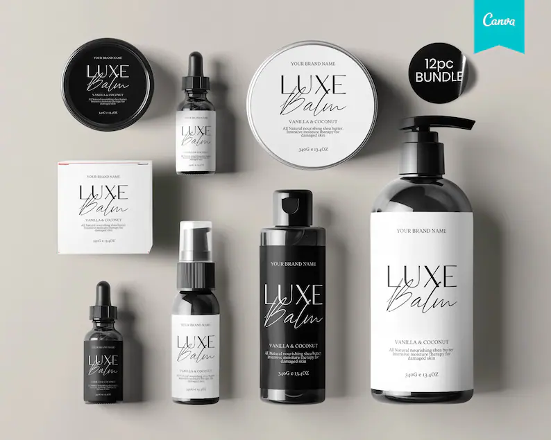

<figcaption>

**[Label templates](https://www.etsy.com/ca/listing/1138996881/editable-cosmetic-label-templates-canva?ga_order=most_relevant&ga_search_type=all&ga_view_type=gallery&ga_search_query=product+labels&ref=sr_gallery-1-7&pro=1&sts=1&organic_search_click=1)**

</figcaption>

</figure>

**Thank Thank You Cards**

Etsy sellers always include a handwritten thank you card with every order to demonstrate the quality of their products. If they need a design, they can use our website and print it out at home.

<figure>

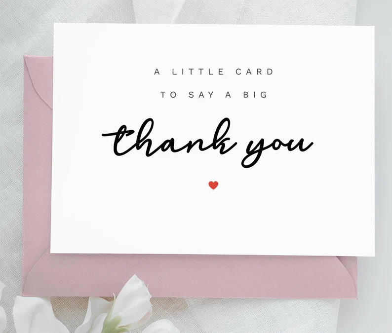

<figcaption>

**[Thank you cards](https://www.etsy.com/ca/listing/1251982277/editable-printable-simple-thank-you-card?ga_order=most_relevant&ga_search_type=all&ga_view_type=gallery&ga_search_query=thank+you+cards+printable&ref=sr_gallery-1-4&pro=1&organic_search_click=1)**

</figcaption>

</figure>

**Printable Planners**

Planner is a great way to help sellers stay organised and focused while they work toward their goals. It's slightly seasonal, with more purchases made in the beginning of the year. People can download and print their planners at home to use them immediately.

<figure>

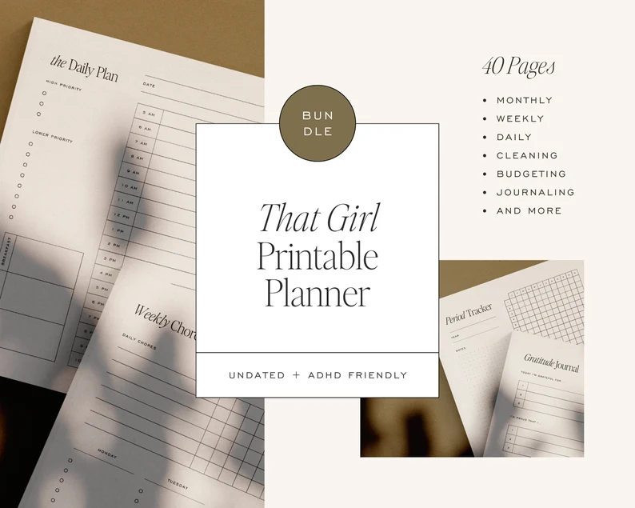

<figcaption>

**[Printable Planners](https://www.etsy.com/ca/listing/1304723034/adhd-printable-planner-daily-planner?ga_order=most_relevant&ga_search_type=all&ga_view_type=gallery&ga_search_query=printable+planners&ref=sc_gallery-1-15&pro=1&plkey=2290acbfe348e4a50bf07a612906beed5dbe7fb2%3A1304723034)**

</figcaption>

</figure>

**Digital Planners**

We found two popular digital planner apps that people use on their iPads: Notability and Goodnotes.

Passionate planners take their business everywhere they go! Now with this digital planner, you can have your entire schedule at your fingertips.

<figure>

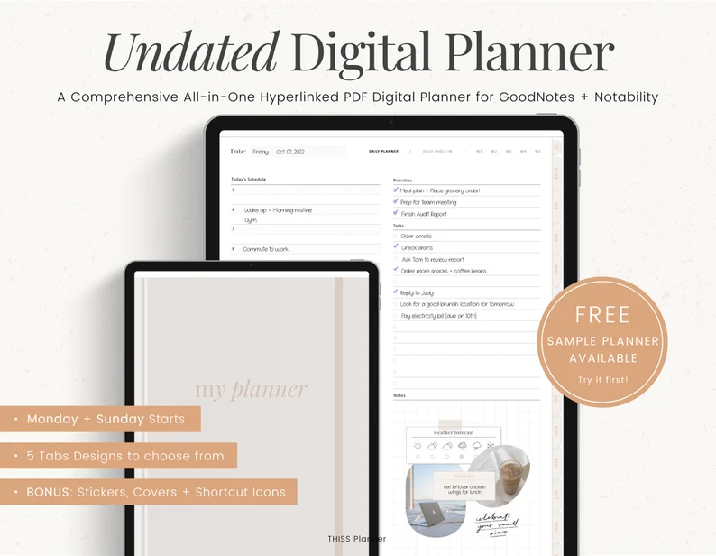

<figcaption>

**[Digital Planner](https://www.etsy.com/ca/listing/827575473/undated-digital-planner-portrait-planner?ga_order=most_relevant&ga_search_type=all&ga_view_type=gallery&ga_search_query=digital+planner&ref=sc_gallery-1-10&pro=1&sts=1&plkey=54730561408e129dfd39620b22673b4172bc71df%3A827575473)**

</figcaption>

</figure>

**Logos**

A logo is something every business needs. Your professional first impression can make all the difference. Logo design is a popular category on Etsy where sellers are fighting hard for people's attention alongside many other designers.

<figure>

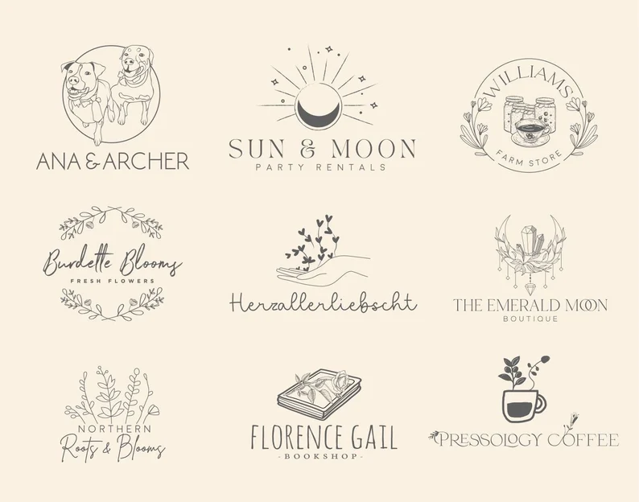

<figcaption>

[**Logo designs**](https://www.etsy.com/ca/listing/1287066437/custom-hand-drawn-logo-logo-design?ga_order=most_relevant&ga_search_type=all&ga_view_type=gallery&ga_search_query=logo&ref=sc_gallery-2-4&pro=1&frs=1&edd=1&plkey=05d5dbc8596f9008a29e544aa6bbf621f5360e84%3A1287066437)

</figcaption>

</figure>

**Business cards**

A business card is a necessity for every individual in the professional world. They're also a good way to stay active on social media, as regular posts are essential for maintaining an online presence.

A business card is a powerful tool to showcase your brand and its information. But it can be difficult to keep up with trends and templates for your business card design.

<figure>

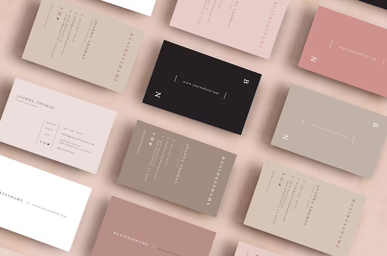

<figcaption>

**[Business card templates](https://www.etsy.com/ca/listing/806160072/6-templates-of-business-card-diy?ga_order=most_relevant&ga_search_type=all&ga_view_type=gallery&ga_search_query=business+cards&ref=sr_gallery-1-10&pro=1&sts=1&organic_search_click=1)**

</figcaption>

</figure>

**Etsy Shop Assets**

If you're an Etsy seller, then it makes sense to have the right tools on hand to help you sell well. From banners and shop icons to emojis and greetings cards, there's plenty of necessities that can boost your sales.

<figure>

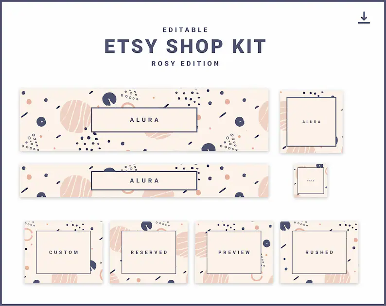

<figcaption>

**[Etsy Shop Kit](https://www.etsy.com/ca/listing/743536832/etsy-banner-etsy-cover-photo-etsy?ga_order=most_relevant&ga_search_type=all&ga_view_type=gallery&ga_search_query=etsy+shop+assets&ref=sr_gallery-1-5&organic_search_click=1)**

</figcaption>

</figure>

**Social Media Templates**

Creating professional looking Instagram posts can take a lot of time. That’s why we created a marketplace of customizable templates that can be used to save hours on site set up and content creation.

<figure>

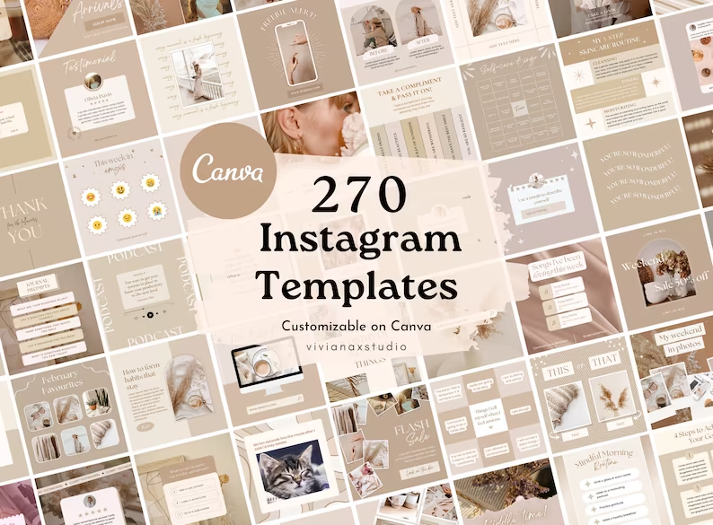

<figcaption>

**[Social Media templates](https://www.etsy.com/ca/listing/1243382324/270-instagram-templates-neutral-social?ga_order=most_relevant&ga_search_type=all&ga_view_type=gallery&ga_search_query=Social+media+templates&ref=sr_gallery-1-3&pro=1&sts=1&organic_search_click=1)**

</figcaption>

</figure>

**Invitations**

Have you ever hosted a party then found yourself scrambling to buy invitations? It's happened to me too! With my cards, customers can just print them at home and save themselves the trouble.

<figure>

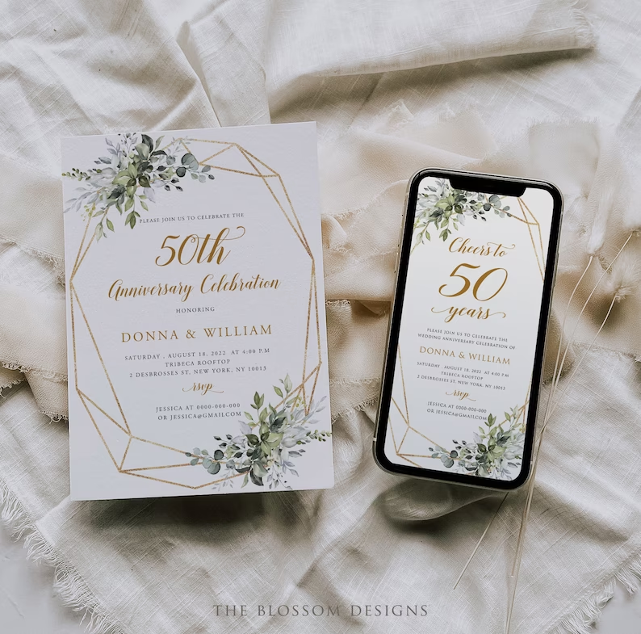

<figcaption>

**[Invitation template](https://www.etsy.com/ca/listing/1264067027/greenery-anniversary-invitation-bundle?ga_order=most_relevant&ga_search_type=all&ga_view_type=gallery&ga_search_query=invitations+printable&ref=sc_gallery-1-9&pro=1&plkey=5935d3a1422a8b2045b607ba5228764dfba32d21%3A1264067027)**

</figcaption>

</figure>

**Self-improvement Printables**

Printables like fitness planners and diet planners offer a lot of opportunities for people to get healthier and live more fulfilling lives.

<figure>

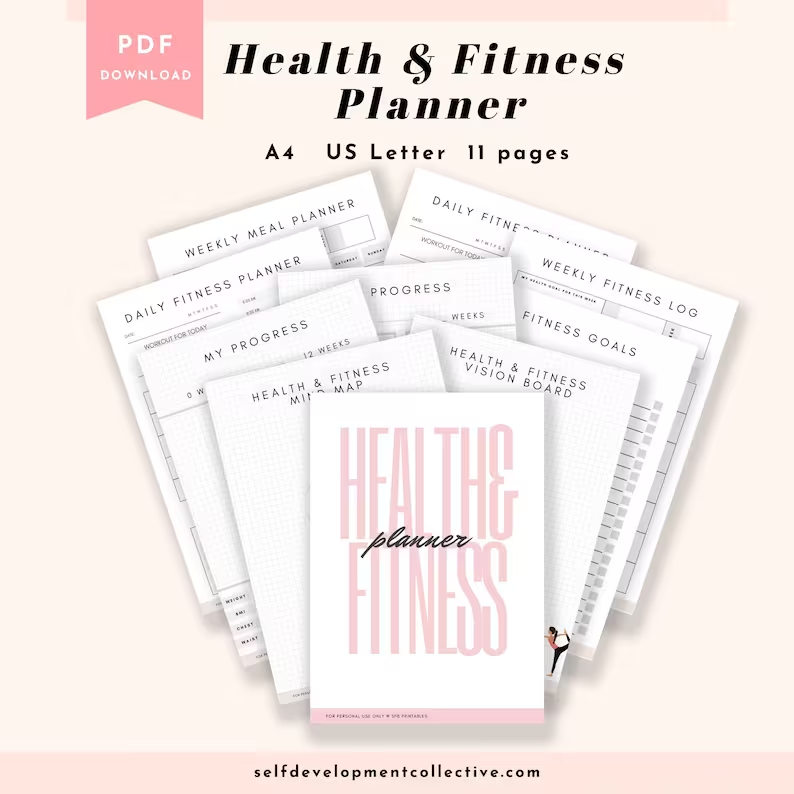

<figcaption>

**[FItness planner](https://www.etsy.com/ca/listing/1338550036/fitness-planner-printable-2023-fitness?ga_order=most_relevant&ga_search_type=all&ga_view_type=gallery&ga_search_query=fitness+planner&ref=sc_gallery-1-3&plkey=4b1920f20cf75dbee022b32971d9a4a1e85dac4c%3A1338550036)**

</figcaption>

</figure>

‍

**Wedding Printables.**

WEDDINGS! This is a HUGE niche on Etsy, with everything you can think of related to weddings. Invitations, table menus, baby shower games and more--they're all on there!

<figure>

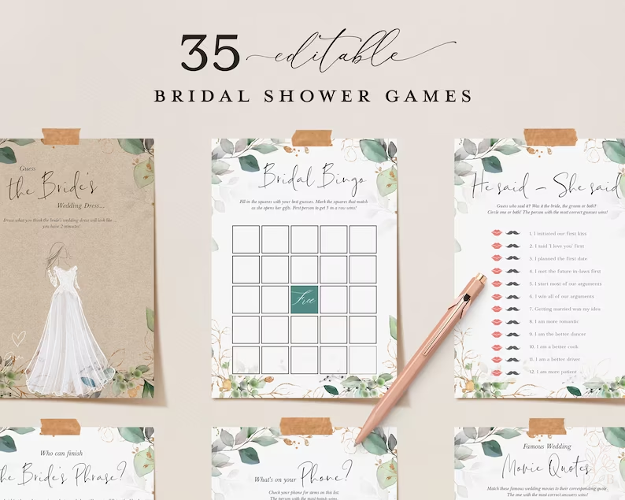

<figcaption>

**[Wedding printables](https://www.etsy.com/ca/listing/843564527/cleo-35-editable-bridal-shower-games?ga_order=most_relevant&ga_search_type=all&ga_view_type=gallery&ga_search_query=wedding+printables&ref=sr_gallery-1-24&pro=1&sts=1&organic_search_click=1)**

</figcaption>

</figure>

**Event Printables**

By using printable products, organisers can create custom party resources like decorations, invitations and photo frames. This means you can save time and money without scrimping on quality.

<figure>

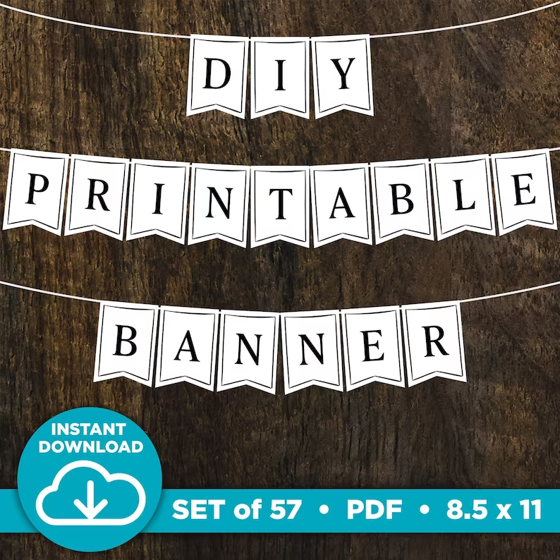

<figcaption>

**[Party sign](https://www.etsy.com/ca/listing/1284724443/cute-printable-banner-birthday-party?ga_order=most_relevant&ga_search_type=all&ga_view_type=gallery&ga_search_query=event+printables&ref=sr_gallery-1-6&organic_search_click=1)**

</figcaption>

</figure>

**The Cafe/Restaurant Sign**

Having your own restaurant or coffee shop is a huge commitment. Why not make it easier on them by providing designs for their menu, signage, loyalty cards, and more? This can help with branding and allow for fast customization.

‍

<figure>

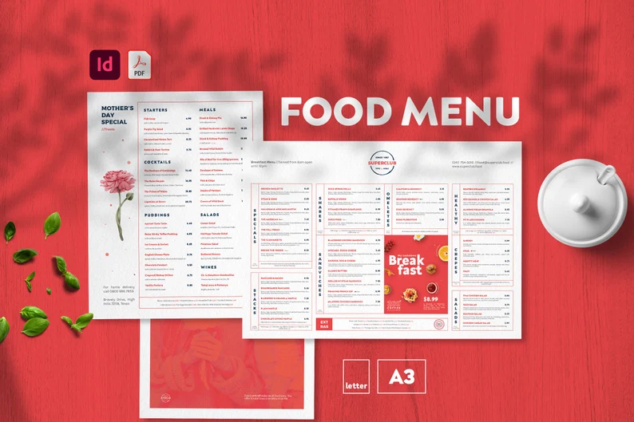

<figcaption>

**[Food menu template](https://www.etsy.com/ca/listing/869638827/food-menu-template-valentines-day-menu?ga_order=most_relevant&ga_search_type=all&ga_view_type=gallery&ga_search_query=printable+cafe+sign&ref=sc_gallery-1-14&pro=1&sts=1&plkey=9fc648b73397f6238b045e3851305a4aaf2b2cc1%3A869638827)**

</figcaption>

</figure>

**Children Learning Material**

‍As a parent, you want your child to grow up learning and in a healthy environment. We know you'll feel comfortable knowing that our team approaches your children's education with the utmost care and compassion, working to provide them with a strong foundation for the rest of their lives.

One of the most popular ways to sell learning materials or toys is to target babies and young children. Items that teach them about alphabets, numbers, shapes, colors, etc., all need to be cute for this audience.

<figure>

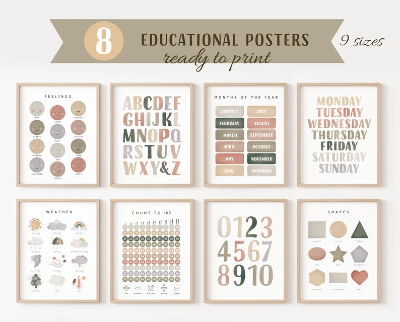

<figcaption>

**[Educational posters](https://www.etsy.com/ca/listing/1231292342/set-of-educational-posters-8-homeschool?ga_order=most_relevant&ga_search_type=all&ga_view_type=gallery&ga_search_query=montessori+printables&ref=sr_gallery-1-8&pro=1&sts=1&organic_search_click=1)**

</figcaption>

</figure>

**Ebook and Guides**

Would you like to teach others about the skills you learned through your experience? You could make a guide and put it up on Etsy to share your knowledge.

<figure>

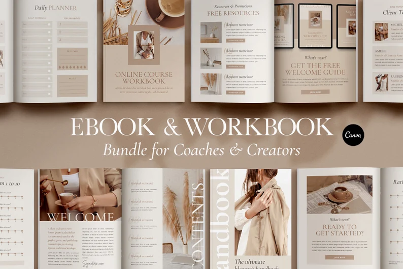

<figcaption>

**[Ebook and Guide templates](https://www.etsy.com/ca/listing/1244521169/workbook-ebook-template-2-in-1-bundle?ga_order=most_relevant&ga_search_type=all&ga_view_type=gallery&ga_search_query=ebook&ref=sc_gallery-1-1&pro=1&sts=1&plkey=ad1ff07f60f0b0952b06631d70b928403dff90a1%3A1244521169)**

</figcaption>

</figure>

**Workbooks**

These workbooks are great for anyone who wants to dabble in writing while learning good grammar, a great vocabulary, and even more!

If you aren't sure what type of planner you're looking for, a workbook might be the perfect option. Similar to planners, a workbook is usually geared towards those who want self-care and self-improvement. They purchase it, download it, and print for use right away.

<figure>

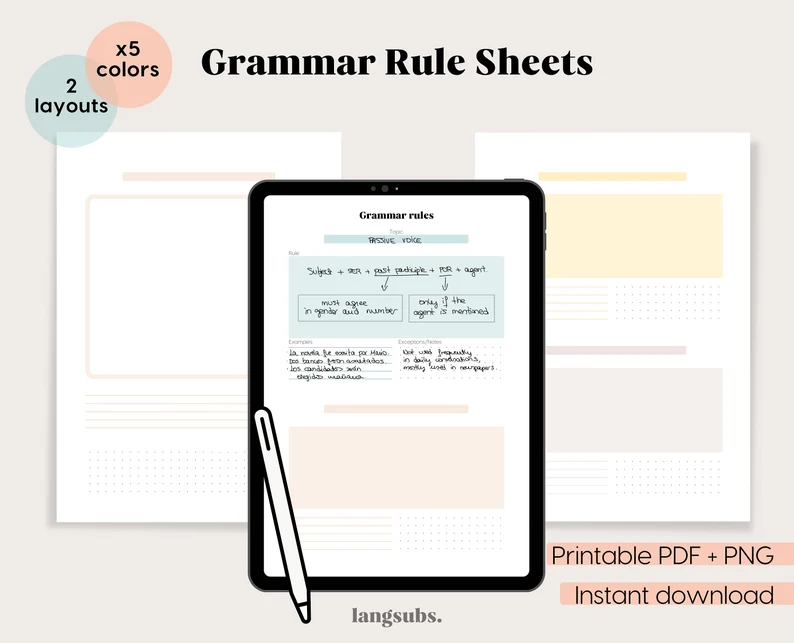

<figcaption>

**[Language sheets](https://www.etsy.com/ca/listing/1295456767/grammar-rule-sheets-for-language?ga_order=most_relevant&ga_search_type=all&ga_view_type=gallery&ga_search_query=english+workbook&ref=sr_gallery-1-8&pro=1&sts=1&organic_search_click=1)**

</figcaption>

</figure>

**Lightroom Presets**

Lightroom is a great photo editing app, and presets offer quick editing for those on the go.

‍

<figure>

<figcaption>

**[Presets](https://www.etsy.com/ca/listing/856053558/mobile-lightroom-presets-blogger-mom?ga_order=most_relevant&ga_search_type=all&ga_view_type=gallery&ga_search_query=lightroom+presets&ref=sr_gallery-1-2&pro=1&sts=1&organic_search_click=1)**

</figcaption>

</figure>

**Phone wallpapers**

Seriously, aren't you sick of looking at your boring old phone? Have some fun with some new personalized wallpapers!

Selling wallpapers is a great way for digital artists to make money. These images can be put on any type of phone screen and often come as WPS files.

<figure>

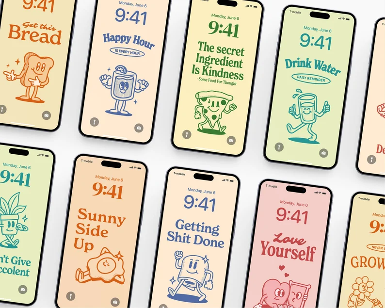

<figcaption>

**[phone wallappers](https://www.etsy.com/ca/listing/1310670728/retro-iphone-wallpaper-bundle-set-of-10?ga_order=most_relevant&ga_search_type=all&ga_view_type=gallery&ga_search_query=phone+wallpaper&ref=sr_gallery-1-15&pro=1&sts=1&organic_search_click=1)**

</figcaption>

</figure>

**iOS icon pack**

Since iOS 14, iPhone users have been able to edit the icons for their apps on their phone. Nowadays, it's a very popular niche when people need to edit app icons.

<figure>

<figcaption>

**[ios icon pack](https://www.etsy.com/ca/listing/1271363813/floating-dreams-ios-ipados-android-theme?ga_order=most_relevant&ga_search_type=all&ga_view_type=gallery&ga_search_query=ios+pack&ref=sr_gallery-1-24&bes=1&sts=1&organic_search_click=1)**

</figcaption>

</figure>

**Wall art**

Digital art is an excellent option for people who want to buy affordable digital versions of their favorite artwork. With the use of apps such as Photoshop or Procreate, you can set images as backgrounds, social media headers and digital art paintings.

<figure>

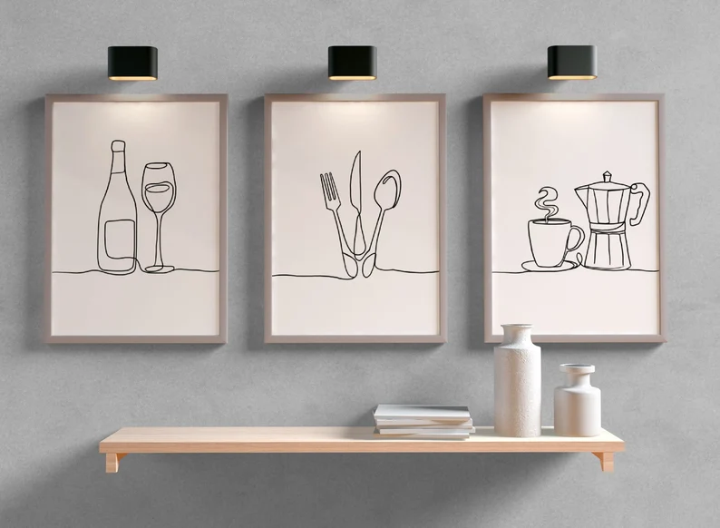

<figcaption>

**[printable wall art](https://www.etsy.com/ca/listing/1046690000/set-of-3-line-drawing-printable-kitchen?ga_order=most_relevant&ga_search_type=all&ga_view_type=gallery&ga_search_query=wall+art&ref=sr_gallery-2-21&bes=1&sts=1&organic_search_click=1)**

</figcaption>

</figure>

**Resume templates**

Resume templates can be a great tool for job seekers. They're a helpful resume-building platform that provides professional models, example resumes, and other templates that are easily customizable to meet the needs of career seekers.

People all over the world find Etsy to be a resource for their professional-looking resume templates. They usually come in Microsoft Word and Google Doc formats, but they can also be formatted to other word processing programs.

<figure>

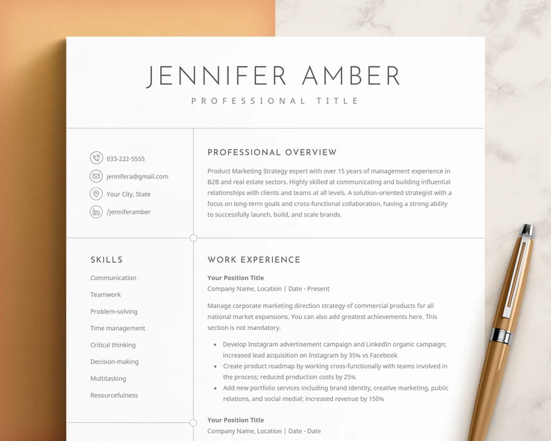

<figcaption>

**[resume template](https://www.etsy.com/ca/listing/995710406/resume-template-professional-modern?ga_order=most_relevant&ga_search_type=all&ga_view_type=gallery&ga_search_query=resume+template&ref=sr_gallery-1-2&pop=1&sts=1&organic_search_click=1)**

</figcaption>

</figure>

‍

**Crochet Patterns, Knitting Patterns, Embroidery Patterns, Sewing Pattern**

If you have the skills and the passion, then Etsy is a great place to sell these patterns.

<figure>

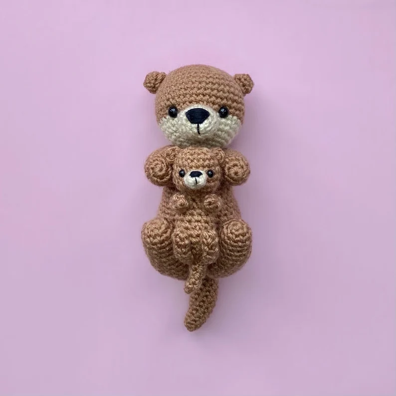

<figcaption>

**[crochet pattern](https://www.etsy.com/ca/listing/969343205/pattern-olive-and-otis-the-otter-pup?ga_order=most_relevant&ga_search_type=all&ga_view_type=gallery&ga_search_query=crochet+pattern&ref=sc_gallery-1-13&pop=1&sts=1&plkey=3bad75411446c7b6995ab6ad138a4a726ed478c7%3A969343205)**

</figcaption>

</figure>

**Pattern for knitting**

Recipe cards allow you to keep track of ingredients and dish preparation time, which is helpful for planning ahead.

Home cooks and chefs find inspiration for new recipes all the time, and they like to keep track of them. Using blank recipe card templates is a great way to jot down favorite ideas.

<figure>

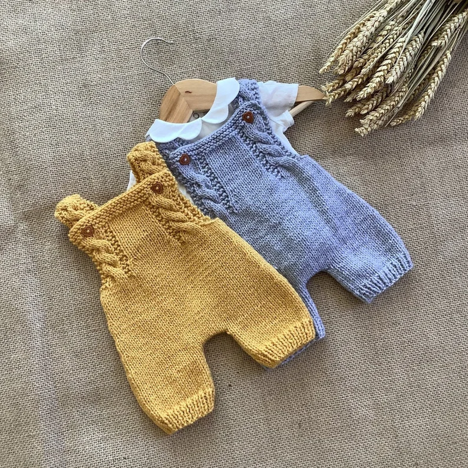

<figcaption>

**[pdf knit patterns](https://www.etsy.com/ca/listing/1034557923/robin-overalls-knitting-pattern-baby?ga_order=most_relevant&ga_search_type=all&ga_view_type=gallery&ga_search_query=knitting+pattern+pdf&ref=sr_gallery-1-47&pop=1&organic_search_click=1)**

</figcaption>

</figure>

**Meal Planning Cards.**

These fitness tracker cards are an easy way for dieters to stay on track and be sure they're achieving their goal.

<figure>

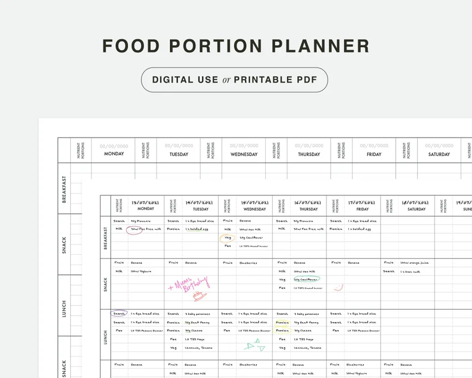

<figcaption>

**[Printable meal cards](https://www.etsy.com/ca/listing/1036845156/food-portion-planner-digital-download?ga_order=most_relevant&ga_search_type=all&ga_view_type=gallery&ga_search_query=meal+planning+cards&ref=sc_gallery-1-7&plkey=6b13b0d66f9af5fbdc9c0be8dda44e0096d0116e%3A1036845156)**

</figcaption>

</figure>

**Coloring books**

Colouring books can be a lot more than just fun! They have numerous benefits, including stress relief and improved creativity. With Paperplanes, you don't have to choose between adult or kids titles - we've got them both!

Coloring books are a creative outlet for kids. But recently, adults have been using them to be creative and reduce stress.

<figure>

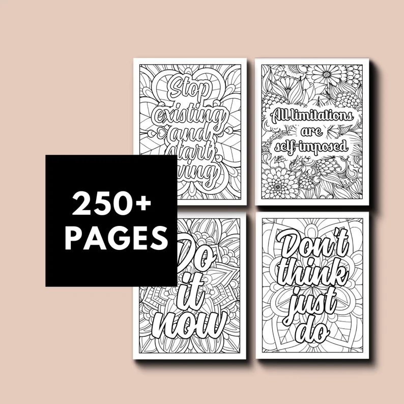

<figcaption>

**[PDF coloring sheets](https://www.etsy.com/ca/listing/1103148126/250-adult-motivational-quote-coloring?ga_order=most_relevant&ga_search_type=all&ga_view_type=gallery&ga_search_query=colouring+books+pdf&ref=sr_gallery-1-6&pop=1&organic_search_click=1)**

</figcaption>

</figure>

**Clip Art**

If a picture is worth 1000 words, clip art is worth 100,000! Add animated clipart to your posts for enjoyable, non-intrusive call-to-action graphics.

Artists create digital art and sell it as clip art. Clip art is small elements of digital art that customers buy collections of to use in their own projects, or print out to personalize their items.

<figure>

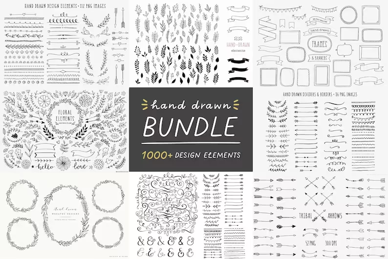

<figcaption>

**[Clipart](https://www.etsy.com/ca/listing/1023735326/hand-drawn-design-elements-bundle-doodle?ga_order=most_relevant&ga_search_type=all&ga_view_type=gallery&ga_search_query=clipart&ref=sr_gallery-1-18&pro=1&sts=1&organic_search_click=1)**

</figcaption>

</figure>

**Digital Papers**

A lot of patterns are designed for scrapbooking.

<figure>

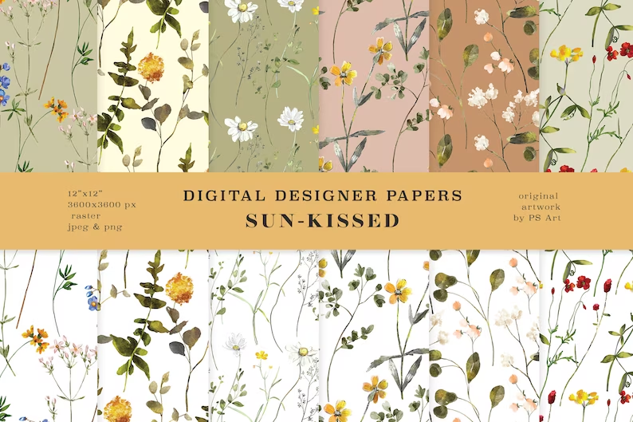

<figcaption>

**[digital paper](https://www.etsy.com/ca/listing/1275251731/watercolor-meadow-flowers-digital-paper?ga_order=most_relevant&ga_search_type=all&ga_view_type=gallery&ga_search_query=digital+paper&ref=sc_gallery-1-2&pro=1&sts=1&plkey=e1e0ae3e531735bab768ed93d6da9f190925ea02%3A1275251731)**

</figcaption>

</figure>

**Zoom backgrounds**

One of the newest trends is zoom and other online meeting programs, mainly because they are a convenient way to avoid commuting. Custom backgrounds can show personality or just serve as a distraction from messy bedrooms.

<figure>

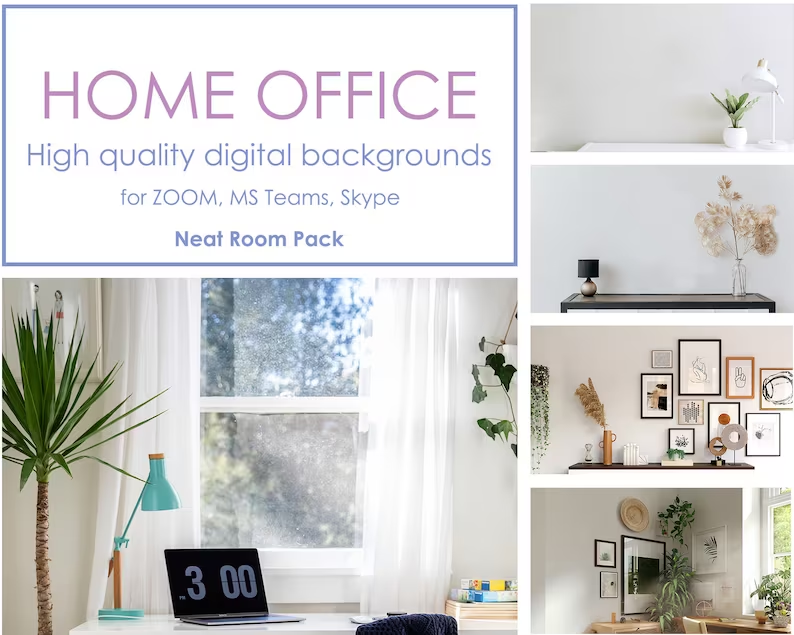

<figcaption>

**[zoom backgrounds](https://www.etsy.com/ca/listing/944134866/zoom-background-home-office-digital-pack?ga_order=most_relevant&ga_search_type=all&ga_view_type=gallery&ga_search_query=zoom+backgrounds&ref=sr_gallery-1-10&organic_search_click=1)**

</figcaption>

</figure>

**Spreadsheets**

The two most popular Microsoft Excel templates that are used by shop owners are accounting and profit calculators. These templates allow you to monitor your expenditures and make accurate predictions.

<figure>

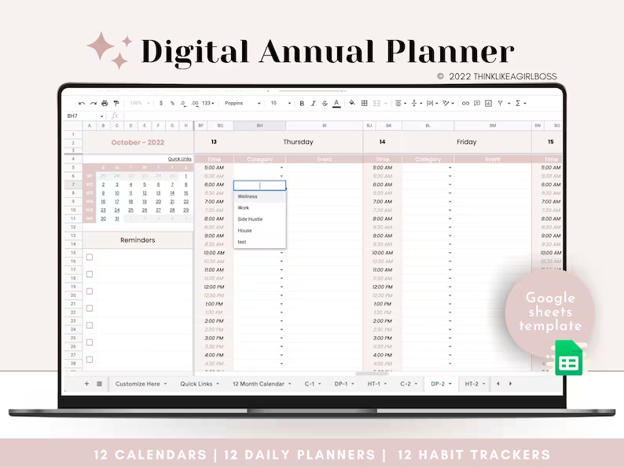

<figcaption>

**[spreadsheets](https://www.etsy.com/ca/listing/1300849792/digital-annual-planner-undated?ga_order=most_relevant&ga_search_type=all&ga_view_type=gallery&ga_search_query=spreadsheet&ref=sr_gallery-1-7&pop=1&sts=1&organic_search_click=1)**

</figcaption>

</figure>

**Website templates**

If you're building a website and aren't quite sure where to start, we recommend either Wordpress, Wix, or Shopify. They offer free templates that allow beginners to create a website with no coding required.

‍

<figure>

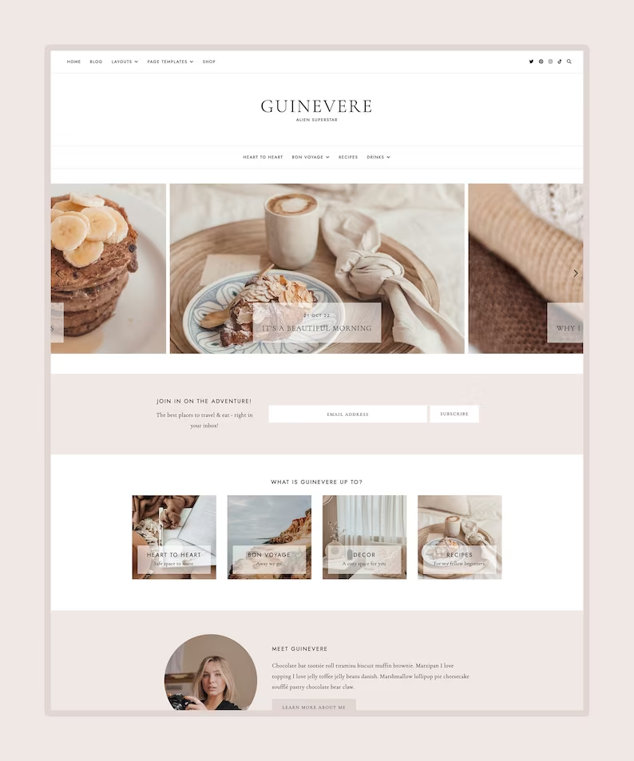

<figcaption>

**[wordpress templates](https://www.etsy.com/ca/listing/772274827/updated-guinevere-wordpress-theme-fully?ga_order=most_relevant&ga_search_type=all&ga_view_type=gallery&ga_search_query=website+template&ref=sr_gallery-1-7&pro=1&sts=1&organic_search_click=1)**

</figcaption>

</figure>

## List of file types supported by Etsy:

The most commonly used file types are JPG, PNG, and PDF. They all have their merits, but deciding on one depends entirely on what you're using them for.

‍

Generally, PNG or SVG files are used for graphics with transparent backgrounds, while PDFs are great for ebooks.

- .bmp

- .doc

- .gif

- .jpeg

- .mobi

- .mov

- .mp3

- .mpeg

- .psp

- .rtf

- .stl

- .txt

- .zip

- .ePUB

- .iBook

When starting your business, you may want to include evergreen, or year-round, items in your inventory. Once you’ve established your brand and gained a following, you can add seasonal items in order to increase demand during certain times of the year.

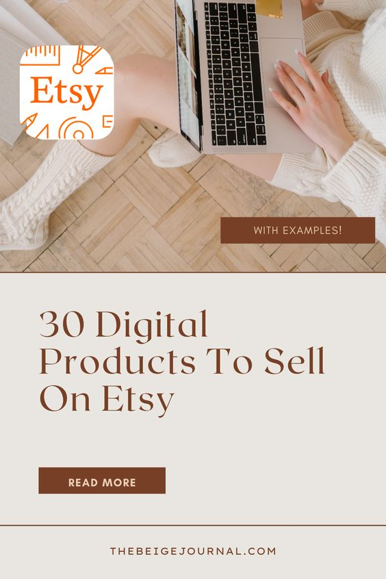

## My favorite Etsy research tools

\[sc name="etsyresearchtools" \]\[/sc\]

\[sc name="etsypostoffercta" \]\[/sc\]
