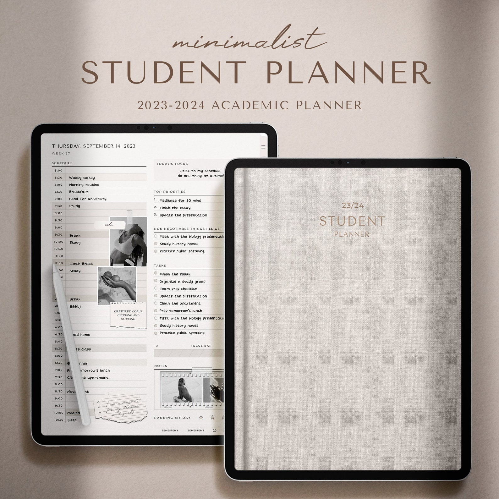
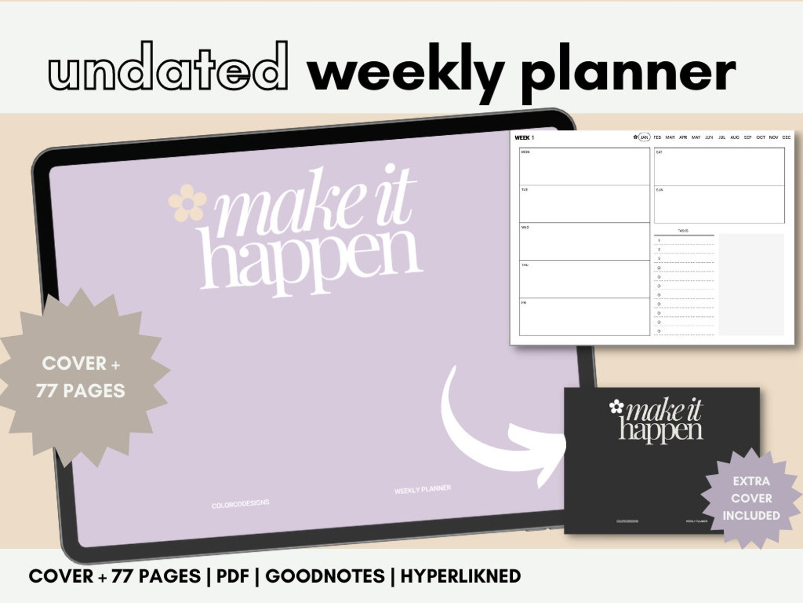
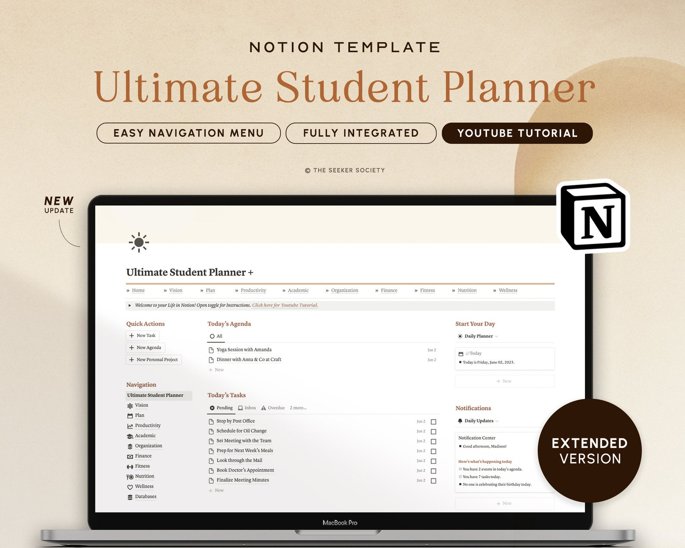

With the scent of fresh books and new stationery in the air, it's clear that a new academic year is upon us. Whether you're brimming with motivation or just trying to get by, here are some tips to help you navigate the upcoming school year with confidence and purpose.

1. **Set Intentions and Realistic Goals**  
    At the start of every year, many of us make resolutions, even if we don't always stick to them. The same principle applies to the academic year. What are your aspirations for this semester? Maybe you're aiming for a better grade in a particular subject or hoping to boost your overall GPA. Perhaps you're seeking a more balanced student life or even hoping to catch someone's eye. Whatever your goals, jot them down somewhere visible to keep yourself on track.

3. **Declutter and Organize**  
    Your physical and digital spaces are where you'll be spending a lot of time, so it's essential to keep them tidy. Start by cleaning your room, arranging your desk, and maybe even giving your space a little makeover. Go through old papers and files, discarding what you don't need and organizing the rest. Don't forget about your digital space too! Organize files on your laptop, delete unnecessary apps, and tidy up your cloud storage.

5. **Block Out Your Schedule**  
    Once you have your class timetable, mark it on your calendar. Check your school's academic calendar for essential dates and consult course syllabuses for assignment and exam schedules. It's also a good idea to block out daily routines, ensuring they're realistic and balanced. While it's essential to stick to your schedule, remember to be adaptable when unexpected events arise.

7. **Cut Down Your Screen Time**  
    In our digital age, it's easy to get lost in endless scrolling or binge-watching. While it's okay to indulge occasionally, consider setting limits. Maybe use a timer during study breaks to prevent unintentional hours on social media or limit the number of episodes you watch in one sitting.

9. **Have a Healthy Lifestyle**  
    Physical activity is vital for our well-being. Whether it's a walk outside, a yoga session, or even learning a new dance routine, find something that gets you moving. And while students are notorious for irregular sleep patterns, try to aim for 7-9 hours of sleep when you can.

11. **Review Your Study System**  
     A solid study system can make a world of difference. Reflect on what's working for you and what might need tweaking. Maybe you need a change in study environment, or perhaps certain study aids aren't helping as much as you thought. Remember, it's okay to ask for help when you're stuck.

13. **Romanticize Your Student Life**  
     Find joy in the everyday. Imagine you're the protagonist in a coming-of-age film. Make your study space aesthetically pleasing, try studying in a cafe, or start a journal. Embracing and enjoying the student journey can lead to increased motivation and productivity.

In conclusion, the academic year is full of challenges, but with the right approach, it can also be immensely rewarding. Here's to a successful and fulfilling year ahead!

## Check out these digital student planners

<figure>

<figcaption>

[Digital Planner | Student Planner | iPad Planner | GoodNotes Planner | Academic Planner 2023-2024 | College Planner | Daily Planner iPad](https://www.etsy.com/ca/listing/1475029777/digital-planner-student-planner-ipad?click_key=26ab84a9281a6cc40a330bd4fc20d5a85539972f%3A1475029777&click_sum=588b9424&ref=hp_rv-1&sts=1)

</figcaption>

</figure>

[See on Etsy](https://www.etsy.com/ca/listing/1475029777/digital-planner-student-planner-ipad?click_key=26ab84a9281a6cc40a330bd4fc20d5a85539972f%3A1475029777&click_sum=588b9424&ref=hp_rv-1&sts=1)

<figure>

<figcaption>

[2023 UNDATED SIMPLE AESTHETIC Digital Planner, ipad planner, landscape digital planner, to do list, hyperlinked, goodnotes planner](https://www.etsy.com/ca/listing/1520686310/2023-undated-simple-aesthetic-digital?click_key=fce961b86eb266536faff23a5abdf4b32da39493%3A1520686310&click_sum=5729b74a&ref=hp_rv-3)

</figcaption>

</figure>

[See on Etsy](https://www.etsy.com/ca/listing/1520686310/2023-undated-simple-aesthetic-digital?click_key=fce961b86eb266536faff23a5abdf4b32da39493%3A1520686310&click_sum=5729b74a&ref=hp_rv-3)

<figure>

<figcaption>

[Notion Template Extended Student Planner Academic Planner Notion Dashboard College Planner Study Assignment Tracker Notion Homework Tracker](https://www.etsy.com/ca/listing/1440613373/notion-template-extended-student-planner?ref=hp-3&pro=1&sts=1&plkey=38a3cffd5088a81653bf6ac6b0f50c6ff6e4323b%3A1440613373)

</figcaption>

</figure>

[See on Etsy](https://www.etsy.com/ca/listing/1440613373/notion-template-extended-student-planner?ref=hp-3&pro=1&sts=1&plkey=38a3cffd5088a81653bf6ac6b0f50c6ff6e4323b%3A1440613373)
