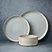
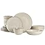
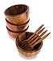
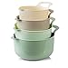

Fall is here, and it's time to embrace the season's bounty of fresh produce. One vegetable that often gets overlooked during this time of year is zucchini. While it may be a summer staple, zucchini is versatile enough to be enjoyed in a variety of autumn-inspired dishes. In this blog post, we'll explore seven zucchini recipes that are perfect for cozying up with this fall. From hearty lasagnas to creamy ziti, these recipes will make you fall in love with zucchini all over again.

## 1\. Zucchini Lasagna

When it comes to comfort food, there are few meals as satisfying as warm, cheesy lasagna. This Zucchini Lasagna is a lighter take on the classic dish, using thinly sliced zucchini in place of noodles. It also features ground turkey for a healthier meat sauce option.

### Ingredients

- Zucchini, thinly sliced

- Ground turkey

- Tomato sauce

- Cheese (mozzarella and Parmesan)

- Spices (oregano, basil, garlic powder)

### Directions

1. Preheat the oven and prepare a baking pan.

3. In a saucepan, cook the ground turkey and add spices.

5. Layer the zucchini slices in the baking pan.

7. Add the meat sauce and cheese.

9. Repeat the layers and bake until golden and bubbly.

## 2\. Creamiest Fall Ziti

Ring in the fall season with this veggie-packed, delicious ziti! The Creamiest Fall Ziti features a creamy pumpkin sauce and tons of melty cheese, making it the perfect fall dinner.

### Ingredients

- Ziti pasta

- Pumpkin sauce

- Cheese (mozzarella and Parmesan)

- Zucchini, diced

- Spices (nutmeg, cinnamon)

### Directions

1. Preheat the oven and prepare a baking pan.

3. Cook the ziti pasta and set aside.

5. In a blender, prepare the creamy pumpkin sauce.

7. Mix the pasta, sauce, and diced zucchini.

9. Top with cheese and bake until golden.

[Read the full recipe here](https://tasty.co/recipe/creamiest-fall-ziti?ref=openai_gpt_plugin)

## 3\. After-School Zucchini Pizzas

Looking for a quick and healthy snack for the kids? These After-School Zucchini Pizzas are the perfect solution. With just a few ingredients, you can create a low-carb, delicious treat that's ready in under 30 minutes.

### Ingredients

- Zucchini, sliced into rounds

- Tomato sauce

- Cheese (mozzarella)

- Mini pepperoni or other toppings

### Directions

1. Preheat the oven and prepare a baking sheet.

3. Place zucchini rounds on the sheet.

5. Add a dollop of tomato sauce and cheese on each round.

7. Add mini pepperoni or other toppings.

9. Bake until cheese is melted and bubbly.

## 4\. Zucchini Bread

What's fall without some warm, freshly baked bread? This Zucchini Bread recipe is moist, flavorful, and perfect for breakfast or as a snack.

### Ingredients

- Zucchini, grated

- Flour

- Sugar

- Eggs

- Baking soda

- Cinnamon and nutmeg

### Directions

1. Preheat the oven and grease a loaf pan.

3. In a bowl, mix all the dry ingredients.

5. Add the wet ingredients and grated zucchini.

7. Pour the mixture into the loaf pan.

9. Bake until a toothpick comes out clean.

## 5\. Zucchini Fritters

If you're in the mood for something crispy and savory, these Zucchini Fritters are a must-try. They're quick to make and are perfect as an appetizer or side dish.

### Ingredients

- Zucchini, grated

- Flour

- Eggs

- Cheese (Parmesan)

- Spices (garlic powder, salt, pepper)

### Directions

1. Grate the zucchini and squeeze out excess moisture.

3. In a bowl, mix the zucchini with flour, eggs, and spices.

5. Heat oil in a pan.

7. Drop spoonfuls of the mixture into the pan.

9. Fry until golden brown on both sides.

## 6\. Zucchini Soup

As the weather gets colder, a bowl of warm soup becomes increasingly appealing. This Zucchini Soup is creamy, delicious, and incredibly easy to make.

### Ingredients

- Zucchini, chopped

- Onion, chopped

- Garlic, minced

- Chicken or vegetable broth

- Cream or milk

### Directions

1. Sauté the onion and garlic in a pot.

3. Add the chopped zucchini and broth.

5. Simmer until zucchini is tender.

7. Blend the mixture until smooth.

9. Add cream or milk and heat through.

## 7\. Zucchini Stir-Fry

For a quick and healthy weeknight dinner, try this Zucchini Stir-Fry. It's packed with vegetables and can be customized with your choice of protein.

### Ingredients

- Zucchini, sliced

- Bell peppers, sliced

- Onion, sliced

- Garlic, minced

- Soy sauce

- Protein of choice (chicken, tofu, etc.)

### Directions

1. Heat oil in a wok or large pan.

3. Sauté the garlic, onion, and bell peppers.

5. Add the zucchini and cook until tender.

7. Add the protein and soy sauce.

9. Stir-fry until everything is well-cooked and flavorful.

## Elevate Your Fall Feasts with These Aesthetic Dishware Sets

This fall, elevate your culinary presentations with these highly-rated, aesthetic dishware sets that perfectly complement the season's palette and mood.

#### 1\. Famiware Dinnerware Sets - Cappuccino White

  
**Price:** [$79.99](https://www.amazon.com/dp/B09XWHBYZ7)

[PUSH THE BUTTON](https://www.amazon.com/dp/B09XWHBYZ7)

  
The Famiware Dinnerware Set in Cappuccino White is the epitome of rustic elegance. The 12-piece set serves four and is perfect for those hearty fall stews and pumpkin-spiced desserts. The neutral tones effortlessly blend with autumnal table settings, making it a versatile choice for any occasion.

#### 2\. Gibson Elite Matisse Double Bowl Dinnerware Set - Taupe

  
**Price:** [$72.99](https://www.amazon.com/dp/B09QFZSNTC)

[buy now](https://www.amazon.com/dp/B09QFZSNTC)

  
This 16-piece set in a soothing taupe color is perfect for a sophisticated fall dinner. The double bowl feature is ideal for serving soups and salads, a staple in fall menus. The Gibson Elite Matisse set brings a touch of modernity to traditional fall gatherings.

#### 3\. BestySuperStore Mini Acacia Wooden Bowls

  
**Price:** [$32.99](https://www.amazon.com/dp/B084PY3ZP9)

[buy now](https://www.amazon.com/dp/B084PY3ZP9)

  
For those who love a touch of nature on their dining tables, these mini Acacia wooden bowls are a must-have. They come with free wooden spoons and are perfect for serving dips, sauces, or small snacks. The wood grain complements the earthy tones of fall, adding a natural touch to your table.

#### 4\. COOK WITH COLOR Mixing Bowls - Ombre Mint

  
**Price:** [$17.99](https://www.amazon.com/dp/B084X1G2W9)

[buy now](https://www.amazon.com/dp/B084X1G2W9)

  
Last but not least, these ombre mint mixing bowls are a vibrant addition to your fall kitchen. The set includes four nesting bowls with pour spouts and handles, making them perfect for mixing, serving, and storing. The ombre design adds a pop of color to the earthy tones of the season.
