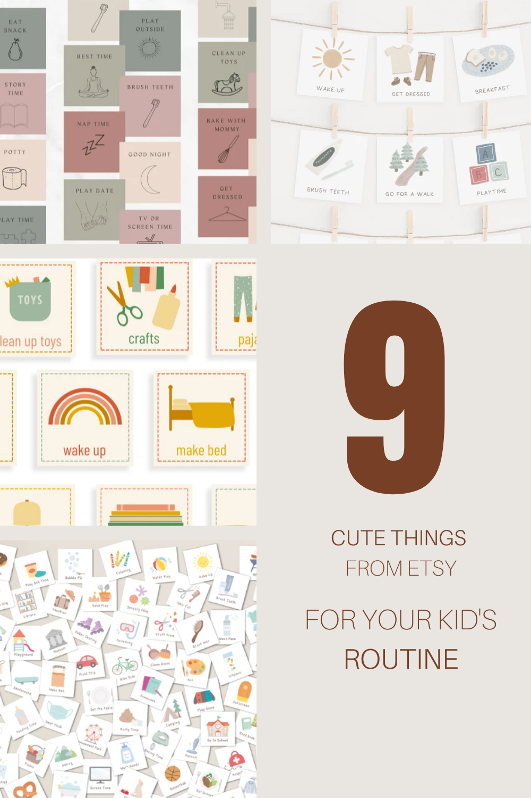

Now that I’m a mom, life has been hectic and I am starting to want to create more of a routine for myself.  I’ve also learned that kids can also start having their own routines, so now that my kids are getting older and I want to start them off with a schedule so they know what’s coming in the day.  This also helps them prepare mentally for what’s happening to avoid any tantrum so here are a few things that I found on Etsy that will help create a schedule for everyone and some thing that will look aesthetically pleasing around the house

<figure>

<figure>

<figcaption>

1

</figcaption>

</figure>

<figure>

<figcaption>

2

</figcaption>

</figure>

<figure>

<figcaption>

3

</figcaption>

</figure>

<figure>

<figcaption>

4

</figcaption>

</figure>

<figure>

<figcaption>

5

</figcaption>

</figure>

<figure>

<figcaption>

6

</figcaption>

</figure>

<figure>

<figcaption>

7

</figcaption>

</figure>

<figure>

<figcaption>

8

</figcaption>

</figure>

<figure>

<figcaption>

9

</figcaption>

</figure>

</figure>

My all time favourite is from [The Creative Sprout Co](https://www.etsy.com/ca/shop/TheCreativeSproutCo?ref=simple-shop-header-name&listing_id=871663681) because it’s available in a few different languages.  If you’re into adding your native language to the whole routine and want to introduce a second language, I highly recommend them!

1. [Routine Chart, Routine Checklist, Routine Cards, Daily Rhythm Cards, Daily Rhythm, Printable Routine Chart, Daily Routine for Toddlers](https://www.etsy.com/ca/listing/871663681/routine-chart-routine-checklist-routine?ga_order=most_relevant&ga_search_type=all&ga_view_type=gallery&ga_search_query=kids+routine+chart&ref=sr_gallery-1-17&organic_search_click=1)
2. [Daily and Weekly Routine Cards](https://www.etsy.com/ca/listing/1103198134/daily-and-weekly-routine-cards-i-mix-and?ga_order=most_relevant&ga_search_type=all&ga_view_type=gallery&ga_search_query=kids+routine+chart&ref=sr_gallery-1-38&pop=1&sts=1&organic_search_click=1)
3. [240 Kids Routine Cards + 10 Charts](https://www.etsy.com/ca/listing/1193847851/240-kids-routine-cards-10-charts?ga_order=most_relevant&ga_search_type=all&ga_view_type=gallery&ga_search_query=toddler+routine&ref=sr_gallery-7-19&organic_search_click=1) 
4. [Daily Routine Cards](https://www.etsy.com/ca/listing/1202204354/daily-routine-cards-printable-montessori?ga_order=most_relevant&ga_search_type=all&ga_view_type=gallery&ga_search_query=toddler+routine&ref=sr_gallery-5-40&organic_search_click=1)
5. [Editable Weekly Visual Routine Chart](https://www.etsy.com/ca/listing/1151520802/editable-weekly-visual-routine-chart?ga_order=most_relevant&ga_search_type=all&ga_view_type=gallery&ga_search_query=toddler+routine&ref=sr_gallery-1-34&bes=1&sts=1&organic_search_click=1)
6. [Weekly Kids Calendar, Printable Visual Schedule](https://www.etsy.com/ca/listing/745675891/weekly-kids-calendar-printable-visual?ga_order=most_relevant&ga_search_type=all&ga_view_type=gallery&ga_search_query=toddler+routine&ref=sr_gallery-2-1&bes=1&sts=1&organic_search_click=1)
7. [Editable Daily Routine Cards](https://www.etsy.com/ca/listing/926585792/editable-daily-routine-cards-toddler?ga_order=most_relevant&ga_search_type=all&ga_view_type=gallery&ga_search_query=toddler+routine&ref=sr_gallery-1-4&pop=1&sts=1&organic_search_click=1)
8. [Printable Daily Routine Cards for Toddlers, Preschoolers, and Kids](https://www.etsy.com/ca/listing/945581307/printable-daily-routine-cards-for?ga_order=most_relevant&ga_search_type=all&ga_view_type=gallery&ga_search_query=toddler+routine&ref=sr_gallery-4-26&sts=1&organic_search_click=1)
9. [Weekly Visual Routine Chart Weekly Visual Calendar Chore Chart for Kids](https://www.etsy.com/ca/listing/1216912956/weekly-visual-routine-chart-weekly?ga_order=most_relevant&ga_search_type=all&ga_view_type=gallery&ga_search_query=toddler+routine&ref=sr_gallery-2-4&organic_search_click=1)

## Join our newsletter for more!

\[mailerlite\_form form\_id=3\]
