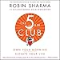
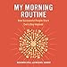
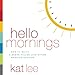

Hey there, morning enthusiasts and skeptics alike! Today, I'm diving into a topic that's near and dear to my heart: morning routines. We all see those aesthetic morning routines and want to be THAT GIRL. But here are some hard-hitting truths that might just change the way you think about mornings. So grab your coffee, tea, or kale smoothie, and let's get into it!

## The Morning Routine Hype

First off, let's address the elephant in the room: morning routines are not a magical solution to all your problems. I know, I know, those Instagram posts make it look so dreamy. But the reality is, a morning routine is a practice round for the rest of your day. It's about training yourself to take on challenges on your terms, not just making your mornings look pretty.

## The Early Bird Doesn't Always Get the Worm

Waking up early doesn't guarantee success. The time you wake up is only relevant to how much time you've given yourself to have some space before the world starts demanding your attention. So whether you're an early bird or a night owl, it's all about what works for you.

## Not a Morning Person? No Problem!

If you're not a morning person, don't sweat it. In fact, Amy believes that a morning routine is even better suited for someone who isn't naturally inclined to jump out of bed with a smile. It gives you that extra time to transition from groggy to great.

## The Struggle for Consistency

Keeping a morning routine is hard, and that's okay. It's a test of your ability to be consistent in different areas of your life. And let's be real, it takes time and effort to establish a routine that's right for you. So don't rush it; instead, focus on what feels right and adjust as needed.

## Motivation Comes from Action

Ever wake up and just not feel like doing your routine? You're not alone. But here's the kicker: motivation comes from taking action, not from perfect planning. So even if you're not feeling it, doing your routine can actually be the thing that kicks your motivation into gear.

## Sleep Over Routine

Never sacrifice sleep for a killer morning routine. If you're not well-rested, your morning routine will be counterproductive. So prioritize sleep, and then think about how to make your mornings better.

## Flexibility is Key

Your morning routine should be flexible and tailored to your personal goals and lifestyle. Life happens, and it's okay to deviate from the plan sometimes. What's important is that you're setting yourself up for success in a way that's sustainable for you.

## The Reality Check

Morning routines are not a one-size-fits-all solution. They won't solve all your time management issues, make you instantly happy, or turn you into a millionaire. But they can be a powerful tool for self-improvement if done right.

## The Final Truth

And here's the last truth, which might be a bit surprising: Your morning routine doesn't really matter in the grand scheme of things. It's just one step in a larger journey towards achieving your life goals. What truly matters is the vision you have for your life and the steps you're taking to make that vision a reality.

## Elevate Your Mornings: Top 3 Books on Morning Routines

If you're looking to revamp your mornings but don't know where to start, these three books offer invaluable insights into the power of morning routines. Here's a closer look at each:

## 1\. [The 5AM Club: Own Your Morning. Elevate Your Life.](https://www.amazon.com/dp/B07KRM53PR) by Robin Sharma

- **Price**: $18.74

### Description:

Robin Sharma's "The 5AM Club" is more than just a book; it's a movement. The book delves into the lives of billionaires, entrepreneurs, and high-performers who swear by waking up at 5 a.m. to gain a competitive edge. Sharma provides a 20/20/20 formula that breaks down the first hour into three 20-minute segments dedicated to exercise, planning, and learning. This book is perfect for those who are looking to maximize their mornings and, by extension, their lives.

* * *

## 2\. [My Morning Routine: How Successful People Start Every Day Inspired](https://www.amazon.com/dp/B07CTXNHQV) by Benjamin Spall and Michael Xander

- **Price**: $13.78

### Description:

If you've ever wondered how successful people start their day, "My Morning Routine" has the answers. Authors Benjamin Spall and Michael Xander have interviewed a variety of successful individuals, from athletes to CEOs, to compile a comprehensive guide on morning routines. The book offers a range of options and flexibility, recognizing that not everyone is a morning person. It's a great read for those who want to explore different approaches to mornings and find a routine that fits their lifestyle.

* * *

## 3\. [Hello Mornings: How to Build a Grace-Filled, Life-Giving Morning Routine](https://www.amazon.com/dp/B076ZQTKWX) by Kat Lee

- **Price**: $17.32

### Description:

Kat Lee's "Hello Mornings" takes a slightly different approach by incorporating spirituality into the morning routine. The book focuses on three simple activities: God Time, Plan Time, and Move Time. Lee argues that dedicating time to spiritual growth, planning your day, and physical exercise can lead to a more fulfilling life. This book is ideal for those who are looking to add a spiritual dimension to their mornings.

* * *

Whether you're an early riser or a night owl looking to make the most of your mornings, these books offer a wealth of knowledge and practical tips. So why wait? Start owning your mornings today!

## Change your life with our E-book!

\[sc name="blueprint" \]\[/sc\]
