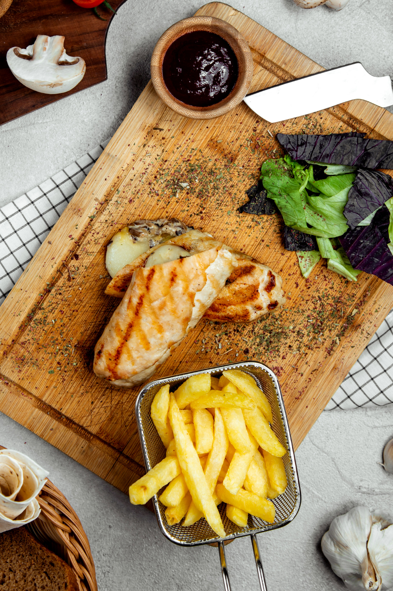
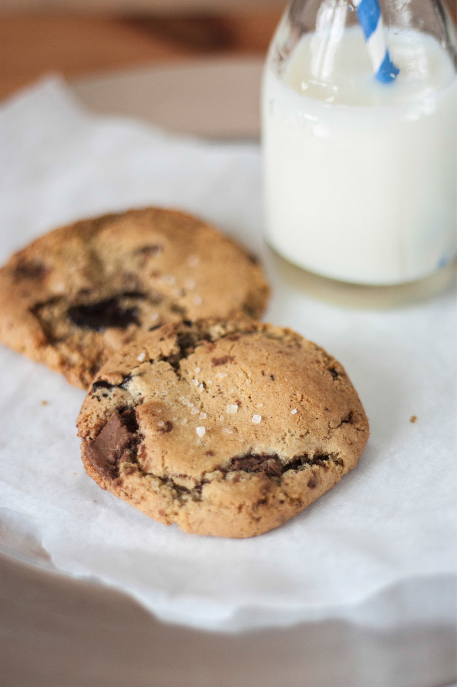

Air fryers are a healthy alternative to deep-frying that will satisfy your cravings for foods that typically have a lot of fat. For instance, you can enjoy some crispy french fries without the guilt!

Air fryers use rapid air circulation for cooking food. They come with temperature controls, so you don't have to worry about burning your foods.

Plus, air fryers are versatile too so you can easily create foods with any air fryer recipes!

> You can use it to air fry, reheat leftovers, melt cheese, toast nuts, and much more! Here are ten creative ways to use your air fryer.

## Easily Roast an Eggplant

If you love eggplants but have trouble cooking them perfectly every time, the Airfryer is for you.

> To roast your eggplant in the shortest amount of time possible, cut your eggplant into 1-inch slices. Spray some oil on both sides before putting it in the Airfryer at 375-degrees Fahrenheit for 10 minutes or until tender.

The skin will be crispy, just like how you prefer your roasted eggplants to be without all that hassle of having to watch over them as they roast.

## Toast Nuts Without Burning

If you love toasted nuts, making them in the Airfryer is perfect for you!

> Make sure that you spread your desired amount of walnuts, peanuts, or pecans into a single layer on top of a baking sheet before putting it in the Airfryer at 375-degrees Fahrenheit for 8-10 minutes.

It's best to shake them around halfway through cooking to ensure even browning. Once done, let cool, and they are ready to be eaten as snacks or used as toppings on salads or ice cream! You can also toast spices like cumin and fennel seeds in the Airfryer, but make sure not to burn them.

## Make Hard-Boiled Eggs Perfectly

You can use the Airfryer to make perfect hard-boiled eggs in just six minutes! You will need a muffin pan or egg mold.

Place each empty egg cavity in the muffin pan before putting six large eggs into each of the empty cavities.

> Put your eggs in the Airfryer for 6 minutes at 370-degrees Fahrenheit, and then let them cool for 5 minutes before removing them from their molds.

You can enjoy these boiled eggs on their own or cut them to add on top of salads!

## Reheat Leftovers

If you love to enjoy your leftover rice and pasta but hate having them turn soggy, the Airfryer is for you.

> To reheat leftovers in less than 10 minutes, spread your desired amount of leftovers on a baking dish and cook it in the Airfryer at 350-degrees Fahrenheit for 5-7 minutes or until hot.

This way, you can enjoy meals without worrying about losing their flavor! You can also use this method to make sure that cheese gets nice and crispy! Just melt it first before putting it into the Airfryer.

## Melt Cheese

Melt some tasty cheese by using parchment paper! The Airfryer makes it super easy to get melted cheese in just 6 minutes.

> Cut your desired amount of string cheese into cubes and layer them between two sheets of parchment paper before putting it in the Airfryer for 5-6 minutes at 370-degrees Fahrenheit.

The cheese will be melted when you take out the parchment paper from the oven, so you can easily tear off this cheesy goodness with a fork!

## Bake the Crunchiest Salad Topper

Salad is much more fun when it's topped with crispy bacon bits that add flavor and texture to every bite! Just cut 12 slices of bacon into halves before putting them in a single layer on top of a baking sheet lined with foil or parchment paper.

> Make sure there is enough space from each slice before putting them in the Airfryer at 350-degrees Fahrenheit for 5 minutes.

Rotate your bacon slices, and then continue to cook these crunchy pieces of goodness for another 3-4 minutes or until crispy. You can also directly put your bacon into a pan over medium heat to get them ready faster!

## Crispy Pickle Chips

The Airfryer makes it easy to crisp up your favorite pickles! Make sure that you cut the pickles into halves lengthwise before putting them on top of a baking sheet lined with parchment paper.

> Make sure there is enough space between each pickle half before putting them into the Airfryer at 370-degrees Fahrenheit for 5 minutes.

This way, even if your pickles shrink a little bit while roasting, you won't end up with one soggy chip!

## Cook Frozen Foods Without Thawing

Using the Airfryer to cook frozen food is perfect for busy days and busy people!

You can easily heat your frozen appetizers like mozzarella sticks and potato croquettes without having to thaw them out first!

> Just make sure that you directly put these frozen foods in the Airfryer at 350-degrees Fahrenheit so they will be deliciously crisp when they are ready to eat.

So, what's great about this method is that it doesn't change the flavor or texture of your favorite goodies!

## Make a Perfect Crisp Sandwich

There's nothing more disappointing than serving yourself a toasted sandwich only to find it soggy in the middle. Well, there is no need for that since you can now enjoy your favorite sandwiches with crisp toasty bread!

> Just put it into the Airfryer at 370-degrees Fahrenheit for 8-10 minutes or until breads are crispy and brown on both sides.

You can also layer on cheese or some mayo before putting them together again, so they will all fuse as one delicious treat!

## Bake in Small Portions

If you're baking a single batch of cookies, you might end up wasting a lot of time waiting for it, especially if you don't use parchment paper. Make life easier for yourself by using a mini baking pan!

> Bake your cookies in batches and put the batter on small pans.

Don't forget to spray some cooking oil so they won't stick onto it! And voila, you can enjoy warm fresh cookies just like that.

Now that you know all these creative ways to use your Airfryer go ahead and try them out for yourself! You will indeed never run out of ideas on how to make quick food even faster than usual!

Just be sure to check the instruction manual first before trying other methods so you, too, can become an expert at using this innovative kitchen appliance! Try out these recipes or develop your own unique combination of flavors for a better experience and taste!

## Looking for an air fryer? Check these out

[](https://www.amazon.ca/COSORI-Electric-Programmable-Reminder-Equipped/dp/B07N3SHJRM?crid=2O8FVLSYBLTA3&keywords=air%2Bfryers&qid=1645138867&sprefix=air%2Bfryer%2Caps%2C121&sr=8-1-spons&spLa=ZW5jcnlwdGVkUXVhbGlmaWVyPUEyT09OS1c1NFpSVDFUJmVuY3J5cHRlZElkPUEwNTUwMTYwM0tMMkIxNVFMUVRJNiZlbmNyeXB0ZWRBZElkPUEwODI1OTM3M05EUVM0SjRMR1lDMiZ3aWRnZXROYW1lPXNwX2F0ZiZhY3Rpb249Y2xpY2tSZWRpcmVjdCZkb05vdExvZ0NsaWNrPXRydWU&th=1&linkCode=li3&tag=fieldnotesyvrcan-20&linkId=0f7491847cffac0895ae2bfb305ad3a1&language=en_CA&ref_=as_li_ss_il)

[](https://www.amazon.ca/Innsky-Touchscreen-Countertop-Dehydrator-Accessories/dp/B07RX9JQGN?crid=2O8FVLSYBLTA3&keywords=air+fryers&qid=1645139291&sprefix=air+fryer%2Caps%2C121&sr=8-4-spons&psc=1&smid=A18DSD6KVBUVN5&spLa=ZW5jcnlwdGVkUXVhbGlmaWVyPUEzVUg1N1pBNklYWVA4JmVuY3J5cHRlZElkPUEwMDM1MjYzMlpHTE83VUVESVM0WSZlbmNyeXB0ZWRBZElkPUEwMDg3MzU5MjNPMVhEU1FWSEQ1VSZ3aWRnZXROYW1lPXNwX2F0ZiZhY3Rpb249Y2xpY2tSZWRpcmVjdCZkb05vdExvZ0NsaWNrPXRydWU%3D&linkCode=li3&tag=fieldnotesyvrcan-20&linkId=9e8bd49221922590003c00857fc4e412&language=en_CA&ref_=as_li_ss_il)

