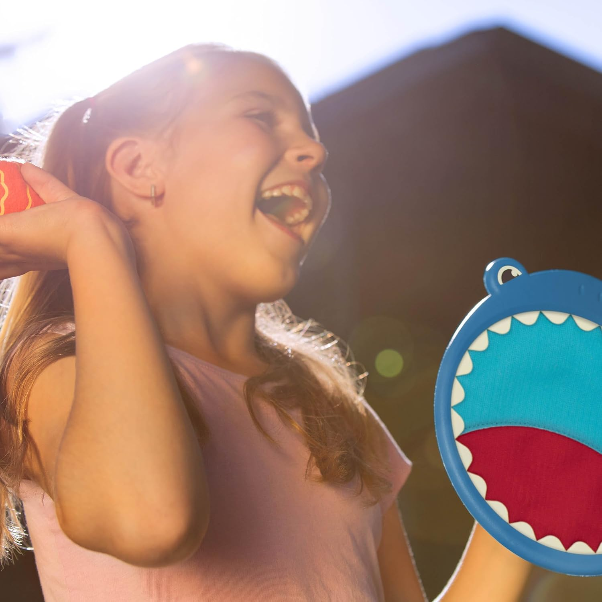
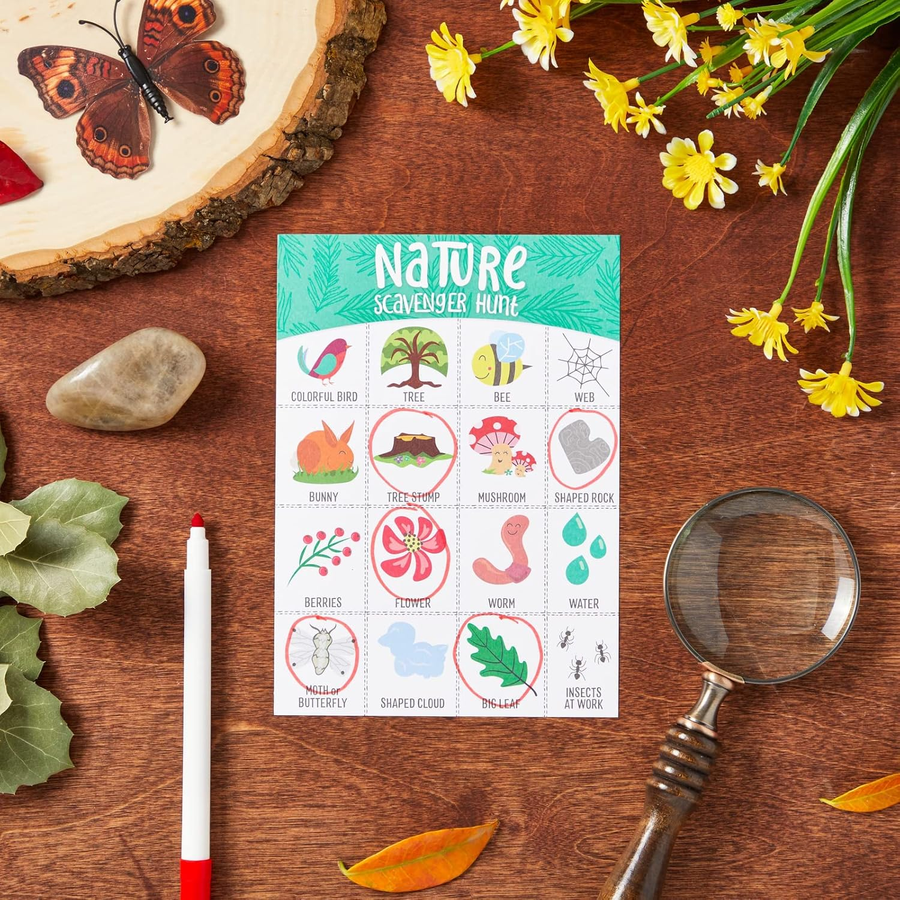
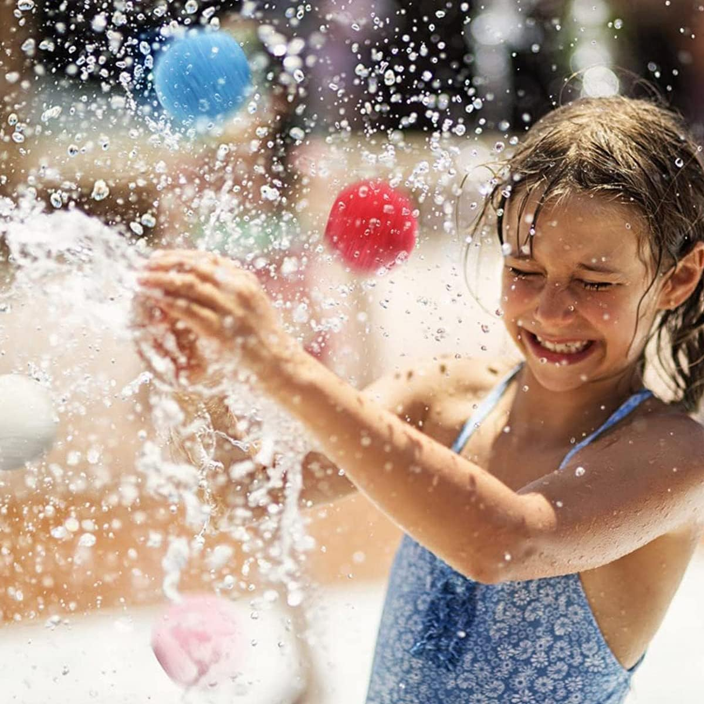
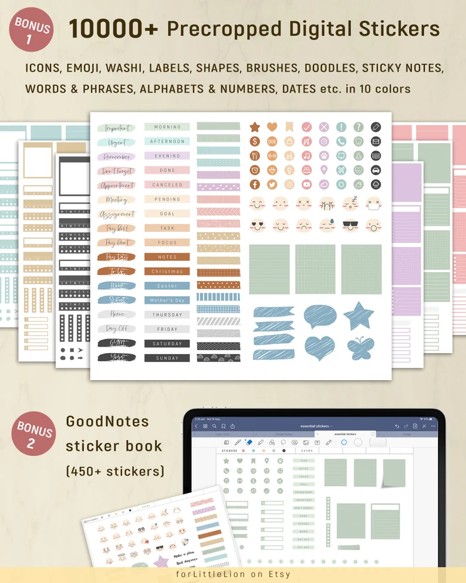

The summertime is the perfect time to get outside and have fun with your kids! Who knows, some of these activities might even make for a great family day trip. Luckily, there are tons of fun things you can do outdoors (some of which might seem like they require more preparation than others) to help keep your kids entertained this summer. 

**Kids love being outdoors, and there are plenty of activities they can do to stay entertained. Here are 9 awesome outdoor activities for kids.**

## 1\. Playing catch

This classic game is a great way for kids to get some exercise while having fun.

<figure>

<figure>

<figcaption>

1

</figcaption>

</figure>

<figure>

<figcaption>

2

</figcaption>

</figure>

<figure>

<figcaption>

3

</figcaption>

</figure>

</figure>

1. [B toys by Battat – Critter Catchers Finley the Shark – Ball and Catch Game Set for kids 3+ (3-Pcs)](https://amzn.to/3OEn4Rw)
2. [Activ Life Kid's Flying Rings \[2 Pack\] Fly Straight & Don’t Hurt - 80% Lighter Than Standard Flying Discs - Replace Screen Time with Healthy Family Fun - Get Outside & Play! Made in USA](https://amzn.to/3OomDev)
3. [Melissa & Doug Sunny Patch Spark Shark Toss and Catch Net Pool Game with 2 Balls](https://amzn.to/3QJXnRG)

## 2\. Going on a nature walk

Kids can explore their surroundings and learn about the world around them while getting some fresh air.

Use these as starting points!

<figure>

<figure>

<figcaption>

1

</figcaption>

</figure>

<figure>

<figcaption>

2

</figcaption>

</figure>

<figure>

<figcaption>

3

</figcaption>

</figure>

</figure>

1. [Nature Journal: A Kid's Nature Journal](https://amzn.to/3HSgmoT) 
2. [Backpack Explorer: Bug Hunt: What Will You Find?](https://amzn.to/3ngh6ee)
3. [Outdoor Scavenger Hunt for Kids, Nature Themed Camping Bingo Game Cards (50 Pack)](https://amzn.to/3nj8rHC)

## 3\. Building a fort

Let your kids use their imaginations to build the ultimate fort using blankets, pillows, and chairs.

<figure>

<figure>

<figcaption>

1

</figcaption>

</figure>

<figure>

<figcaption>

2

</figcaption>

</figure>

<figure>

<figcaption>

3

</figcaption>

</figure>

</figure>

1. [MITCIEN Kids Camping Play Tent with Toy Campfire / Marshmallow /Fruits Toys Play Tent Set for Boys Girls Indoor Outdoor Pretend-Play Game](https://amzn.to/3xQF8kT)
2. [TUMAMA Kids Tent Indoor Outdoor, Play Tent for 3 Years Old up, Tent for Kids with Camping Toys, Pop Up Tents for Kids, Pretend Play for Girl Boy, Toddler Tent Unisex](https://amzn.to/3OkNbgy)
3. [Lavievert Children Playhouse Huge Indian Canvas Teepee Kids Play House with Two Windows - Comes with A Canvas Carry Bag](https://amzn.to/3On4PR8)

## 4\. Drawing with chalk

Get creative with sidewalk chalk and draw pictures or write messages on the driveway or sidewalk.

<figure>

<figure>

<figcaption>

1

</figcaption>

</figure>

<figure>

<figcaption>

2

</figcaption>

</figure>

<figure>

<figcaption>

3

</figcaption>

</figure>

</figure>

1. [Melissa & Doug Sweet Shop Multi-Colored Chalk and Holders Play Set - 33 Pieces, Great Gift for Girls and Boys](https://amzn.to/3tZO2ev)
2. [DOODLE HOG Sidewalk Chalk Stencil Kit](https://amzn.to/3QJ8sCe)
3. [TBC The Best Crafts 3D Puffy Paint Sidewalk Chalk Paint 6 Neon Colors Washable Non Toxic Paint for Kids Ideal Craft Painting Supplies for Outdoor Garden Pavement Playground Drawing Games DIY Projects](https://amzn.to/3QMGxBC)

## 5\. Riding bikes

Bike riding is a great way for kids to get some exercise while exploring their neighbourhood.

<figure>

<figure>

<figcaption>

1

</figcaption>

</figure>

<figure>

<figcaption>

2

</figcaption>

</figure>

<figure>

<figcaption>

3

</figcaption>

</figure>

</figure>

1. [JOYSTAR Vintage 12 & 14 & 16 Inch Kids Bike with Basket & Training Wheels for 2-7 Years Old Girls & Boys (Green, Beige & Pink)Balance Bike for 18-36 Months](https://amzn.to/3QX1w4T)
2. [Toddlers Kids Balance Training Bicycle Adjustable Seat Detachable Pedals Indoor & Outdoor](https://amzn.to/3OmeCGQ)
3. [XJD 3 in 1 Kids Tricycle for 24 Months to 4 Years Old Boys Girls Toddler Trike for Kids Baby Balance Bike Toddler First Bike with Adjustable Seat Removable Pedal and 3 Wheel Convertible to 2 Wheel White](https://amzn.to/3OkAcvy)

## 6\. Water balloon fight

This is a fun activity for hot summer days! Fill up some water balloons and let the kids have at it. Just make sure they are supervised so that no one gets hurt.

<figure>

<figure>

<figcaption>

3

</figcaption>

</figure>

</figure>

1. [50 Pcs Reusable Water Balls, Splash Bombs Water Soaker Balls, Quick Fill Self Sealing, Highly Absorbent Quick Rebound Soft Cotton Water Balls with Mesh Storage Bag, Summer Beach Pools Outdoor Water Fight Water Polo Toy for Kids Adults (Mixed Color)](https://amzn.to/3xTfOdM)
2. [Water Blaster Gun for Kids,2 Pack of Water Blaster Pumping Water Pistol Water Fight Summer Toys Outdoor Swimming Pool Beach Water Toys for Kids 3 4 5 6 7 8 Years Old-Whale & Hippo](https://amzn.to/39OvaZ7)
3. [Water Guns for Kids - with Backpack, Water Gun Toys Pool Party Beach Games Outdoor Play Water Summer Kids Fight Activities Water Gun Toys for Boys and Girls (Chick)](https://amzn.to/3zVmniO)

## 7\. Hula hooping

Hula hooping is a great way to burn energy and have fun at the same time.

<figure>

<figure>

<figcaption>

1

</figcaption>

</figure>

<figure>

<figcaption>

2

</figcaption>

</figure>

<figcaption>

  

</figcaption>

</figure>

1. [Skip Ball for Kids, Foldable Ankle Skip Ball Flashing Jumping Ring Colorful Sports Swing Ball, Fitness Fat Burning Jump Rope Game for Boy and Girl](https://amzn.to/3A9j0Vm)
2. [Fitness Exercise Hoops for Kids, Detachable Adjustable Weight Size Plastic Colorful Hoops Toy](https://amzn.to/3OOk7hB)

## 8\. Skipping rope

Skipping rope is another classic game that is perfect for outdoor play

<figure>

<figure>

<figcaption>

1

</figcaption>

</figure>

<figure>

<figcaption>

2

</figcaption>

</figure>

<figure>

<figcaption>

3

</figcaption>

</figure>

</figure>

1. [aGreatLife Adjustable Bunny Jump Rope for Kids and Adults: Lightweight and Tangle-free Cotton Skipping Rope for Kids with Hand Carved Rabbit Wooden Handles - With Non-slip and Comfortable Grip - Great For Games and Exercise](https://amzn.to/39UmPTK)
2. [NUOBESTY 1pc Elastic Skipping Rope, Jump Rope Toy Stretch Rope Elastic Fitness Jump Game Rubber Band Skipping Toy Kid Jumping Rope Students Jump Elastic Band Toys Kids Skipping Rope Toys](https://amzn.to/3A6bQBt)
3. [Nona Kid 2 Pack Jump Rope - for Kids and Adults - Easily Adjustable with Anti-Slip Handles - Plus Game Book and Skipping Song Book](https://amzn.to/3OIPtGf)

## 9\. Playing in the dirt

One of the best outdoor activities for kids is playing in the dirt. Kids love getting dirty and it's a great way for them to explore their environment. Playing in the dirt can also teach kids about nature and how to take care of the earth.

