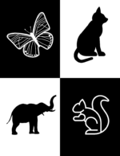
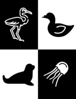

Tummy time is an important part of a baby's daily routine. It helps them strengthen their neck muscle and get some exercise between naps!

Download these cute black and white contrast cards to entertain your baby during tummy time!

## How to use

1. Download the files below
2. Print files on cardstock paper
3. Cut the page in half
4. Fold between the image, and use it to stand up the cards!

\[sc name="tummycards" \]\[/sc\]
