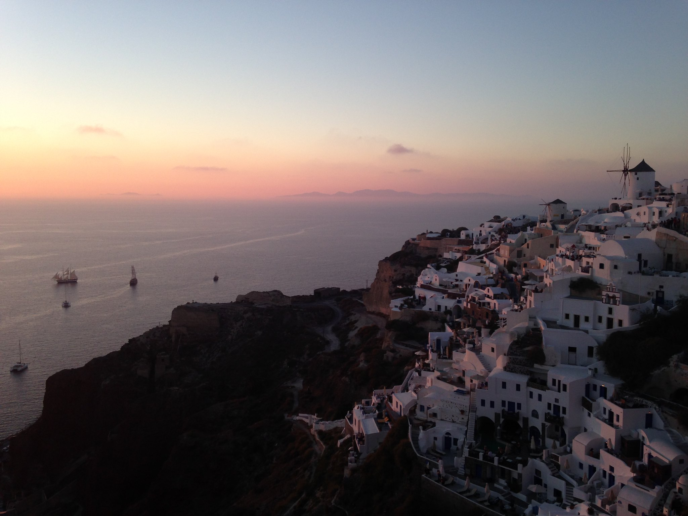

  
  
  
ahhh, who doesn't enjoy this view??  
  
My first impression of this island is that it's meant for taking in the sights and enjoyed slowly.  Looks like lots of nature hikes and ruins to check out.  
  
  
  

<iframe height="480" src="https://www.google.com/maps/d/u/0/embed?mid=ziQObVdti4OY.k8tOgzNiZbW4" width="640"></iframe>

  

|   name       |   description       |
| --- | --- |

| 1 |
| --- |
| 2 |
| 3 |
| 4 |
| 5 |
| 6 |
| 7 |
| 8 |
| 9 |
| 10 |
| 11 |
| 12 |
| 13 |
| 14 |
| 15 |

  

| Alonia Studios |  |
| --- | --- |
| Santorini Airport |  |
| Santo-Moto | moped rentals |
| Akrotiri Archaeological Site | Akrotiri Archaeological Site |
| Perissa - beach | Beach |
| Oia - Byzantine Castle  | Byzantine Castle  |
| Thera - volcano tour |  |
| Nea Kameni |   Volcano   |
| Pyrgos - Cultural village |  |
| Thirasia |  |
| Megalochori - Traditional Village |  |
| Akrotiri - Red beach |  |
| Paralia Vlichada - beach |  |
| Old Port - Fira - Karavolades Stairs |  |
| Oria Gallery |

## Excursions

  
volcano tour  
  
[http://www.santorini-excursions.com/excursions.php#\_=\_](http://www.santorini-excursions.com/excursions.php#_=_)
