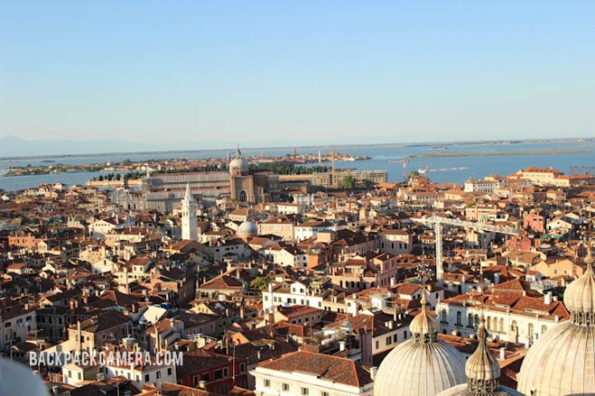
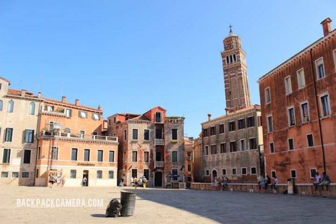
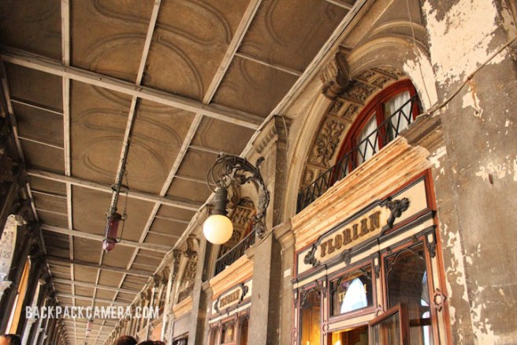
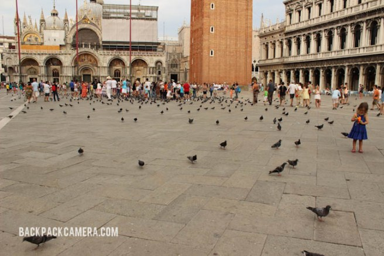
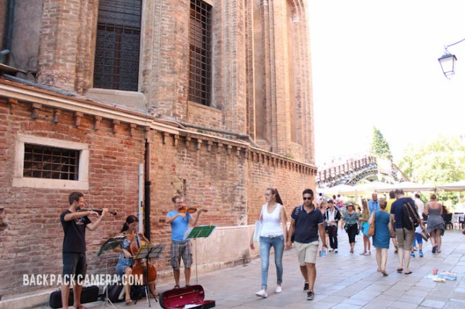

  
  
  
**1\. Go on top of the San Marco Campanile**  
  
I definitely recommend going on top fo the San Marco Campanile. This is the highest point in Venice and the view from up there is just breathtaking! You don’t realize how tightly packed everything in Venice is and how many more hidden alley ways there are until you’ve seen this view!  
  
  
**2\. Get lost in the maze that is Venice**  
  
You might just get around to doing this without trying! With all of Venice’s small alleyways, you just end up getting lost in the streets and going with the flow. I actually got lost on my second day since we just decided to explore without a plan. Thank god I just got a phone and internet plan so we were able to navigate out of the island just in time for our last bus home!  
  
  
**3\. Visit Caffè Florian**  
  
This coffee house is located at the Piazza San Marco and was established in 1720. This is by far the most expensive coffee house I’ve seen on my trip probably since it has so much history! Most people sit outside because there are parts of the caffe that are fenced off to preserve the intricate decorations inside.  
  
  
**4\. Surround yourself with pigeons at Piazza San Marco**  
  
Remember the Italian Job or any movies that’s been featured in Venice and they walk through a sea of pigeons? Well you can experience that at the Piazza San Marco! This famous Piazza is huge and that’s where the Doge Palace is located too. This piazza might look familiar because it’s been duplicated in Vegas at the Venetian Hotel.  
  
  
**5\. Enjoy live street performances**  
  
Once in a while you’ll see live performances on the streets. These are not your typical guitar and one man bands…these are high caliber string trios playing really good classical music. Listening to them just sets the mood perfectly.
