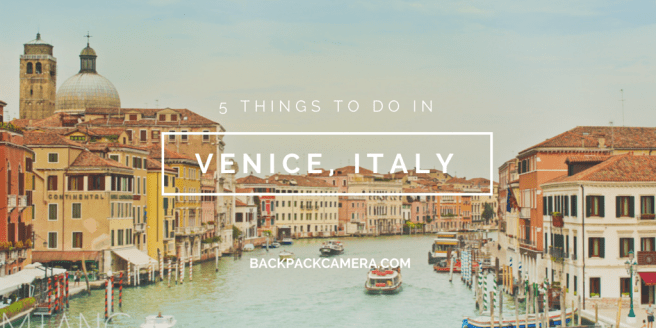
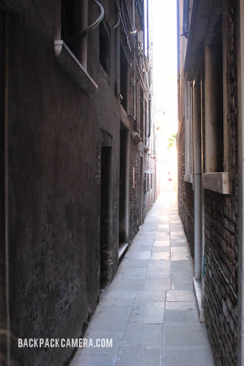
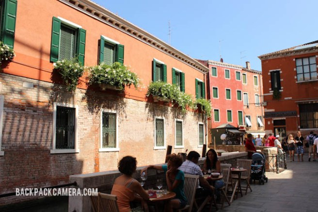
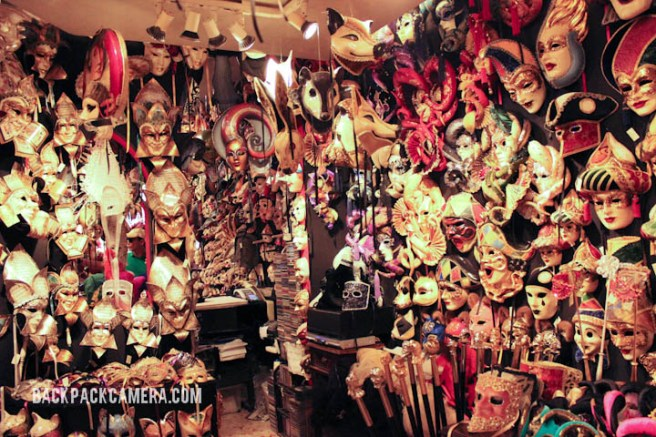
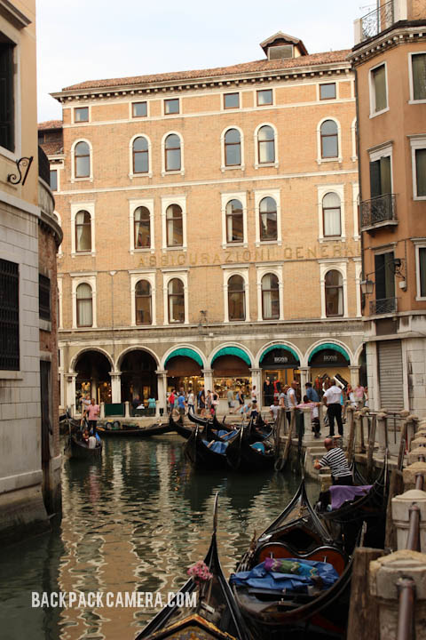
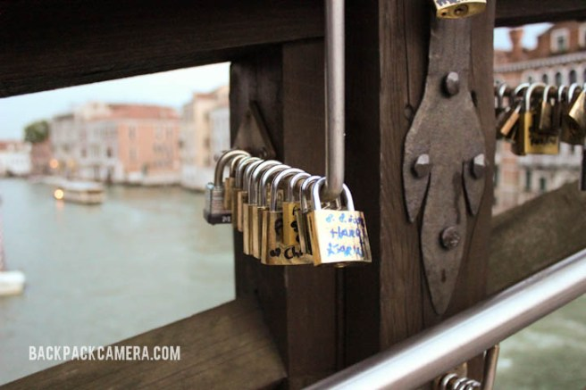

[DECEMBER 27, 2014](https://backpackcamera.wordpress.com/2014/12/27/5-things-to-do-in-venice-italy/) ~ [LEAVE A COMMENT](https://backpackcamera.wordpress.com/2014/12/27/5-things-to-do-in-venice-italy/#respond) ~ [EDIT](https://wordpress.com/post/76267229/619)

## 1\. Narrow alley ways

Experience being a local by entering any small passages ways you see.  There so much more hidden in these alley ways that shows the authenticity of this place than on the main streets.

## 2. Have dinner outside

Summer time is the perfect time to have a meal outside.  There are plenty restaurants that have sidewalk seating… a perfect way to enjoy the rustic scenes Venice…but beware of the mosquitoes! I found that there are lots of small mosquitoes in Venice that does their fair share of damage!

## 

## 3\. Buy a Venetian mask

Venice is famous for their Carnival where people disguise in elaborate masks, and hence being famous for their distinctive masks.  There are lots of mask shops around Venice from a wide price range.  There some that goes for hundreds of dollars!

## 4\. Ride the gondola

Just like in the movies, you can ride one of these gondolas with someone serenading you as you pass through the city’s romantic canals.  The gondola rides are not cheap though, it’s about 35 euros a person …but you’ll have to share with other people. If you want to have your own two person ride it’s about 70 euros a person for 30 mins.

## 5\. Put a love lock a bridge

Love locks are a thing now, and it is pretty obvious on the bridges of Venice.  You can find them on just about any bridge big or small, but this one bridge seemed to be the main one.  If you’re there on your honeymoon or with a significant other…you should leave a mark in this magical place!

