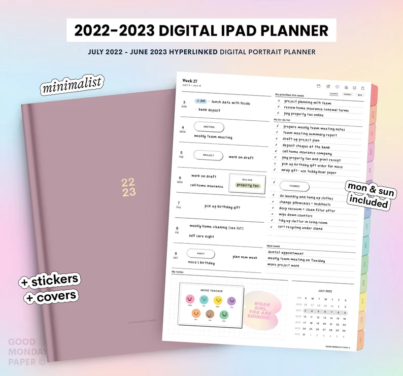

Are you considering a new bed for your little one? Montessori floor beds have gained popularity in recent years due to their child-centric design and numerous benefits. In this guide, we'll explore everything you need to know about Montessori floor beds, including answering the most commonly asked questions and providing a sneak peek into our top bed recommendations. So, let's dive in and discover why Montessori floor beds could be the perfect choice for your family!

## What are Montessori Floor Beds?

Montessori floor beds are low-to-the-ground, minimalist bed frames specifically designed for young children. Inspired by the Montessori educational philosophy, these beds encourage independence, freedom of movement, and self-regulation. They are typically made from natural materials like wood, and may have a simple slatted or platform design. Montessori floor beds allow children to access their sleeping space with ease, fostering a sense of autonomy and responsibility from an early age.

## What are the benefits of Montessori Floor Beds?

There are numerous benefits to using Montessori floor beds for your children, including:

- **Encouraging independence:** Montessori floor beds promote a child's ability to explore their environment, make choices, and develop self-confidence.

- **Safety**: With their low height, Montessori floor beds minimize the risk of injuries due to falls, making them a safer option for young children.

- **Simplicity:** Montessori floor beds offer a clutter-free, minimalist design that helps children focus on their rest and relaxation.

- **Ease of transition:** Montessori floor beds can ease the transition from a crib to a big-kid bed, reducing the anxiety often associated with this change.

## Are Montessori Floor Beds suitable for all ages?

  
While Montessori floor beds are designed primarily for toddlers and preschoolers, they can be suitable for children of various ages. However, it's essential to consider factors such as the child's development, mobility, and safety needs. For infants, it's crucial to follow safe sleep guidelines and ensure the sleeping space is free of loose bedding or other hazards. As children grow, you can customize the Montessori floor bed setup to suit their needs and preferences.  

## How to create a Montessori-friendly bedroom?

To create a Montessori-friendly bedroom, follow these tips:

- **Keep it simple:** Choose furniture with a minimalist design and avoid overcrowding the room.

- **Use natural materials:** Opt for furniture and decor made from natural materials such as wood, cotton, and wool.

- **Make it accessible:** Ensure that your child can easily reach their belongings, such as toys, books, and clothes.

- **Foster independence**: Create a space that encourages your child to explore, learn, and grow on their own terms.  
    

## Here are some Montessori floor bed options to consider

<figure>

<figcaption>

HAPPYMOON® Montessori floor bed with slats , Nursery crib, Kids bed Montessori toddler Platform bed, Children pen Play room

</figcaption>

</figure>

[Buy on Etsy](https://www.etsy.com/ca/listing/1095008745/happymoon-montessori-floor-bed-with?ga_order=most_relevant&ga_search_type=all&ga_view_type=gallery&ga_search_query=montessori+floor+bed&ref=sc_gallery-1-2&pop=1&sts=1&plkey=65fd9b00d1dfb669c497ced201d1dd13bfad58a8%3A1095008745)
