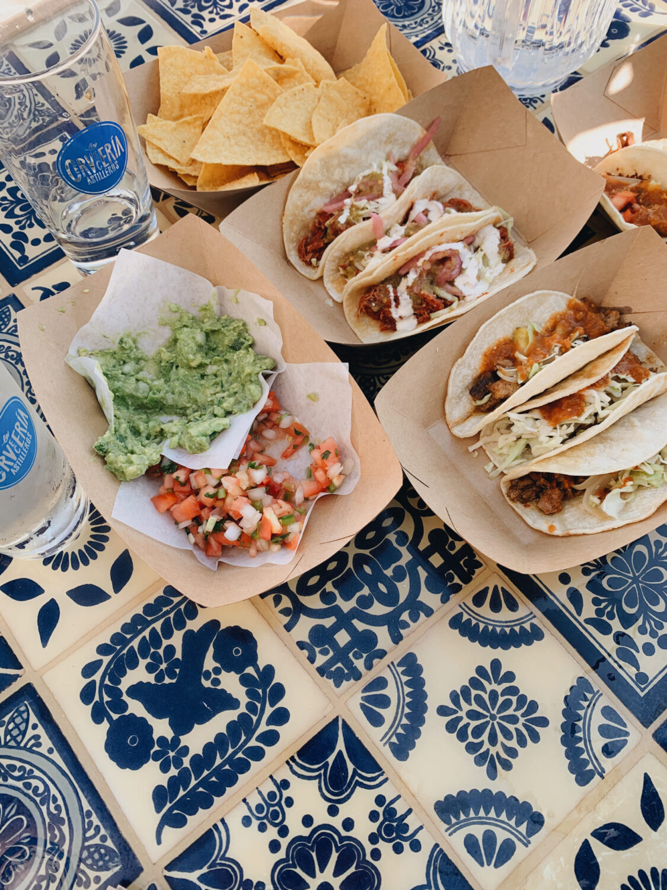
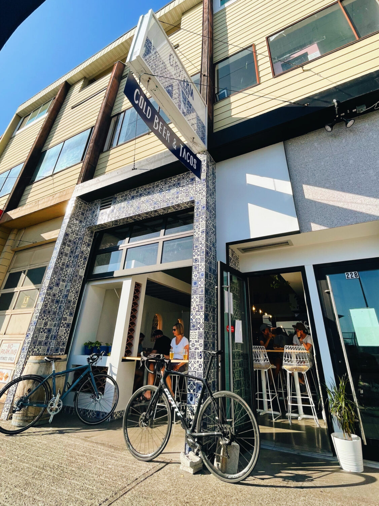

A new brewery located in North Vancouver's Lonsdale district reminds me of Mexico!

The tiles and the vibes of this place is so refreshing and the kind of place you'd want to hang out at in the summer.

Sit down for a cold one or grab some of their tacos and guac.

The shop itself is on the smaller side, but they also had a patio that was spacious.

> [
> 
> View this post on Instagram
> 
> ](https://www.instagram.com/p/CRZWYeGMVuK/?utm_source=ig_embed&utm_campaign=loading)
> 
> [A post shared by La Cerveceria Astilleros (@lacerveceriaastilleros)](https://www.instagram.com/p/CRZWYeGMVuK/?utm_source=ig_embed&utm_campaign=loading)

