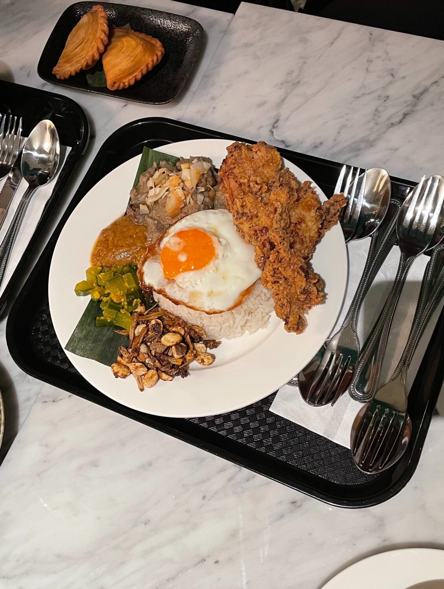
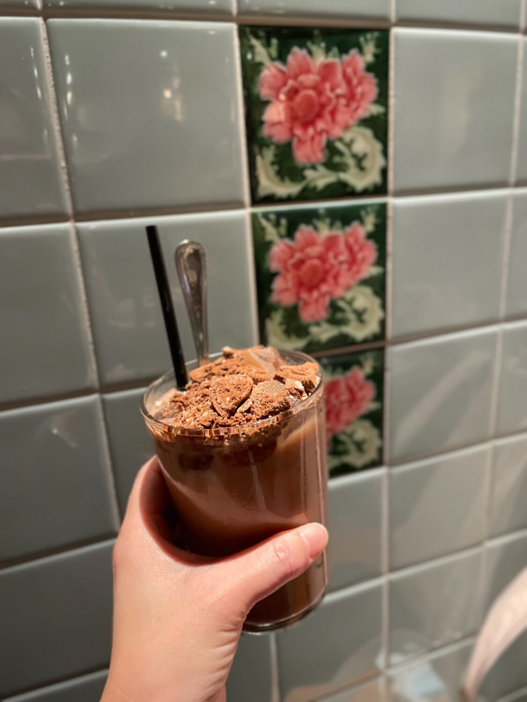

A new Singaporian restuarnat has opened up! I finally got to try this cute spot with all the famous Singaporian dishes.

The decor plays a homage to classic Asian cafes and you actually order at the counter so it feels like you're at the hawker's market and see them mix their famous teas at the counter.

Things to try are their laksa, nasi lemak, teh tarik (tea) and kaya toast!

> [
> 
> View this post on Instagram
> 
> ](https://www.instagram.com/p/CWJKv3ur3Mj/?utm_source=ig_embed&utm_campaign=loading)
> 
> [A post shared by Nancy Go Yaya Eating House (@nancygoyaya)](https://www.instagram.com/p/CWJKv3ur3Mj/?utm_source=ig_embed&utm_campaign=loading)

