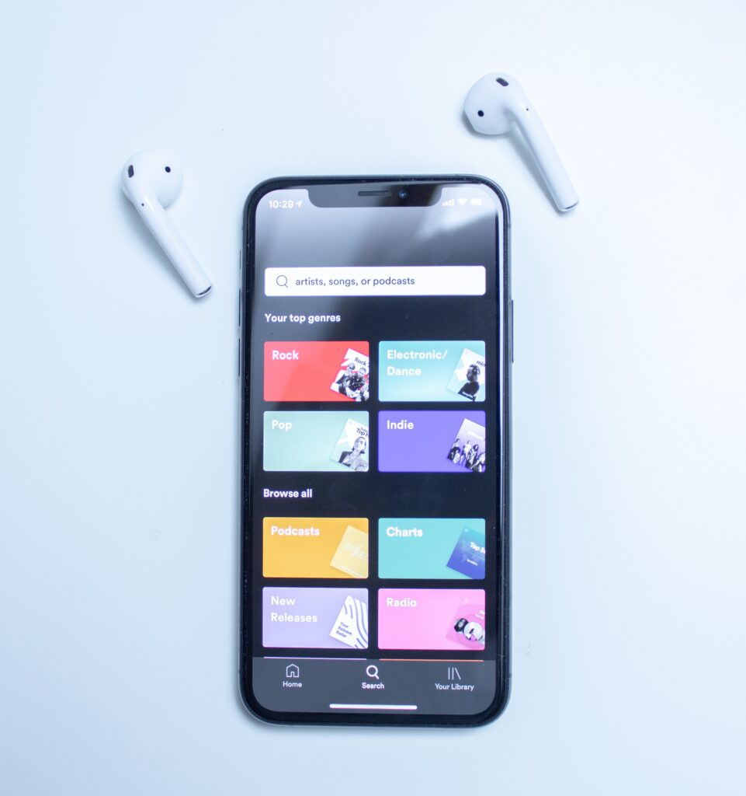

Mom brain is a thing.  Especially during the early days when you're sleep-deprived and can't remember anything! I am crediting my sanity to these apps that I've been using - and still using - now that my baby is a toddler!

#### 

#### [Huckleberry App](https://huckleberrycare.com/)

**Baby app for tracking sleep, food, and medicine**

I chose this app because of its aesthetically pleasing user interface and also usability!  I've downloaded a few apps that track baby sleep and feeds, but it didn't really flow the way it did when I need to track something in the middle of the night or on the go.  

My favourite feature is the Sweet Spot setting on the app! I had no idea how baby sleep worked in the first few weeks and was SO tired.  This Sweet Spot setting was a lifesaver and gave me some idea of when to put baby sleep down.  I was also able to get away with sleep training my little one because we had a good foundation from using this app (disclaimer: also also me Googling everything sleep).  The app is free(!) to use and I'm just amazed at how much value it gave without me paying a penny!

#### 

#### [Wonder Weeks App](https://www.thewonderweeks.com/about-the-wonder-week-app/)

#### **Baby app for tracking development**

I'm sure you've heard of some mention of the Wonder Weeks, if not, you have now.  Baby development is such a complex and amazing thing to watch.  And because of these developmental phases, your baby may go through some more than usual fussy periods.  When I heard about Wonder Weeks, I knew I need to know more, but most of all, I wanted to know when these periods happen so I can prepare myself!  

The Wonder Weeks app is a paid app, but I thought it was worth purchasing because it mentally prepared me for these fussy periods and it also helped me understand my baby more.  The knowledge that the app provided me about leaps or developmental phases really helped remove some frustration when my baby was fussy.  It gave me some relief to know that the sleepless nights will come to an end and everything was "normal".

If you want to take a deeper dive into the research behind Wonder Weeks, they actually first started off as a book.  There's more information in the book itself, but the app times up with your baby's growth so know which weeks they'll be going through leaps without you having to calculate it yourself.  The only thing I wish it had was notifications on my phone when a leap is near.  But I check it often enough that I have a mental note of when it happen.

#### Spotify

**Baby app for white noise**

There are tons of apps out there for white noise, but I honestly just found a playlist on Spotify!  Thought, I have the paid version of Spotify, so it doesn't interrupt/ startle your sleeping baby with an ad while they're sleeping 😱 

Check back for more!

\[sc name="affiliate-disclosure" \]\[/sc\]
