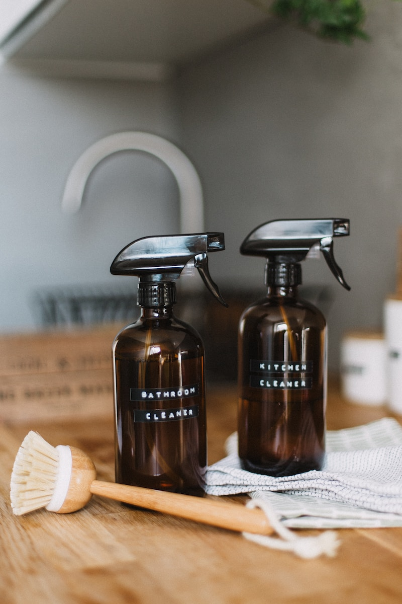

There's nothing like kickin' back in a squeaky-clean and super-organized home, am I right? Picture this: you walk in after a looong day, and bam! Instant stress relief. But let's get real, folks – keeping things neat and tidy is no piece of cake. Lucky for ya, we've got a sneaky little trick up our sleeves: Amazon! That one-stop shop has some seriously cool stuff that'll turn your messy den into a zen den.

In this blog, we're gonna take you on a wild ride through Amazon's must-have goodies for a spic-and-span, clutter-free home. We're talkin' genius space-savers, life-changing cleaning gadgets, and more. It doesn't matter if you're a seasoned neat freak or a first-time declutterer, our top picks will totally change the game and make chores way less of a drag.

## Tineco Cordless Handheld Vacuum

The Tineco Cordless Handheld Vacuum has completely transformed my cleaning routine, and I couldn't be happier! Switching from a clunky corded vacuum to this lightweight wonder has been a revelation. Its suction power is simply outstanding – it effortlessly sucks up all the dirt and debris, leaving my floors spotless and my carpets looking brand new. The convenience of going cordless is a game-changer; I can move around my entire house without any restrictions, making cleaning sessions a breeze.

One of the best features is its ergonomic design, which makes handling it a joy. The attachments are super handy for getting into tricky spots, and I love that it comes with a wall-mounted charging dock, always keeping it ready for action. The battery life is impressive too – it lasts through my whole cleaning spree without a hitch. Not only does it clean like a champ, but the multi-layer filtration system also ensures the air in my home stays fresh and free from allergens. Emptying the dirt cup is a breeze, and the whole process is mess-free. In short, the Tineco Cordless Handheld Vacuum has truly elevated my cleaning game, and I highly recommend it to anyone looking for a powerful, hassle-free cleaning solution.

https://www.amazon.com/Tineco-Cordless-Handheld-Charging-Hardwood/dp/B07R9KDNKL/?encoding=UTF8&pd\_rd\_w=Q15ZX&content-id=amzn1.sym.952cfb50-b01e-485f-be6e-00434541418b%3Aamzn1.symc.e5c80209-769f-4ade-a325-2eaec14b8e0e&pf\_rd\_p=952cfb50-b01e-485f-be6e-00434541418b&pf\_rd\_r=6629CVMHCBC5JRQR9AWB&pd\_rd\_wg=B1Okv&pd\_rd\_r=2e2878a5-b133-4a8d-9665-89cdcbaeb6f7&ref=pd\_gw\_ci\_mcx\_mr\_hp\_atf\_m

## Electric Power Mop Cleaner

I recently purchased the Electric Power Mop Cleaner, and it has truly been a game-changer in my cleaning routine! This powerful mop takes the hassle out of scrubbing and polishing my floors. With its strong motor and rotating microfiber pads, it effortlessly glides across different surfaces, leaving them sparkling clean. What impressed me the most is its versatility; it works wonders on hardwood, tiles, and even vinyl floors, making it a one-stop solution for my entire home.

The reusable microfiber pads are an eco-friendly bonus, saving me money on disposable pads while also being easily washable. The long-lasting battery life ensures that I can tackle multiple rooms without needing a recharge. Plus, the adjustable handle and lightweight design make it comfortable to use, even for extended cleaning sessions. The Electric Power Mop Cleaner has taken the drudgery out of mopping, and I couldn't be happier with the results. If you're on the hunt for a reliable and efficient mop that'll make your floors shine effortlessly, this is the one to go for!

https://www.amazon.com/Electric-Cleaning-Cleaner-Reusable-Microfiber/dp/B09C5RK8J9/ref=sr\_1\_18?crid=17JPOY7QNDCNZ&keywords=power+mop&qid=1689743898&sprefix=power+mo%2Caps%2C318&sr=8-18
