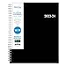
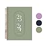
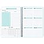
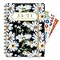
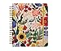

In today's digital age, the allure of paper planners remains steadfast. There's something incredibly satisfying about physically writing down your tasks, appointments, and goals. If you're in the market for a new planner for 2024, Amazon offers a plethora of options to suit various needs and preferences. In this blog post, we'll delve into Amazon's best-selling paper planners for 2024, each with its unique features and benefits.

## 1\. [Blue Sky 2023-2024 Academic Year Weekly and Monthly Planner](https://www.amazon.com/dp/B0BS4827KF)

### Price: $10.17

### Size: 8.5" x 11"

  
The Blue Sky Academic Year Planner is a classic choice for students, professionals, and anyone who likes to keep their life organized. With a flexible cover and wirebound design, this planner is both durable and easy to use. The 8.5" x 11" size provides ample space for jotting down tasks, appointments, and notes. The weekly and monthly layouts offer a comprehensive view of your schedule, making it easier to plan and prioritize.

**Why It's a Best-Seller:**  
The Blue Sky planner combines functionality with affordability. At just $10.17, it offers all the essential features you'd expect in a high-quality planner without breaking the bank. Its academic year format also makes it ideal for students and educators.

[buy now](https://www.amazon.com/dp/B0BS4827KF)

## 2\. [Rileys 2023-2024 18-Month Academic Weekly Planner](https://www.amazon.com/dp/B09WNM1Y4D)

### Price: $12.99

### Size: 8 x 6 Inch

  
The Rileys 18-Month Academic Weekly Planner is a compact yet feature-rich option. Its 8 x 6-inch size makes it portable and convenient for on-the-go planning. The planner comes with a flexible cover and twin-wire binding, ensuring durability. It also includes dedicated notes pages, allowing you to jot down important reminders or creative ideas.

**Why It's a Best-Seller:**  
What sets this planner apart is its 18-month format, providing extended planning capabilities. The additional notes pages are a thoughtful touch, making it a versatile choice for both personal and professional use.

[buy now](https://www.amazon.com/dp/B09WNM1Y4D)

## 3\. [Undated Weekly Goals Notebook](https://www.amazon.com/dp/B091F4B9M6)

### Price: $6.99

### Size: A5 (5.7 x 8.0 inches)

  
The Undated Weekly Goals Notebook is perfect for those who prefer a more flexible planning system. This A5-sized planner comes with spiral binding, making it easy to flip through pages. Since it's undated, you can start using it at any time of the year without wasting pages.

**Why It's a Best-Seller:**  
The undated format and affordable price point make this planner a hit among users who want maximum flexibility. At just $6.99, it's a budget-friendly option that doesn't skimp on quality.

[buy now](https://www.amazon.com/dp/B091F4B9M6)

## 4\. [Ymumuda 2023-2024 Planner](https://www.amazon.com/dp/B0BFHNP9TY)

### Price: $6.59

### Size: 8.4" X 6"

  
The Ymumuda Planner is a 12-month planner that runs from July 2023 to June 2024. It features a spiral binding and comes with stickers, an elastic closure, an inner pocket, and coated tabs. The floral design adds a touch of elegance, making it not just functional but also aesthetically pleasing.

**Why It's a Best-Seller:**  
This planner offers a host of additional features like stickers and an inner pocket, all at an incredibly affordable price of $6.59. Its mid-size dimensions make it portable while still providing enough space for all your planning needs.

[buy now](https://www.amazon.com/dp/B0BFHNP9TY)

## 5\. [RIFLE PAPER CO. 2024 Blossom 17-Month Hardcover Spiral Planner](https://www.amazon.com/dp/B0BWSL1KKH)

### Price: $40.00

### Size: 10" x 8.5"

  
The RIFLE PAPER CO. Blossom Planner is a premium option for those who want to splurge a little. This 17-month hardcover planner comes with weekly and monthly pages, inspirational quotes, sticker sheets, and an illustrated pocket folder. The spiral binding allows for easy page-turning, and the 10 x 8.5-inch size offers plenty of space for detailed planning.

**Why It's a Best-Seller:**  
This planner is a best-seller because of its luxurious features and design. The hardcover ensures durability, while the additional features like sticker sheets and inspirational quotes make planning a more enjoyable experience.

[buy now](https://www.amazon.com/dp/B0BWSL1KKH)

* * *

Choosing the right planner can make a world of difference in how organized and productive you feel. Whether you're a student, a professional, or someone looking to better manage their time, there's a planner on this list for you.
