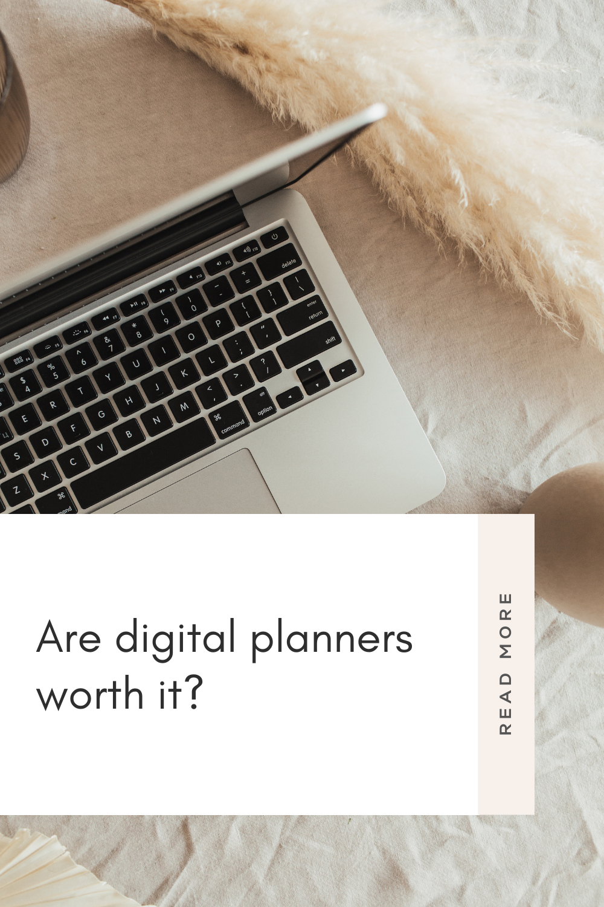
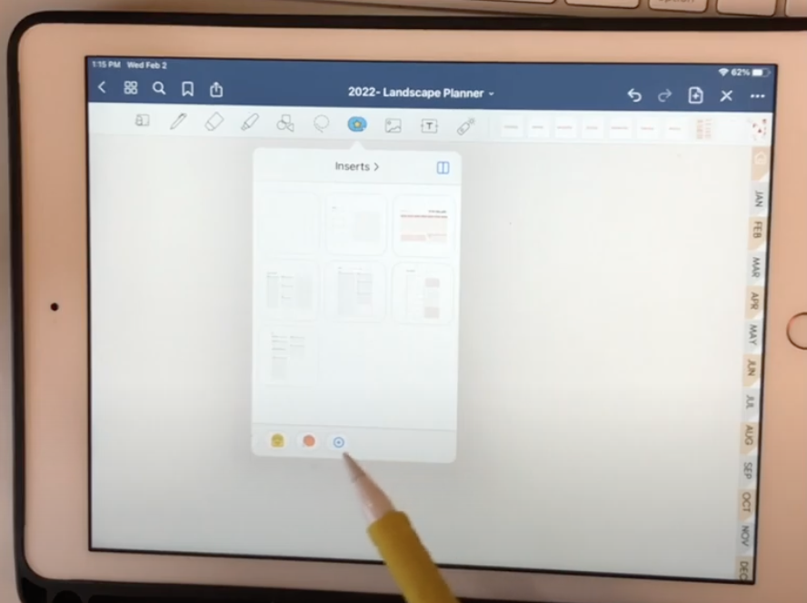

Digital planners are becoming increasingly popular, **but are they worth the investment?** The answer may depend on your needs and preferences.

Like any planning system, digital planners can help you stay organized and on track. Here are some benefits of using a digital planner!

## Cost effective

You can often find digital planners for a fraction of the price of a traditional paper planner.

## Environmentally friendly

If you're looking to be more eco-conscious, a digital planner is a great option. There's no need to use paper or other materials, and you can even recycle your old digital planner when you're done with it.

## Customizable

With a digital planner, you can usually customize it to fit your needs and preferences. This might include changing the layout, adding or removing features, or choosing from a variety of pre-made templates.

## Portable

A digital planner is easy to take with you wherever you go. You can access it on your phone, tablet, or laptop – wherever is most convenient for you. You can download your digital planner on any number of devices, such as a smartphone or tablet, and have it ready to go at any time.

## Easy to use

Digital planners are typically very user -friendly. Many of them use drag-and-drop features that make budgeting easy as pie!

## Easy to sync

Most digital planners will sync quickly and easily with other devices, so you can access your information from wherever you are.

## Free to start

Some digital planners are 100% free - like ours! You can download your own started planner below and test out digital planning for yourself!  

\[sc name="gumroad\_freedigitalplanner" \]\[/sc\]

**Related Posts**
