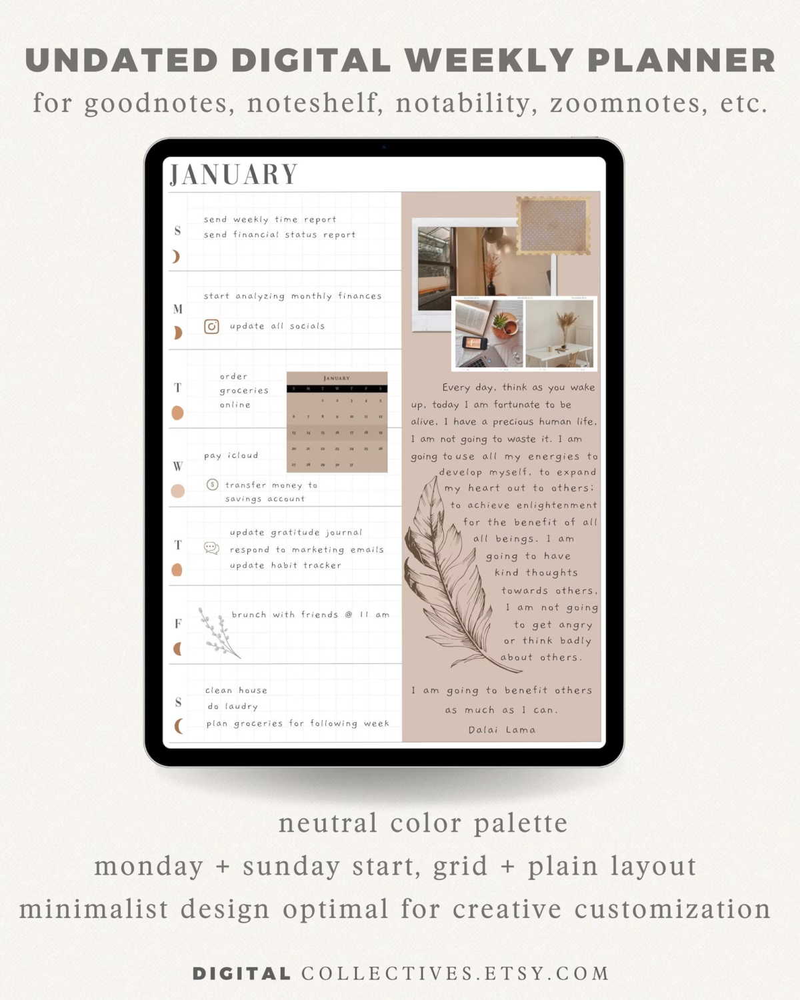
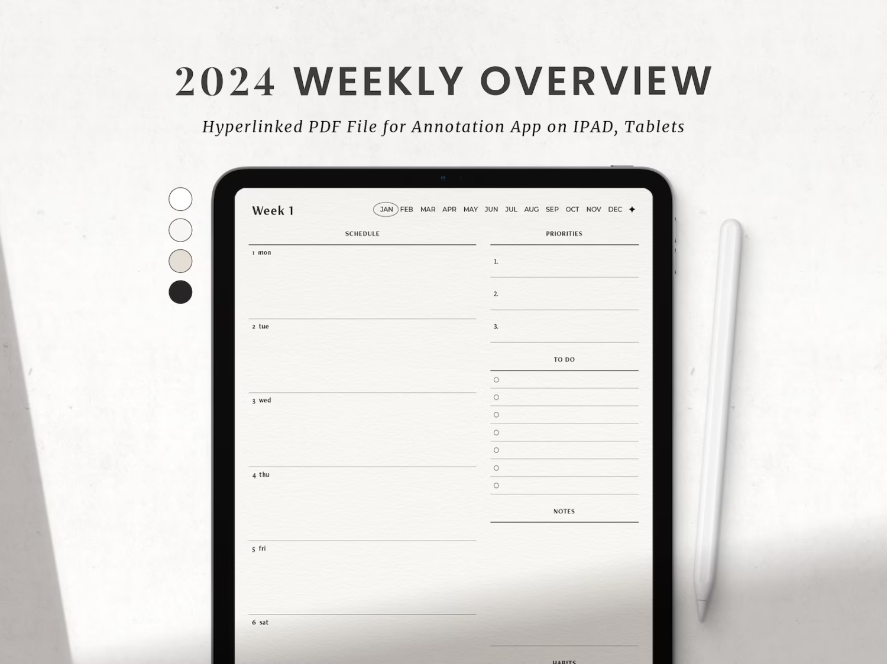
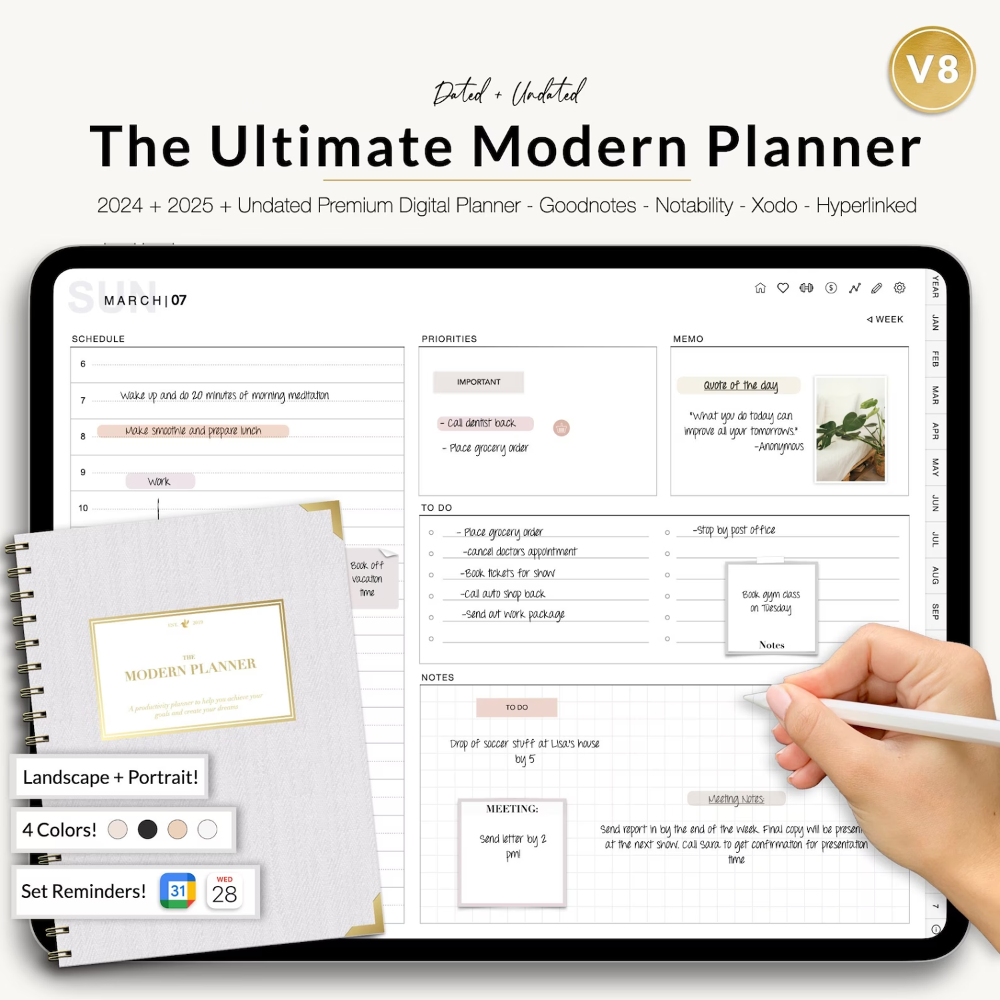
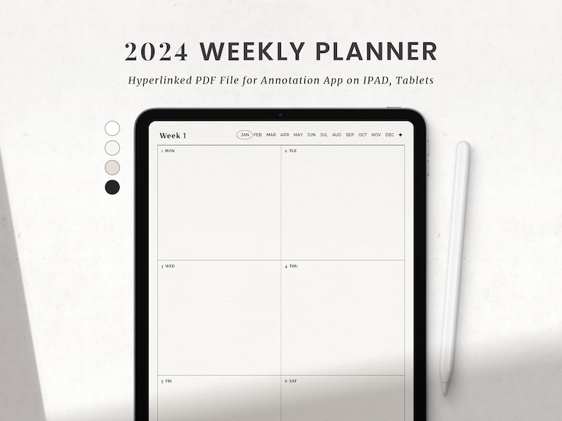
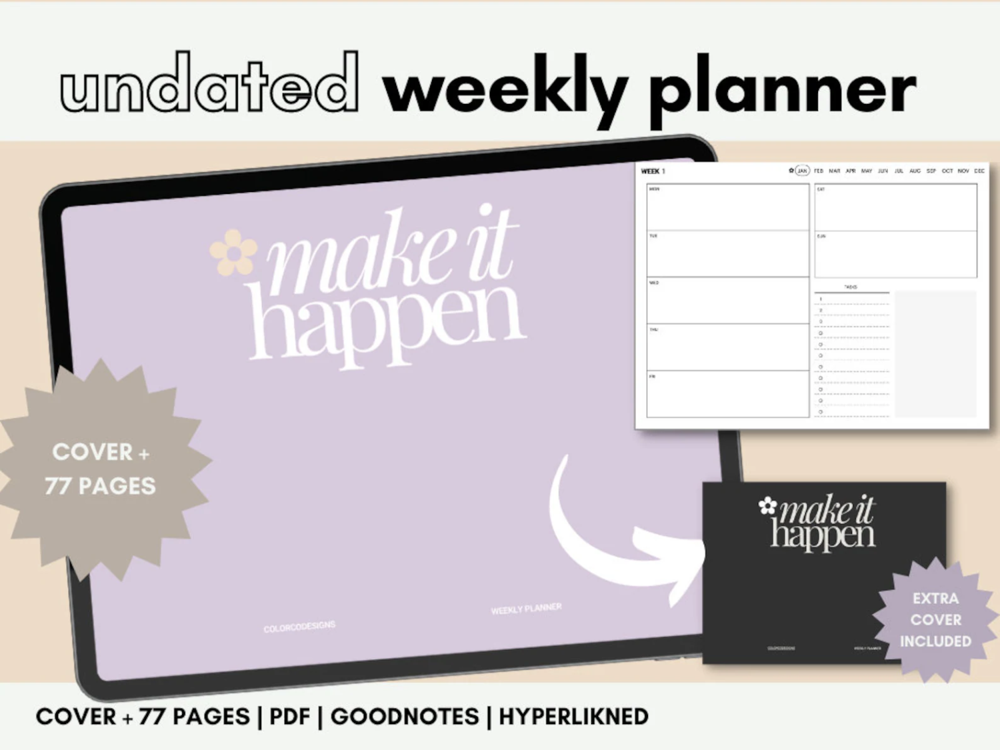

Are you on the hunt for the perfect digital planner to keep your life in check for 2024? Well, you're in luck! I've been diving deep into the world of digital planners on Etsy, and let me tell you, I've found some absolute gems that are sure to make your planning heart skip a beat.

From sleek, undated layouts for those who hate being boxed in by dates, to meticulously designed planners tailored for GoodNotes users, there's something for everyone. Whether you're a student juggling assignments, a busy professional keeping track of meetings, or just someone who loves to keep their life neatly organized, these planners are your digital saviors.

In this post, I'm going to walk you through some of the most eye-catching, functional, and downright gorgeous digital planners I've stumbled upon. Each one has its unique flair and functionality, catering to different styles and needs.

### Undated Digital Weekly Planner

This undated digital weekly planner offers a flexible and customizable approach to organizing your schedule. Perfect for those who prefer a non-restrictive planning system, it allows you to start at any point in the year without wasting pages. The planner is designed with a clean, minimalist layout, making it easy to view your weekly tasks and appointments at a glance. It's compatible with various digital note-taking apps, ensuring a seamless integration into your digital lifestyle.

[View this product on Etsy](https://www.etsy.com/ca/listing/1014385694/undated-digital-weekly-planner-weekly?ga_order=most_relevant&ga_search_type=all&ga_view_type=gallery&ga_search_query=digital+weekly+planners&ref=sr_gallery-1-2&pro=1&dd=1&organic_search_click=1)

### Digital Weekly Planner 2024 for GoodNotes

This Digital Weekly Planner for 2024 is specifically tailored for GoodNotes users, offering a streamlined and efficient way to manage your weekly schedule. It features a well-organized layout that includes daily sections, a to-do list, and a notes area, making it ideal for those who like to keep detailed track of their weekly tasks and appointments. The planner's design is both functional and aesthetically pleasing, ensuring that planning is not only productive but also enjoyable. Its digital format allows for easy modifications and updates, making it a versatile tool for personal or professional use.

[View this product on Etsy](https://www.etsy.com/ca/listing/1180169451/digital-weekly-planner-2024-goodnotes?ga_order=most_relevant&ga_search_type=all&ga_view_type=gallery&ga_search_query=digital+weekly+planners&ref=sr_gallery-1-3&bes=1&sts=1&dd=1&organic_search_click=1)

### 2024 Digital Planner for GoodNotes

This 2024 Digital Planner is a comprehensive tool designed for GoodNotes users. It offers a detailed and well-structured layout for managing your yearly, monthly, and weekly schedules. The planner includes various features such as goal setting pages, to-do lists, and note-taking sections, making it a versatile choice for both personal and professional planning. Its user-friendly design ensures easy navigation and customization, allowing you to tailor it to your specific needs. The planner's digital format is perfect for those who prefer an eco-friendly and paperless way of organizing their life.

[View this product on Etsy](https://www.etsy.com/ca/listing/783042303/2024-digital-planner-goodnotes-planner?ga_order=most_relevant&ga_search_type=all&ga_view_type=gallery&ga_search_query=digital+weekly+planners&ref=sr_gallery-1-7&pro=1&bes=1&sts=1&dd=1&organic_search_click=1)

### Digital Planner for GoodNotes and iPad

This Digital Planner is designed for GoodNotes and iPad users, offering a dynamic and interactive way to organize your schedule. It features a beautifully crafted layout that is both intuitive and visually appealing, perfect for those who appreciate a blend of functionality and design. The planner includes monthly, weekly, and daily views, along with additional sections for notes and personal goals. Its compatibility with the iPad and GoodNotes app ensures a smooth and responsive user experience, making planning and tracking your activities more efficient and enjoyable.

[View this product on Etsy](https://www.etsy.com/ca/listing/979834364/digital-planner-goodnotes-planner-ipad?ga_order=most_relevant&ga_search_type=all&ga_view_type=gallery&ga_search_query=digital+weekly+planners&ref=sc_gallery-1-6&pro=1&bes=1&sts=1&dd=1&plkey=9dba00a1168e7f99e6450eabac282414958c5779%3A979834364)

### 2024 Weekly & Monthly Digital Planner

This 2024 Weekly & Monthly Digital Planner is a comprehensive tool for detailed time management and organization. It offers a clear and well-structured layout for both monthly overviews and detailed weekly planning. The planner is designed to cater to various planning styles, with ample space for appointments, tasks, and notes. Its digital format makes it highly adaptable and convenient for use on multiple devices. Ideal for professionals, students, or anyone looking to stay organized, this planner combines practicality with a sleek, modern design.

[View this product on Etsy](https://www.etsy.com/ca/listing/1179581717/2024-weekly-monthly-digital-planner?ga_order=most_relevant&ga_search_type=all&ga_view_type=gallery&ga_search_query=digital+weekly+planners&ref=sr_gallery-1-15&sts=1&dd=1&organic_search_click=1)

### 2024 Undated Simple Aesthetic Digital Planner

This 2024 Undated Simple Aesthetic Digital Planner is perfect for those who value flexibility and simplicity in their planning. Being undated, it allows you to start using it at any point in the year without being constrained by dates. The planner features a minimalist design that focuses on functionality, offering a clutter-free environment for organizing your daily, weekly, and monthly tasks. Its simple aesthetic is pleasing to the eye, making planning a more relaxed and enjoyable experience. Compatible with various digital devices, this planner is ideal for anyone seeking a straightforward and efficient way to manage their time.

[View this product on Etsy](https://www.etsy.com/ca/listing/1520686310/2023-undated-simple-aesthetic-digital?click_key=431722ad453d8fa4fa2204ceebe0a65acb3e3f0a%3A1520686310&click_sum=9ff889fe&ref=shop_home_active_2)

As we wrap up our exploration of these fantastic digital planners, it's clear that the world of digital organization has something for everyone. Whether you're a fan of the sleek, minimalist design of the Undated Simple Aesthetic Planner or you're drawn to the detailed and comprehensive layout of the 2024 Weekly & Monthly Digital Planner, there's a perfect match for your planning style.

What's truly exciting about these planners is their versatility. They're not just about keeping track of appointments and to-dos; they're about bringing a sense of order and calm to our often chaotic lives. And the best part? They're all just a click away on Etsy, ready to be downloaded and integrated into your daily routine.

So, whether you're a busy professional juggling multiple projects, a student planning your academic year, or just someone looking to bring a bit more organization into your life, these digital planners are your companions in the journey towards better time management and increased productivity.

Remember, the right planner can do more than just remind you of your next meeting; it can be a tool for mindfulness, a space for reflection, and a stepping stone to achieving your goals. So, go ahead, choose the one that resonates with you, and let's make planning a part of our journey to a more organized and fulfilling life!

\[sc name="gumroad\_freedigitalplanner" \]\[/sc\]
