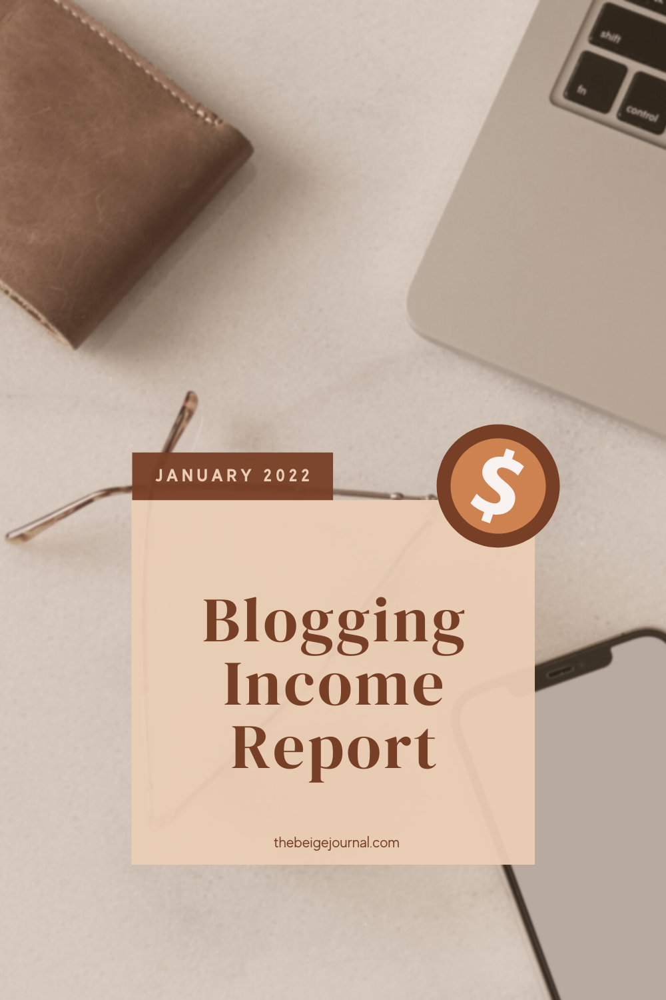

## January 2022

A new year means new ventures!  I started this in the last few months of 2021 as a “home” for all my freebies and resources.  This year, I want to grow it and see how far I can go!

> If you’d like to follow along with how I’m monetizing my blog and other online platforms, then check back every month for my income reports!

As a disclosure, this is not my first time making money online, so I already have some experience. [You can see my old income reports here](https://thebeigejournal.com/entrepreneurship/income-report-%f0%9f%92%b0-may-2016/) - but I've taken a huge hiatus since then and am coming back with little to now product and a brand new blog!  Nothing comes without some trial and error!  I’m coming back refreshed with a new mindset to try and grow my digital strategies.  My goal this time is to share it here because I know people that are just starting out would love to see all the things that go on behind the scenes!

Making money online has always been fascinating for me because you can do this at the comfort of your own home with little start up cost.  For the most part, I have been creating digital products to sell on my Etsy ([check out my shop](https://www.etsy.com/ca/shop/ColorCoordinated?ref=seller-platform-mcnav)) to make money - the “traditional” way - where you exchange goods for money.  This time, I would like to try growing my income streams by creating content - like this blog!

**A blog - you must think - isn’t that old school?** Well, it’s rare that people refer to themselves as bloggers nowadays.  Most people are content creators - most popular for creating content on Instagram and TikTok.  But I’m not here trying to chase those kinds of followers.  To be honest, I just don’t have time for that right now.  That’s why I’ve decided to focus on growing a blog and I want to show you the process in 2022 - and that it could be possible to earn money without being an influencer.

Well, enough talk, let's dig into our income report for 2022.

Here are a few things I’ll cover in this report

- Monthly traffic/ followers
- Breakdown of income
- Summary of what I did this month
- Goals for next month

## Monthly Traffic

Because more traffic means more eyeballs on your product and content!  This is the most important thing to optimize and grow to be visible online.

**January traffic**

Blog: 9,690 views

Pinterest: 742 followers

Youtube: 746 subscribers

Instagram: 2116 followers (something that I’m not actively growing)

## Income

- [Etsy shop](https://thebeigejournal.com/shop): $28.55

- Affiliates: $144.25

- Adsense: $60.52

## Expense

\* read about all the tools I use in the section below!

- [Canva Pro](https://thebeigejournal.com/Canva): $8.50

## Net Profit

$224.82

## What did I do to grow in January?

Because I’m in the stationery niche, January is the high season! People are looking for new planners and stationery to get their new year organized! 

**Youtube**

[I made a video of a flip through of my digital planner](https://youtu.be/_mSMu9z6EZc) (and a freebie) and it was great at generating traffic to my website.  Most people were coming through for the freebie download, but I was also able to grow my email list.

This month I haven’t really been doing too many new things.  I’ve been really focused on Youtube for the last few months and learning all about it.  I didn’t know Youtube can be such a traffic generator, but it can be!

## Tools I use

I’m a big advocate for using free software for as long as possible! Here are the tools you can start using for free!

**[Canva](https://thebeigejournal.com/Canva)** \- for all my designing needs.  They also provide scheduling on social media so I don’t have to export all my designs!  It really streamlines things when I don’t have to download and upload again and my designs are all in one place!  

**[Tailwind](https://thebeigejournal.com/tailwind)** - Pinterest has been THE most recommended social media for bloggers to get into, so I’ve been using Tailwind for my pinterest scheduling and designing.  This tool helps me create all my monthly pins in less than 30 mins!  It’s such a time saver when you’re expected to create fresh pins (which means different/ new images) all the time!

**[Mailerlite](https://thebeigejournal.com/mailerlite)** - from all the email marketing platforms I’ve used, Mailerite has been the easiest and most versatile one I’ve used.  It’s also very generous with their free tier so you don’t have to pay while you’re growing your list.  On their free plan, you also have lots of features that you normally won’t get from other platforms like the use of RSS feeds and automation for your emails.

## Goals for next month

Continue to grow my traffic.  I’m getting more and more strapped for time because of my kids, so I really want to find the most optimal way to grow my blog and business.  I’ve heard lots of good things about 

**Spend more time on Pinterest**

I’ve heard lots of good things about Pinterest, and after all these years, I’ve never really dug deep into its benefits.  So I’ll be spending more time using Pinterest next month!

**Streamline + schedule**

I’ll do my best to schedule more things ahead of time and build a process for all things I need to get done!  I always say this, but I have a shiny object syndrome, so sometimes I get distracted and work on something new and exciting instead of focusing on what works!

I hope you enjoyed my income report this month!

**If you want to see more of this, sign up for my newsletter below so you don’t miss out on my updates!**

\[mailerlite\_form form\_id=4\]
