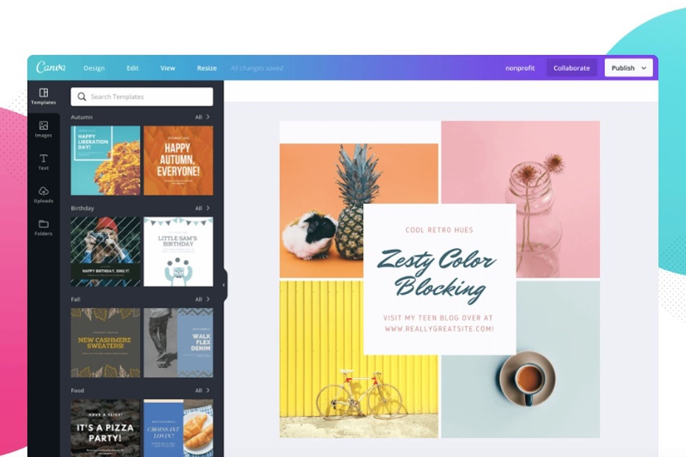
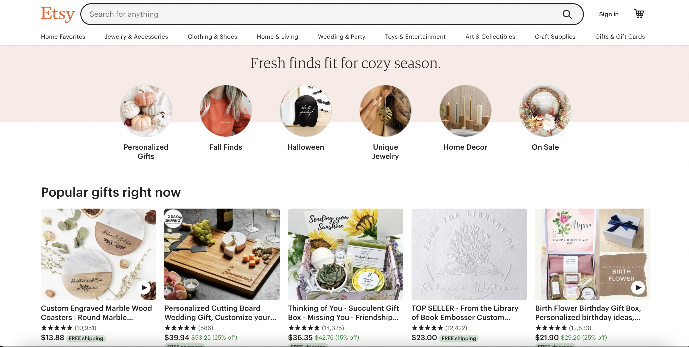
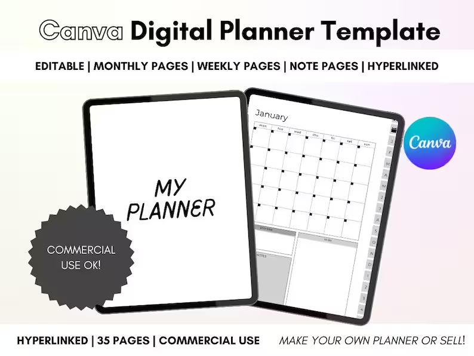
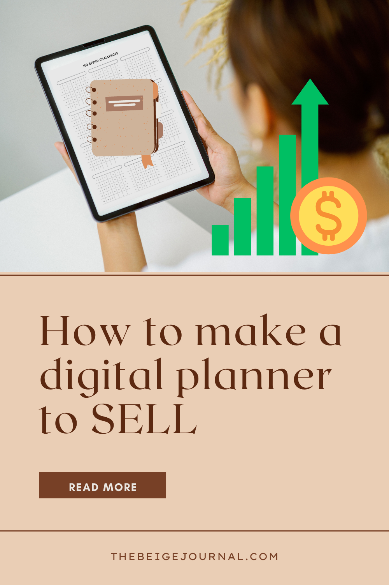

The holiday season is around the corner and we're excited for sales!

As a stationery lover, Etsy is always my favourite place to search for unique items. So, I always make sure to check Etsy during Black Friday and Cyber Monday sales for all holiday gifts (and something extra for me :) )

So while you're searching for your next planner, don't forget to check their Etsy Gift Guide for gifts for your close ones (or for yourself!)

[See the Etsy Gift Guide](https://www.etsy.com/gift-guides)

**And the list you've been waiting for! Our Black Friday/Cyber Monday Sale list for 2022!**

During this time, you'll be able to save big on some of our most popular digital planners. So don't wait, take advantage of this great opportunity and get yourself a digital planner today at some of these amazing shops!

https://docs.google.com/spreadsheets/d/1ocrOz-NLC3RIKP9MP-t9xty8iDKx1lUvhy8peL\_yDsQ/edit#gid=1742947089

## Get a head start with 2023!

If you're like most people, you probably have a lot going on in your life.

Between work, family, and social obligations, it can be hard to keep track of everything.

**That's where a digital planner comes in handy.**

A digital planner can help you keep track of your schedule, tasks, and goals.

It's a great way to organize your thoughts and stay on top of your busy life.

Plus, it can be a lot of fun to use!

There are many different types of digital planners available, so you can find one that fits your needs and lifestyle.

So why do you need a digital planner?

**Here are just a few reasons:**

1. **Stay organized:** A digital planner can help you keep track of your schedule and tasks so you don't forget anything important.

3. **Set and achieve goals**: A digital planner can help you set goals and track your progress over time. This is a great way to stay motivated and on track.

5. **Be more productive**: By using a digital planner, you can make the most of your time and get more done each day.

7. **Have fun**: Digital planners are often very user-friendly and interactive. This makes them enjoyable to use, which can encourage you to stick with it long-term.

<figure>

<figcaption>

[  
http://perfectandpaperless.etsy.com/](http://perfectandpaperless.etsy.com/)

</figcaption>

</figure>

<figure>

<figcaption>

[https://www.etsy.com/shop/CelCorDesigns](https://www.etsy.com/shop/CelCorDesigns)

</figcaption>

</figure>

<figure>

<figcaption>

[https://www.etsy.com/es/shop/MoneriasJournals](https://www.etsy.com/es/shop/MoneriasJournals)

</figcaption>

</figure>

<figure>

<figcaption>

[https://www.etsy.com/shop/creativedesignsjoy](https://www.etsy.com/shop/creativedesignsjoy)

</figcaption>

</figure>

<figure>

<figcaption>

[https://www.etsy.com/shop/HelloFridayPlanners](https://www.etsy.com/shop/HelloFridayPlanners)

</figcaption>

</figure>

<figure>

<figcaption>

[https://www.etsy.com/shop/IntentionalLiferCo](https://www.etsy.com/shop/IntentionalLiferCo)

</figcaption>

</figure>

<figure>

<figcaption>

[https://www.etsy.com/shop/JeyDesignShop/](https://www.etsy.com/shop/JeyDesignShop/)

</figcaption>

</figure>

<figure>

<figcaption>

[https://www.etsy.com/shop/lauriesboutique](https://www.etsy.com/shop/lauriesboutique)

</figcaption>

</figure>

<figure>

<figcaption>

[https://www.etsy.com/shop/WildberryPlanner](https://www.etsy.com/shop/WildberryPlanner)

</figcaption>

</figure>

