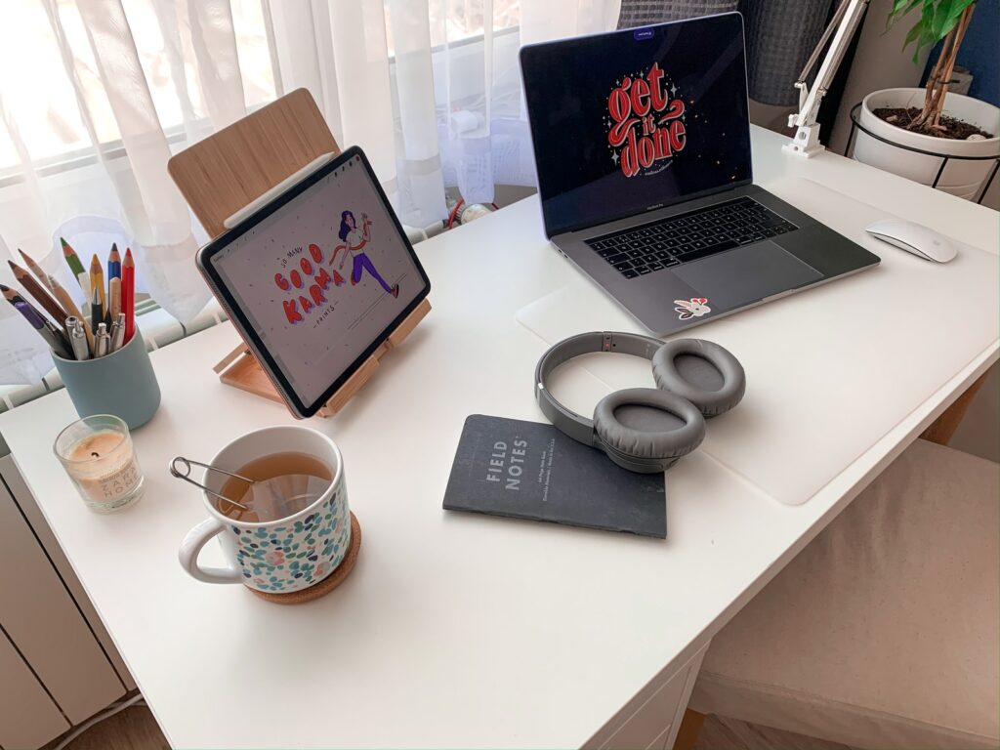
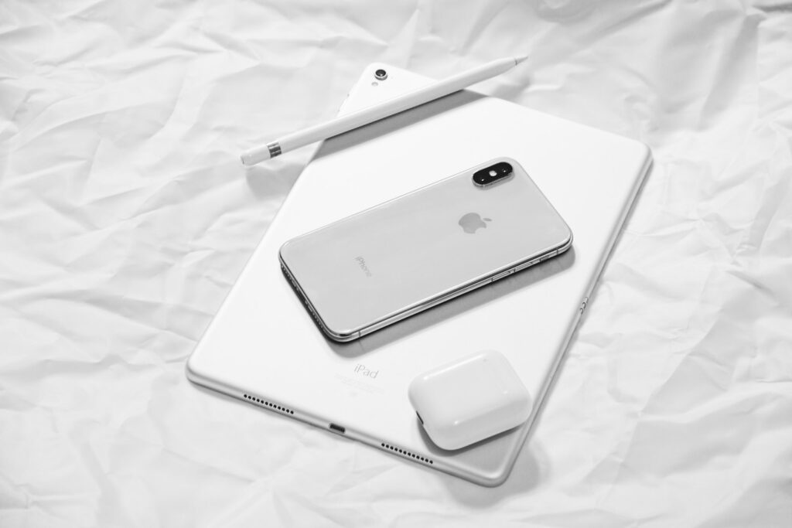
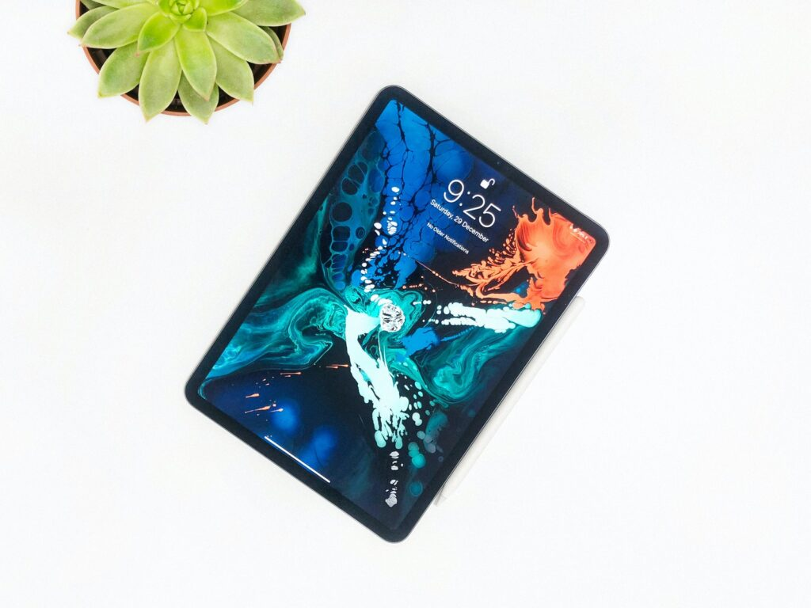
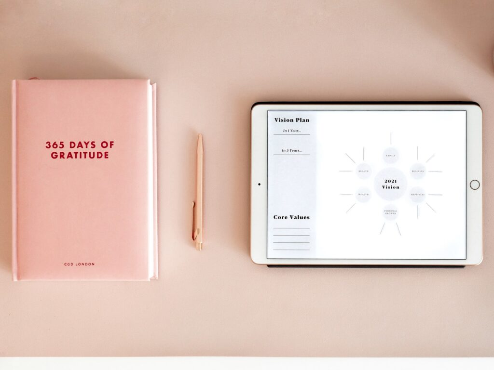
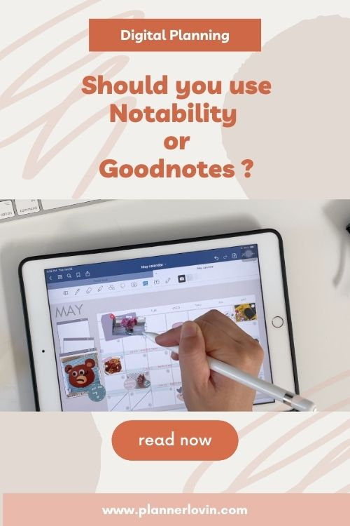

Notability and GoodNotes are among the most powerful digital note-taking tools. They are designed with upgraded features which makes them ideal for use not only by students but also business professionals. But due to their distinct design features, it can be quite challenging to choose the best digital whiteboard between these two. So, what’s the best note-taking app between Notability and GoodNotes? Well, let's find out based on:

- **User Interface**
- **Document Creation and Management**
- **Note Taking**
- **Note Conversion and Comparison**
- **Data Storage, Backup, and Sharing**
- **Pricing**

\* Read til the end for a special freebie!

## User Interface

User Interface (UI) is the first thing that you will come across when using either of these applications. A good app should be designed with a simple, interactive, and easily navigable UI since this is what promotes ease of use.

### Notability

It has a detailed UI with folders aligned on the left sidebar while the notes in the same folders are displayed on the right sidebar. While this design is meant to promote simplicity, it adds clutter to Notability’s UI.

### GoodNotes

There are two layout design options. You can either choose a grid or list overview depending on your preferences. This is where you will find all your notes and folders and if want to create more notes, simply click on the new note option.

### _Verdict_

_GoodNotes’ design helps to minimize clutter and enhance ease of use. Your notes and folders are on one side and you simply need to pick a folder or the relevant note. So, with regards to UI design, it wins._

## Document Creation and Management

The ease of document creation and management determines the ease of use of note-taking apps.

### Notability

The onset of note creation with Notability is almost instantaneous. Once you click on the main screen, you simply have to create the relevant subject that will house your content.

Notability provides endless scrolling options for every note. This enhances the process of note-taking as well as the categorization of content. Furthermore, this helps to enhance organization since you can keep everything in a logical way. This helps to create uniformity in terms of workflow.

It should be noted that the breakpoint between sessions is found when you choose to exit a note-taking session. That means that if you choose to end your session at a certain point, then you have to create a new note with its own title when you start the next note-taking session.

### GoodNotes

There is no doubt that GoodNotes also provides ease of use and simplicity. For starters, you need to choose the type of document you want to create e.g., an image, a notebook, or a folder, etc.

It's worth noting that GoodNotes has made the document management process part of the note creation process. this provides a 2-in-1 solution to users. The fact that it offers a customization option, something that’s clearly missing in Notability means that you can personalize your notes to cater to your preferences, current subject, or even mood as you play with different themes. You can also customize and apply themes on specific parts without changing the theme of the entire notes.

For improved document management and organization, GoodNotes is designed with vertical layers inclusive of nested folders. This means that you can create sub-folders in main folders of up to 10 layers! While this is definitely more than what you need, you have endless options for content organization.

### _Verdict_

_Notability offers simplicity and ease of use. If you are looking for an effective way to quickly jot down notes with simplified and offers organized features, then this is the most ideal app for you._

_Meanwhile, GoodNotes offers a comprehensive way of taking notes. Its customized features make it stand out since you can use various themes for different types of content. Its effectively built to support different types of workflows and with the presence of nested folders, you can classify content based on topics and sub-topics._

_Besides that, it provides solid breakpoints making it possible to highlight different sections of your content. So, if you want to take detailed notes and personalize your content, then GoodNotes is the best way to go._

_The winner in this category? Well, it depends on your preferences. If you want simplicity, Notability is the way to go. For comprehensive note-taking with versatility, then GoodNotes is a good alternative._

## Note Taking

Of course, the main purpose of these apps is to simply take notes. While both of them are game changers and popular with users, they have features that make them stand out. It's worth noting that both Notability and GoodNotes have put a great effort into ensuring that you conveniently take notes.

However, there are similarities in note-taking that could have played a great deal in both of them getting top ratings. They both offer an alternative for customization and efficiently make use of the available digital workspace. As a result, you have the freedom of customizing your notes based on your preferences.

With both Notability and GoodNotes, you can easily change the design, size, and color of your note-taking paper. Their note-taking functionality has been simplified and this means that you can easily navigate through both apps. Additionally, they are made with a wide array of content editing tools including a pen, lasso tool, eraser, shape tool, and a highlighter among others.

They also have the lasso i.e., the selection tool that’s used to select and move contents within the page. You can create a shape by simply drawing the appropriate shape using drawn lines that the software will then convert into the desired shape.

GoodNotes and Notability support the use of Apple Pencil2 as well as a 3rd-party stylus if you are using an iPad. That makes it possible for you to quickly sketch down shapes and take notes. Furthermore, both of them come with an in-built palm rejection feature as well as left-handed support. But there is a little difference in the design of each app.

### Notability

If you don’t want to write, you can still take your notes by using the audio feature. The audio tool allows you to use your voice to dictate audio files which will be transcribed down to notes. The transcribing process usually happens when you play the audio files back.

If you are in an environment where there is a speaker such as a lecture class, then this feature may come in handy since you simply need to open the audio feature.

Personalization in note-taking for Notability is taken a notch higher with the availability of stickers. But you must be ready to pay a few coins for them for in-app purchases. The presence takes everything a notch higher since you can enhance the appearance of your notes.

### GoodNotes

What makes GoodNotes stand out in the note-taking area is that it has a wide range of pen options. In addition to that, these pens are designed with sliders that offer accurate size adjustments. So, you can precisely choose the type of stroke width that suits you.

While GoodNotes also offers a sticker option, you need to download them online and copy/paste them by using a lasso tool. While Notability might beat GoodNotes with its in-build sticker option, it offers more with its new and updated flashcard feature.

With GoodNotes, you can now create flashcards within your notes. This means that the app can show half of the card (for example a question that’s on top of the notepad) and if you tap the same screen, you can see the other part of the card (for example the answers to the question).

While both of them boast of the Lasso feature, GoodNotes’ Lasso is more advanced since it features a shape-snapping design.

### _Verdict_

_Well, Notability takes everything a notch higher with its audio recording feature. This definitely helps to enhance ease of use, especially in settings that involve dictation of content._

_The fact that it also allows the in-app purchase of stickers makes it possible for users to make use of the internal dedicated system to personalize their content._

_GoodNotes on the other hand offers a wide range of pen options with slider adjustments for width. This offers a great level of fine-grain control. Furthermore, the upgrade lasso tool makes it possible for you to draw lines that the app can convert into the desired shape._

_So, what is the best note-taking app? In this case, it would be Notability. Its audio feature is simply a gamechanger and it can’t be ignored. It syncs audio and features in-app stickers._

_GoodNotes has simply enhanced its basic features with nothing revolutionized. It's simply good for fine-grained note-taking with a flash-card review, a broad range of pen options, and a versatile selection tool._

## Note Conversion and Comparison

These two apps allow you to convert your handwritten notes into text notes. It’s a simple process and you have to only highlight the handwritten note using the selection tool and thereafter select the “convert to text” option. This is an interesting feature, especially if you are taking down notes in a hurry.

Whether you opt for Notability or GoodNotes, you have a chance of verifying the note conversion process. However, the process varies since, in GoodNotes, you have to copy the text in the conversion area and then paste it back to the original page. Quite a tedious process, right? Meanwhile, Notability has a simplified “convert” button that you can use to verify the conversion.

There are still more differences when it comes to conversion and this will help to determine which app is superior between the two.

### Notability

This software program allows you to tap into the superpower of mathematical conversions. While this is available in the form of an in-app purchase, you will definitely enjoy the mathematic expressions, rules, and elements, especially if you are a student.

The diversity in its math conversions means it comes with chemical elements and rules, mathematical terms, and Greek symbols. Don’t for a beginner, the math characters can be too complicated.

If you want to compare notes on different documents, then the split-screen view feature can come in handy. This makes it possible to work with multiple documents and comparing notes easier.

### GoodNotes

This note-taking app simply allows the conversion of basic mathematical functions. Well., at least you can use it for addition, division, and subtraction.

When it comes to notes comparison, GoodNotes has a documents tab that’s similar to a tabbed web browser and this makes it easier and faster for you to compare notes. Its native feature allows it to support multiple windows options in iPadOS.

### _Verdict_

_Both of them have great notes comparison features. The split-screen and multiple tabs option allow for a better comparison of documents._

_However, when it comes to conversion, Notability wins hands down since it allows the conversion of complex mathematical formulas and chemical elements._

## Data Storage, Backup, and Sharing

If you are going to take notes with either of these apps, chances are that you might need them for future reference. This means that they must have highly effective storage and backup system. Besides that, an option for sharing is critical since data might need to be transferred.

They both allow for 3rd-party backup storage options such as OneDrive, GoogleDrive, and DropBox as long as you are using an Auto-Backup. This means that you can conveniently select your secondary backup storage that suits your needs since iCloud would be your primary backup unless you have disabled it.

These two applications make use of the Apple-based iCloud sync system to backup stored notes. So, if you are using an iPhone or a Mac application, then sync iCloud for notes to be automatically backed up in the cloud. They also make it possible for you to share and export your notes o other devices. However, there is some notable difference when it comes to sharing notes.

### Notability

It makes the sharing process simple since it involves the use of a link-sharing option. this means that you can create a link, share it publicly and anyone who has access to the link can therefore view the notes file. The best thing is that you are the only one required to have an account with Notability in order to share content, those who view it can do so without accounts. Additionally, shared content can be accessed with any device and browser.

### GoodNotes

It has a traditional note-sharing system since the whole process is based on collaboration. This means that all registered GoodNotes users can share and edit the notes as collaborators. So, if you are not a registered user, it means that you can view the shared document.

### _Verdict_

_Of course, Notability wins in this category. First, notes can be shared through links and viewers don’t need to have Notability accounts! They can also access the same content from any device and browser._

_Meanwhile, GoodNotes is quite restricted since content sharing is based mainly on the aspect of collaboration._

## Pricing

Affordability is crucial since this helps to determine what app suits your budget. The good thing is that both apps are affordable and you can find them for less than $10.00 in-app store.

### Notability

You can’t use the same Notability account for apps on Mac and iOS. This is because Notability has two different types of software for these two devices and as a result, you must purchase them separately. If you are using these two devices, then their operating systems requirements are different and you will end up spending twice.

Its also worth noting that Notability has in-app purchases such as in-built stickers, mathematical conversion as well as handwriting conversion. While these features make this app more desirable and enhance user convenience, they cost more. However, there are no charges for updates which normally happen frequently.

### GoodNotes

This app is compatible with iPhones, iPad, and Mac. This means that a single purchase gives you access to the app on different devices without the need for extra purchases. Additionally, GoodNotes doesn’t have in-app purchases so once you make a single purchase payment, that’s all. Its updates are free as well.

### _Verdict_

_Based on costs alone, GoodNotes is the winner under this category. A single one-time purchase gives you access to everything and you can access the app through multiple devices._

## The Bottom Line

So, what’s the best note-taking app between Notability and GoodNotes? These apps have definitely undergone significant upgrades over the years and they feature new amazing features.

Their design makes both of them admirable and that’s why it’s quite challenging to determine the winner. Its terms of design esthetics, creation of workflow, and cost, GoodNotes is a great choice. Its interface is easy to navigate and makes everything feel wholesome.

But if you are in need of a more practical note-taking app, Notability should be your first option. It has upgraded design tools such as audio, advanced mathematical formulas, and chemical elements. Additionally, it makes it possible to ease convert handwritten notes.

The best note-taking app between the two simply depends on your preferences and what you can afford.

## Get a copy of our Digital Planner!

[Loading...](https://plannerlovin.gumroad.com/l/beigepersonalplanner)

\[sc name="affiliate\_disclosure" \]\[/sc\]

## Pin it!

