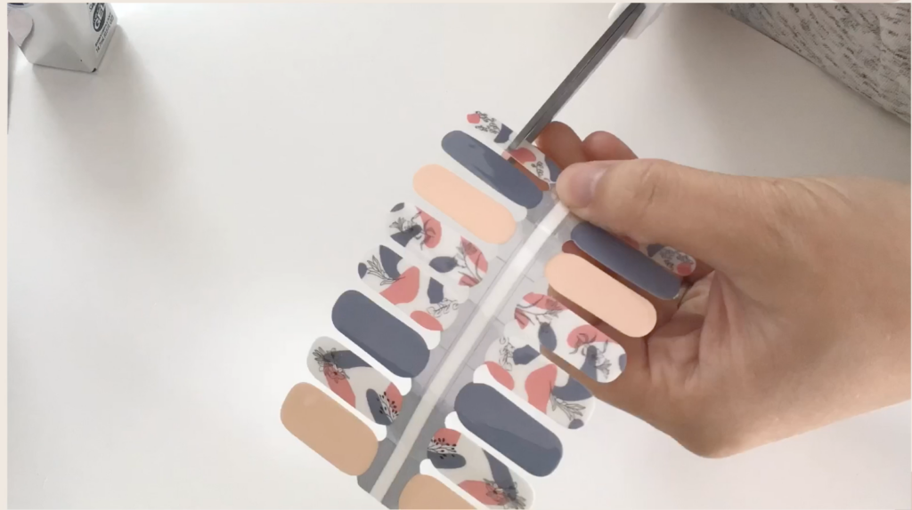
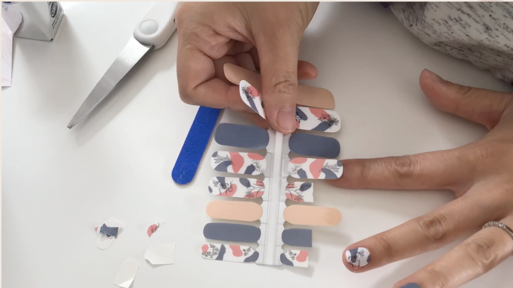
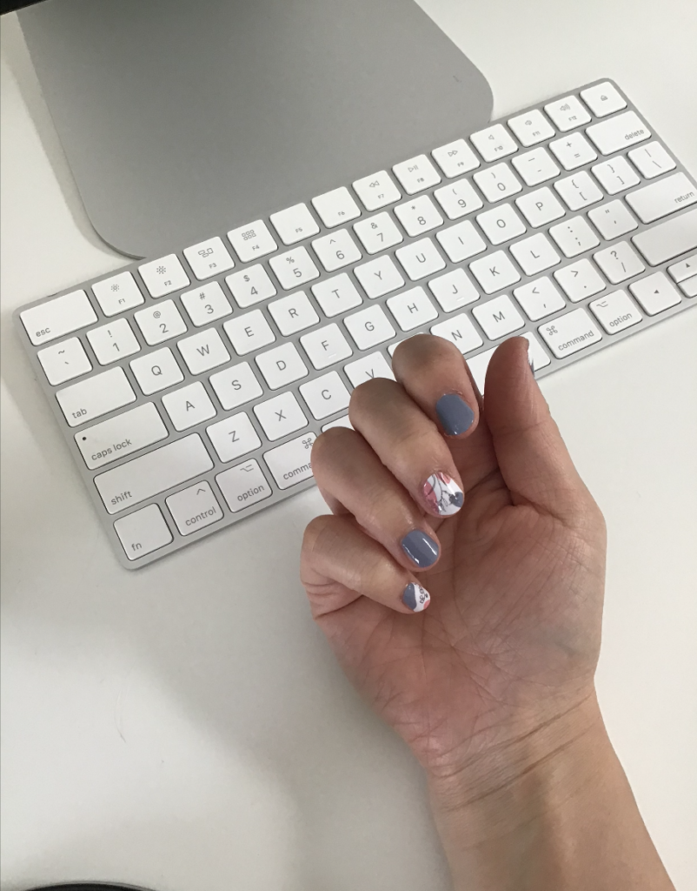

https://www.youtube.com/watch?v=n00ZxIVmcMg&t=158s

I've been wanting to try some nail art for a while now, since we're in lock down. I've been looking at the difference between gel nails, nail wraps and press on nails.

I've finally decided to give nail wraps a try cause it seems mess free and easy to use.

Here are some nail wraps I got from Etsy from a shop called [Olive and Pearl](https://www.etsy.com/ca/shop/OliveandPearlNails?ref=simple-shop-header-name&listing_id=898099870)

The style I got was [Black Floral Abstract Nail Wrap](https://www.etsy.com/ca/listing/898099870/black-floral-abstract-nail-wraps-nail?ref=shop_home_recs_1&pro=1)

Overall, it was very easy to use

Some stickers might not fit perfectly, so you'll need to resize

But with my short nails, I was able to use only one side of the nail wraps, so each set actually can give me two or more sets if I size them accurately.

The finished product!

\[sc name="affiliate\_disclosure" \]\[/sc\]
