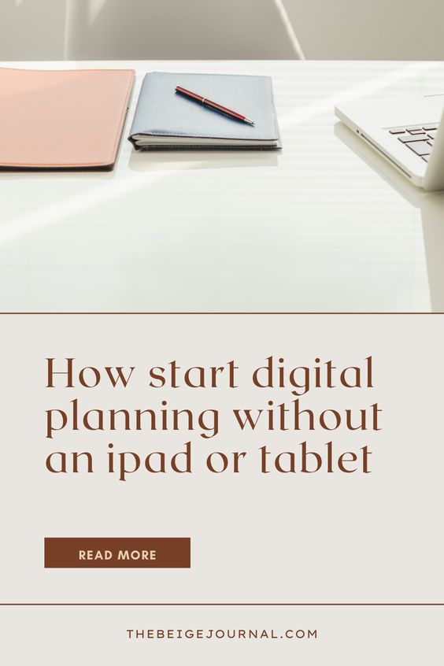

If you're like me, you love the idea of digital planning but don't want to spend the money on an iPad. I get it! But guess what? You don't need one! You can totally start digital planning without an iPad.

**All you need is a computer!**

## **Here are the programs you can run to view digital planners**

### [**Goodnotes (Mac)**](https://www.goodnotes.com/)

Goodnotes is an amazing digital planning tool that has helped me stay organized and on track with my to-do lists and goals. **They also have a desktop version!** It has a user-friendly interface and allows me to keep all my notes in one place. I highly recommend it for anyone looking for a way to streamline their productivity!)

### **[Xodo (Windows & Mac)](https://pdf.online/)**

Need to get more done with less work? Xodo is the perfect PDF solution for saving time and completing important tasks. Optimized for tablets and phones, our PDF reader, scanner, and editor lets you work on the go with less hassle.

### **Any PDF viewer!**

You can get also use any PDF viewer like Preview (on Mac) or Adobe to gets started!

I loved being able to move my planner around with me and not have to worry about losing anything. Plus, I could access it from anywhere, which was super handy. The only downside was that it wasn't as portable as an iPad, but it was still doable.

If you're interested in starting digital planning but don't want to invest in an iPad, definitely give it a try with just your computer first. You might be surprised at how well it works and how much you enjoy it!

