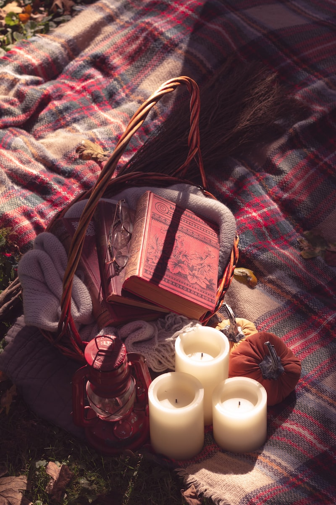

## What is a "witchy aesthetic?

A "witchy" aesthetic often includes elements of nature, such as plants, herbs, and crystals. It may also incorporate items associated with witchcraft and magic, such as tarot cards, cauldrons, and broomsticks. The color palette is often dark and muted, with shades of black, purple, and deep red. Textures like velvet, suede, and lace are common. The overall vibe is mysterious, with a hint of eeriness and a touch of elegance.

## What are some "witchy" imagery?

Decorations like dried flowers, vintage apothecary jars, and candles are also popular in a witchy aesthetic. The imagery used in this aesthetic is often inspired by the occult, like astrology and alchemy symbols, and often featuring imagery of the moon and stars.

## What are some "witchy" clothes?

In fashion, a witchy aesthetic is characterized by long, flowy skirts, capes, and cloaks. Jewelry is often chunky and features occult-inspired symbols like pentagrams and crescent moons. Accessories like wide-brimmed hats, scarfs and gloves are also common.

Overall, the witchy aesthetic is about embracing the mysterious and the unknown, and finding beauty in the darkness. It’s about self-expression, individuality, and being unafraid to embrace the unconventional.

## Looking for some witchy stickers for your planner?

[Get the set here](https://www.etsy.com/ca/listing/1393209378/witchcraft-sticker-bundle-witchy?click_key=bef7f6f624170d55e8d0e07cc8295b1fb75bc892%3A1393209378&click_sum=cc350feb&ref=shop_home_active_1&pro=1)
