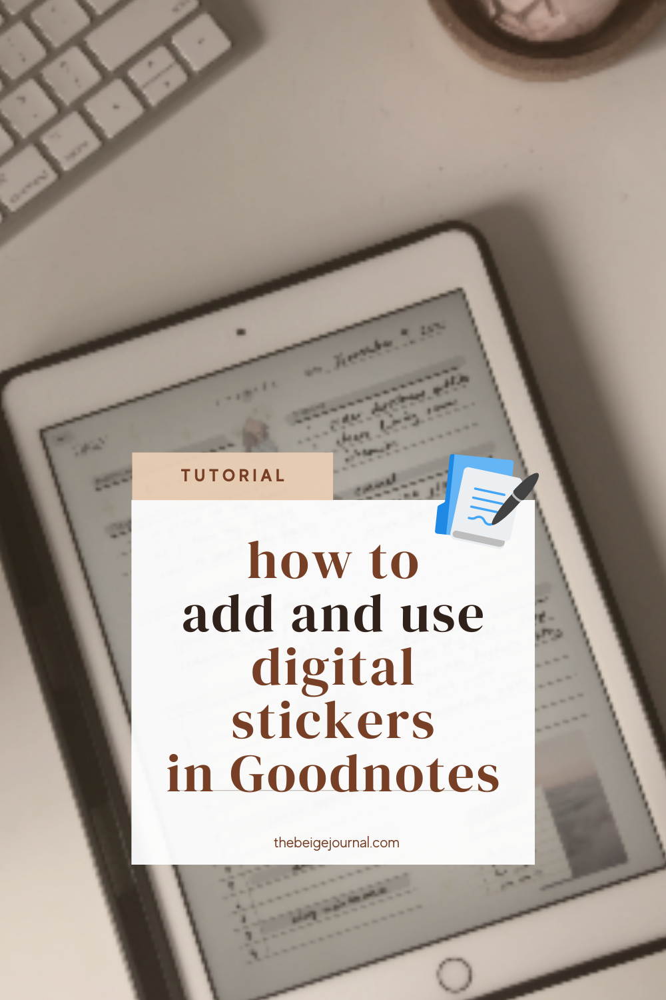
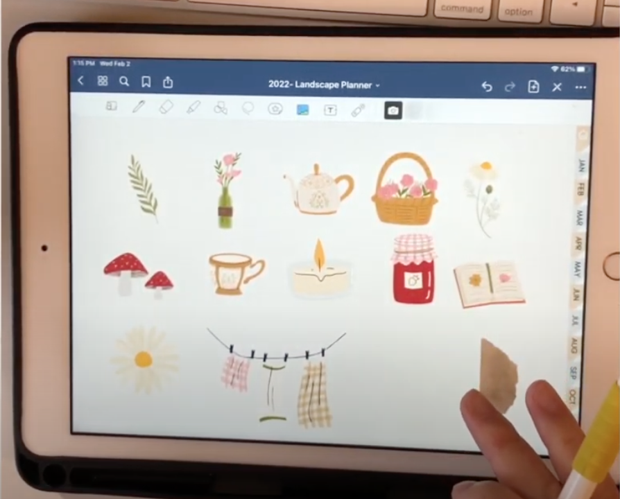
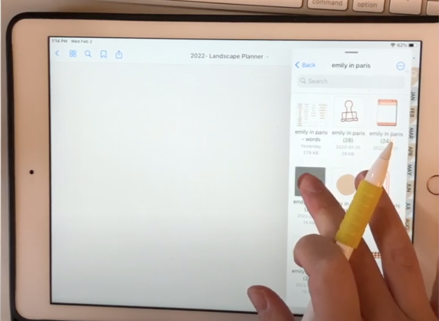
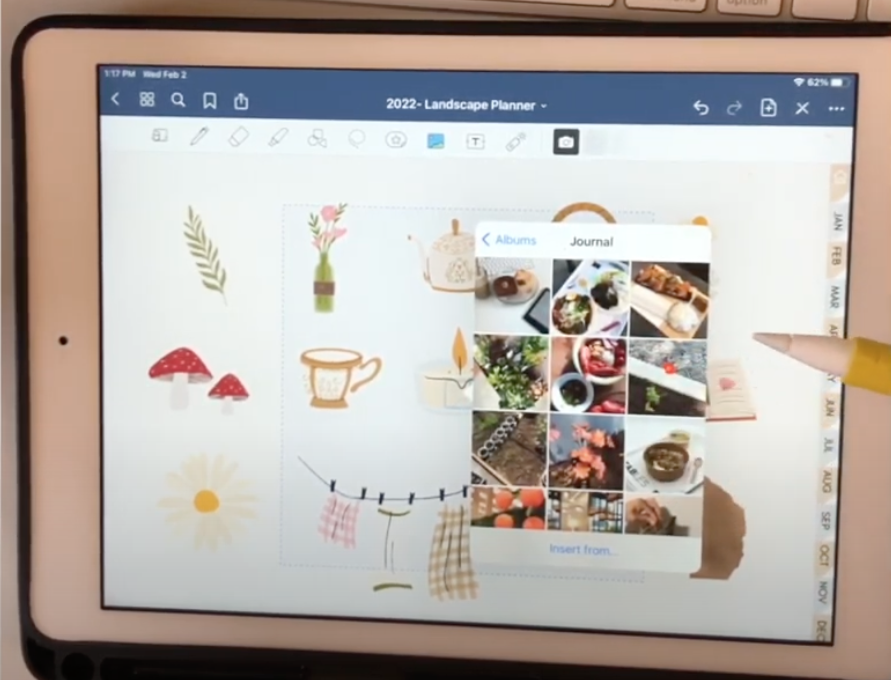
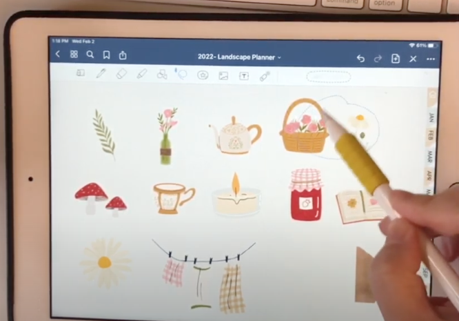
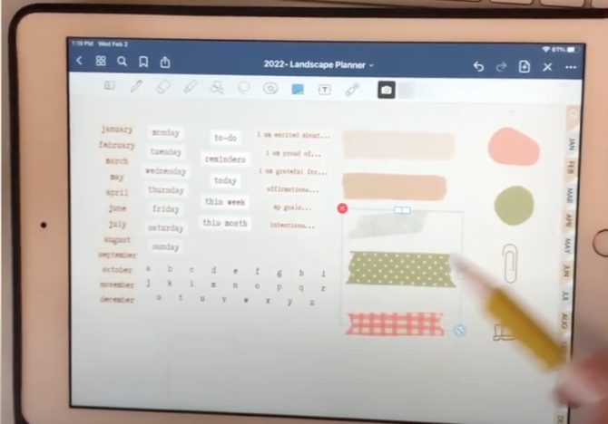
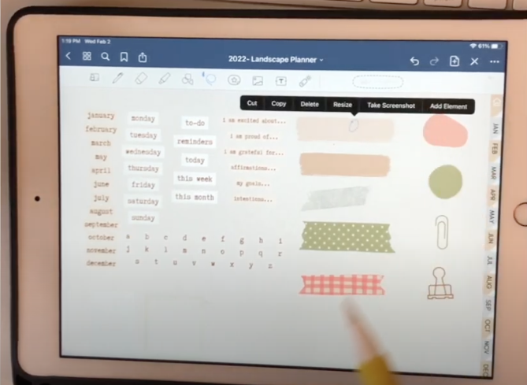
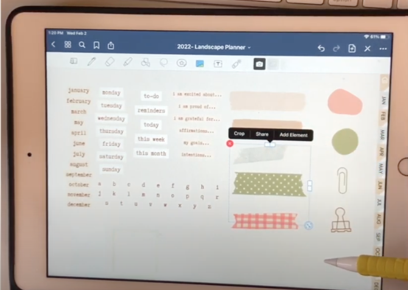
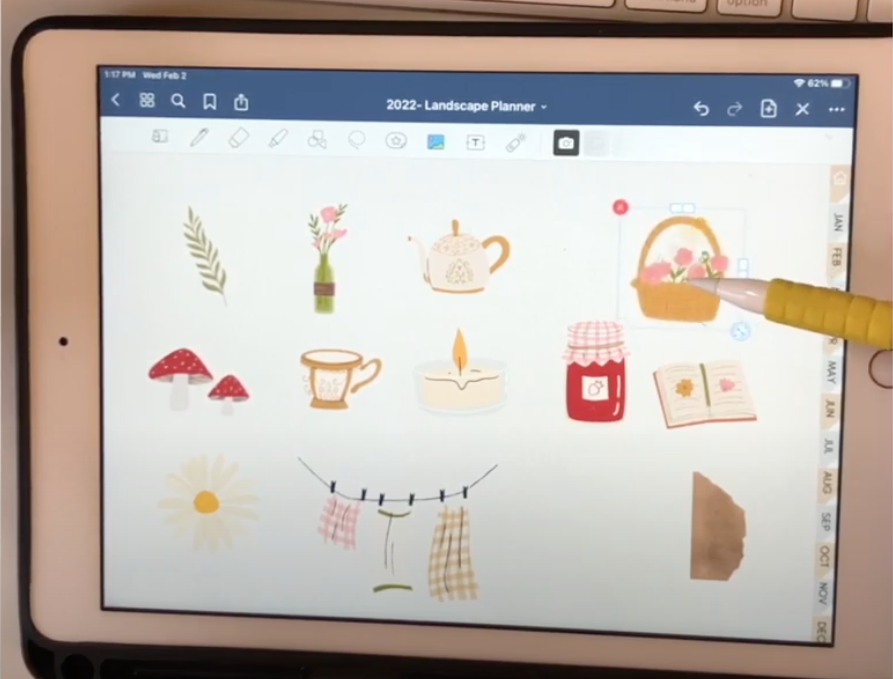

https://youtu.be/FBkqXei6szg

**Watch along on Youtube!**

[Instagram](https://www.instagram.com/createw.mny/) // [Youtube](https://www.youtube.com/channel/UCSRJASK0JGPuJ2N7fP93qfg) // [Etsy Shop](https://www.etsy.com/ca/shop/ColorCoordinated)

\[sc name="youtube-subscribe" \]\[/sc\]

✦ What I used:

- Cottagecore sticker set →[https://tidd.ly/3I5VMAT](https://tidd.ly/3I5VMAT)
- FREE digital planner → [https://thebeigejournal.com/digital-planning-links/](https://thebeigejournal.com/digital-planning-links/)

The best part of digital planning is having endless possibilities with stickers! But a common question is how to add and organize these so called stickers.

Let's take a look at these options. (Check our video if these are unclear!)

## How to add stickers

**Drag and drop**

- On your iPad, you'll be able to split your screen in two or have a file pop up over your Goodnotes app.
- From there, you can drag your stickers over to a GoodNotes page

**Goodnotes Elements feature**

- Open the feature and at the bottom, scroll to the the "+" and add your new collection
- You'll be able to organize them by sets, and name each set
- Either add stickers that are currently on your page, import from a file or photo album

watch our video for more detailed tips!

**Using the image button**

- click the image button and add the select an image from your photo album

## How to move and edit your stickers

### **Moving stickers**

- lasso tool
    - great for grabbing more than one image

- image tool
    - great for hard to grab stickers in tight spaces

### **Editing stickers**

- lasso tool
    - cut
    - copy
    - delete
    - resize
    - take screenshot
    - add to Element

- image too
    - crop
    - share
    - add to Element

## Which file type should I use?

**PNG files works the best!**

- This is because PNG files allows for transparent background.
- If your image does have transparent background, you'll be able to layer your stickers so it looks more realistc!

\[sc name="adsensead" \]\[/sc\]
