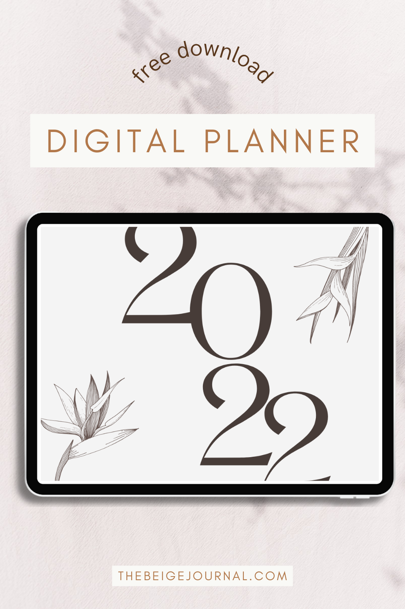
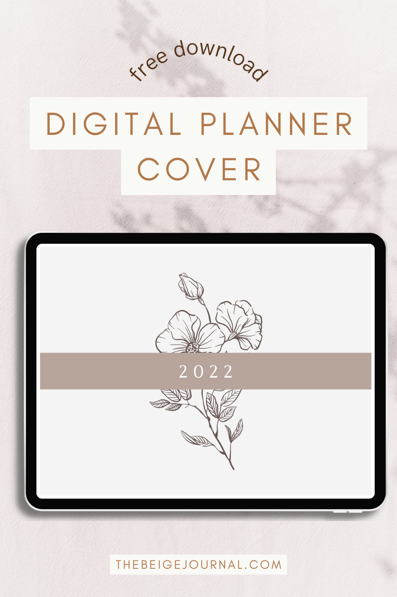
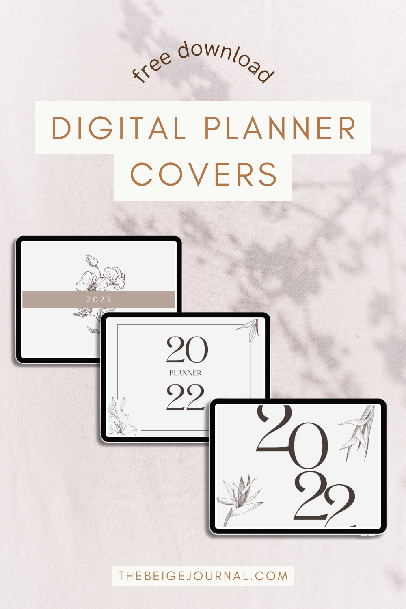

https://www.youtube.com/watch?v=sxEDjtXX4i4&t=38s&ab\_channel=createwithmny

**Watch along on Youtube!**

[Instagram](https://www.instagram.com/createw.mny/) // [Youtube](https://www.youtube.com/channel/UCSRJASK0JGPuJ2N7fP93qfg) // [Etsy Shop](https://www.etsy.com/ca/shop/ColorCoordinated)

The digital planner is so versatile and you can mold it to whatever you like!

The easiest thing to customize your planner is to change the planner cover to fit your style. Watch my tutorial to find out you can easily change your planner cover!

I've also included some freebies for you!

\[sc name="youtube-subscribe" \]\[/sc\]

\[sc name="youtube-about" \]\[/sc\]

\[sc name="adsensead" \]\[/sc\]

[Loading...](https://colorcodesigns.gumroad.com/l/wlcpx)

## Pin it!

