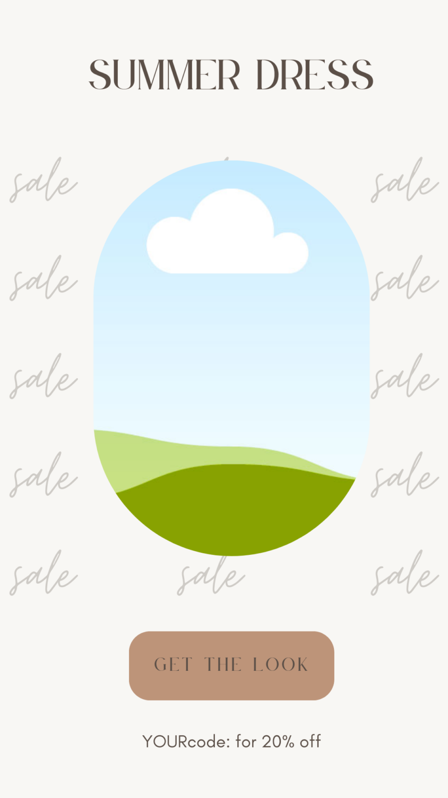

Are you a creative looking to monetize your design skills? Selling Canva templates on [Etsy](https://thebeigejournal.com/etsyfreelistings) can be a lucrative way to turn your passion into profit.

[Canva](https://thebeigejournal.com/Canva) is a popular design tool that allows users to create stunning graphics, social media posts, and marketing materials. With its user-friendly interface and extensive library of design assets, Canva is the perfect platform to create templates for others to use and customize.

In this blog post, we will guide you through the process of creating a Canva template that you can sell on Etsy. Whether you are a seasoned graphic designer or just starting out, this tutorial will provide you with the knowledge and resources you need to start selling your Canva templates on Etsy.

[Try Canva PRO for FREE](https://thebeigejournal.com/canva)

https://www.youtube.com/watch?v=q8H\_guuuCf4&t=1s&ab\_channel=createwithaplan%7Cmanda

## Download our FREEBIE

[Loading...](https://maketemplateshop.gumroad.com/l/qvyoi)

\[sc name="etsypostoffercta" \]\[/sc\]
