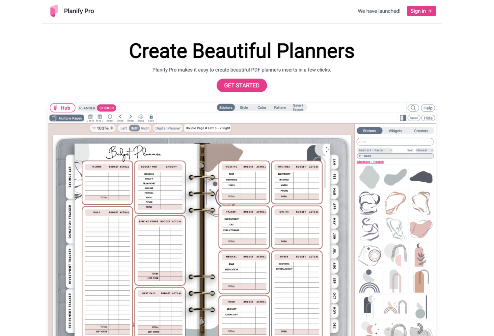

Hey there! I'm thrilled to share my journey in creating and selling a digital planner on Etsy. If you've been thinking about diving into the world of digital goods, making a planner is a fantastic starting point. Let's jump right in!

## **Step 1: Research Like a Pro**

Before anything else, let's play detective. I took a deep dive into existing Etsy planners to see what's hot and what buyers are craving. From daily to fitness planners, I scoped out the scene to craft something truly unique and in-demand. And guess what? Tools like SaleSamurai and eRank were my best pals in this quest!

**You can use Etsy research tools like [SaleSamuri](https://thebeigejournal.com/salesamurai) or [eRank](https://thebeigejournal.com/erank) to find trending planners**

## **Step 2: Designing Dreams**

Once I had my planner type pinned down, the real fun began - designing! Using Canva and Adobe Illustrator, I chose a catchy color scheme and fonts to bring my planner to life. And let me tell you, throwing in some snazzy design elements was a game-changer. Want to try it yourself?

[30 days of Canva PRO free!](https://thebeigejournal.com/Canva)

### Watch our tutorial on how to make a digital planner using Canva and Google Slides

https://youtu.be/z7b-d3pgT\_A

## **Step 3: Formatting Magic**

After the design phase, it was time to format. Tools like Keynote and Google Slides helped me layout the pages. I even added cool interactive bits like clickable tabs. And guess what? Canva can handle it too, for smaller planners.

### Watch the tutorial on how to link pages on Canva

https://youtu.be/PoEax9kib54

## **Step 4: Etsy Here I Come!**

With my planner ready, I set up shop on Etsy. I focused on creating an attractive listing with clear images and detailed descriptions. Pricing? I made sure it was just right - valuable yet competitive.

### Watch how to set up your Etsy shop!

https://youtu.be/Oq9IwdauNL0

## **Step 5: Promotion**

The final step was getting the word out. Social media was my stage, with Instagram and Pinterest as my spotlights. I even dangled some discounts and freebies to lure in my first customers.

### What the tutorial on how to get your first sale!

https://youtu.be/qn-3NS8PXyU

## Get the template!

If you don't have the time to create your own planner, consider getting an already-made template to customize!

This template is also for **COMMERCIAL USE**! So that means you can sell the planners you make, also long as you don't sell the Canva file as-is.

[Get the TEMPLATE!](https://www.etsy.com/ca/listing/1401694401/digital-planner-template-canva-editable)

## Want a program that can create digital planner templates?

Check out [PlanifyPro](https://thebeigejournal.com/planifypro)

[Planify Pro](https://thebeigejournal.com/planifypro) is an online platform that provides over 3000 pre-made planner templates, easing the process of arranging your calendar. The tool is perfect for people who want to get organized for work or school because it includes a wide choice of templates for every situation. You no longer need to design planners from the start because Planify Pro does it everything for you. Get using Planify Pro today and reap the benefits of an effective and user-friendly planner template tool.

[Check them out!](https://thebeigejournal.com/planifypro)

\[sc name="etsypostoffercta" \]\[/sc\]
