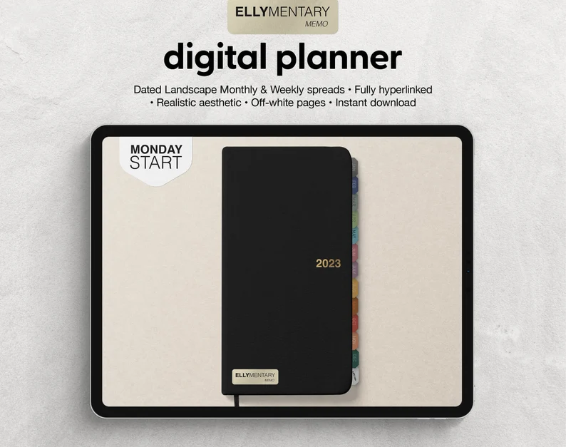

Welcome to our deep dive into the world of vision boards! Whether you're a seasoned pro or a curious newcomer, this guide is designed to answer all your burning questions about this powerful tool for personal development and productivity. So, grab a cup of your favorite beverage, and let's embark on this exciting journey together!

### What is a Vision Board?

A vision board is much more than a collection of images and words. It's a tangible representation of your dreams, goals, and aspirations. Think of it as a visual map to your future. For example, if you're dreaming of a vacation in Bali, your vision board might feature images of tropical beaches, exotic foods, and serene landscapes. It's a daily reminder of where you want to go, both literally and metaphorically.

### How Does a Vision Board Work?

The magic of a vision board lies in the power of visualization. By constantly seeing your goals, your mind starts to embrace them as achievable realities. It's like having a daily dose of inspiration and motivation. Imagine waking up each morning to see a picture of your dream home; it's not just a house, it's a prompt to work towards making that dream a reality.

### What Materials Do I Need?

Creating a vision board is like an arts and crafts project with a purpose. You'll need a board (cork or poster board works great), magazines for inspiration, scissors, glue or pins, and markers. If you're tech-savvy, digital tools like Pinterest or Canva are fantastic for creating a digital board. The key is to choose materials that excite you and make the process enjoyable.

### Choosing Your Vision Board Content

This is where your dreams take shape. Reflect on what you want in different life areas - career, relationships, health, and personal growth. If you're aiming for a promotion, you might include images of a successful workplace or symbols of leadership. The idea is to select things that genuinely resonate with your aspirations.

### Where to Place Your Vision Board

Visibility is key! Place your vision board in a spot where you'll see it often. Your bedroom wall, your office, or even as a screensaver on your computer or phone. Each glance at your board should fill you with motivation and remind you of your journey.

### Updating Your Vision Board

Your vision board isn't set in stone. As your goals evolve, so should your board. Maybe you've achieved some goals, or your priorities have shifted. Regular updates keep your board aligned with your current aspirations. It's like your personal growth diary in images.

### The More, The Merrier: Multiple Vision Boards

Feel free to create multiple boards for different aspects of your life. You might have one for career goals, another for personal development, and a third for travel dreams. This way, you can focus on specific areas without overwhelming yourself.

### There's No Wrong Way to Create a Vision Board

Remember, your vision board is deeply personal. Some prefer a minimalist approach with few images, while others go for a more eclectic mix. What matters is that it reflects your unique goals and desires.

### Making Your Vision Board Effective

To maximize the impact of your vision board, engage with it actively. Spend a few minutes each day looking at it, visualizing your success, and thinking about steps to achieve your goals. It's not just about wishing; it's about inspiring action.

### Vision Boards and Mental Well-being

While vision boards are not a cure-all, they can be a positive tool in managing anxiety or depression. They provide a focus for positive thinking and goal-setting, which can be incredibly uplifting. However, they should complement, not replace, professional mental health care.

### Digital vs. Physical Vision Boards

Digital vision boards are just as effective as their physical counterparts. The key is how you interact with them. Whether you scroll through your board on your phone or gaze at a physical board, the impact lies in the connection you feel with your goals.

### Is My Vision Board Working?

You'll know your vision board is working when you start noticing small changes aligning with your goals. Maybe you find yourself making decisions that bring you closer to your dreams, or opportunities start to align with what's on your board. It's a sign that you're moving in the right direction.

## Looking for vision board kits?

We got you covered! Here are few we found on Etsy!

### 2024 Vision Board Printables - 500 Images

Are you ready to visualize your goals for 2024? This Vision Board Printables kit is a treasure trove of 500 images, meticulously curated to inspire and motivate. Whether you're focusing on personal growth, career advancement, or health and wellness, these images cover a wide range of aspirations. The beauty of this kit lies in its versatility – you can print these images and create a traditional vision board, or use them digitally for a modern approach. It's a wonderful way to keep your dreams and goals in sight, literally!

[Check it out here.](https://www.etsy.com/ca/listing/1535258744/2024-vision-board-printables-500-images?ga_order=most_relevant&ga_search_type=all&ga_view_type=gallery&ga_search_query=vision+board+kits&ref=sc_gallery-1-1&dd=1&plkey=b25ef809f7afa15c465ea051af6f48bc876a078a%3A1535258744)

### Vision Board Kit Printable - 2024 Vision

Dreaming big for 2024? The Vision Board Kit Printable is just what you need to bring those dreams to life. This digital kit is specially designed for the year ahead, helping you visualize and manifest your goals. It's packed with vibrant and inspiring images, quotes, and affirmations that cater to various life aspects like health, wealth, love, and personal development. The great thing about this printable kit is the ease of use – simply download, print, and start creating your vision board. You can even customize it by adding your personal touches. Perfect for setting intentions and keeping motivated throughout the year.

[check it out here.](https://www.etsy.com/ca/listing/1367423755/vision-board-kit-printable-2024-vision?ga_order=most_relevant&ga_search_type=all&ga_view_type=gallery&ga_search_query=vision+board+kits&ref=sr_gallery-1-4&bes=1&sts=1&dd=1&organic_search_click=1)

### 2024 Vision Board Kit - Printable Vision

Get ready to turn your dreams into reality with the 2024 Vision Board Kit! This printable vision kit is a fantastic tool for anyone looking to set clear and actionable goals for the new year. Inside, you'll find a diverse collection of images, motivational quotes, and templates that cater to a variety of ambitions, whether it's career success, personal growth, or lifestyle changes. The beauty of this kit is its flexibility – you can print the elements you love and arrange them in a way that speaks to you. It's not just a tool for goal setting; it's a daily inspiration source that keeps you focused and driven. Discover the power of visualization and start crafting your future today.

[check out the kit here.](https://www.etsy.com/ca/listing/1310728418/2024-vision-board-kit-printable-vision?ga_order=most_relevant&ga_search_type=all&ga_view_type=gallery&ga_search_query=vision+board+kits&ref=sr_gallery-1-5&bes=1&sts=1&dd=1&organic_search_click=1)

### 2024 Vision Board: Manifest Happiness

Imagine a tool that not only helps you visualize your goals but also infuses your daily life with a dose of happiness. The 2024 Vision Board: Manifest Happiness is exactly that! This thoughtfully designed kit is a blend of uplifting images, heartening quotes, and engaging prompts that guide you towards manifesting happiness and success in the coming year. It's ideal for those who believe in the power of positive thinking and are ready to take proactive steps towards their dreams. Whether you're planning to pin it on your wall or keep it in your journal, this vision board is a constant reminder of your aspirations and the joyous journey towards achieving them. Ready to manifest happiness?

[Look at the kit here.](https://www.etsy.com/ca/listing/1510108434/2024-vision-board-manifest-happiness?ga_order=most_relevant&ga_search_type=all&ga_view_type=gallery&ga_search_query=vision+board+kits&ref=sr_gallery-1-1&bes=1&dd=1&organic_search_click=1)

### Vision Board Bundle Kit - Printable 2024

Get ready to embark on a transformative journey with the Vision Board Bundle Kit, tailored for 2024! This comprehensive kit is more than just a set of printables; it's a gateway to self-discovery and goal realization. Inside, you'll find an array of thought-provoking images, motivational quotes, and customizable templates that cater to different life areas like career, health, relationships, and personal growth. What makes this bundle stand out is its holistic approach – it not only aids in visualizing your dreams but also in planning and tracking your progress. Whether you're a seasoned vision board enthusiast or new to the concept, this kit is user-friendly and adaptable to your unique journey. Ready to visualize and achieve your 2024 goals?

[Explore this kit here.](https://www.etsy.com/ca/listing/1364396257/vision-board-bundle-kit-printable-2024?ga_order=most_relevant&ga_search_type=all&ga_view_type=gallery&ga_search_query=vision+board+kits&ref=sr_gallery-1-12&sts=1&dd=1&organic_search_click=1)

### Digital Vision Board Bundle Template

In the digital age, why not give your goal-setting a modern twist? The Digital Vision Board Bundle Template is your tech-savvy companion in manifesting your aspirations. This digital bundle offers a variety of customizable templates that let you create a vision board right on your computer or tablet. Packed with inspiring images, quotes, and interactive elements, this kit is perfect for those who prefer a paperless approach. It's incredibly convenient – you can carry your vision board wherever you go and update it as your goals evolve. Whether you're aiming for professional achievements, personal milestones, or a mix of both, this bundle helps keep your objectives in clear view every day.

[Check out this bundle here.](https://www.etsy.com/ca/listing/1382430608/digital-vision-board-bundle-template?ga_order=most_relevant&ga_search_type=all&ga_view_type=gallery&ga_search_query=vision+board+kits&ref=sc_gallery-1-9&dd=1&plkey=2d7b990179e064a8c5d7537718f39aab045d8afd%3A1382430608)

### Digital Journal Diary Vision Board & Mood Board

Step into a world where your diary meets your dreams with the Digital Journal Diary Vision Board & Mood Board. This unique product combines the reflective practice of journaling with the aspirational essence of a vision board. It's a digital space where you can articulate your thoughts, set goals, and visualize your desires. The mood board aspect adds a layer of emotional texture, allowing you to connect deeply with your aspirations through colors, images, and words. This kit is ideal for those who love to blend creativity with introspection. Whether you're planning your future, tracking progress, or simply seeking a daily dose of inspiration, this digital journal diary is a versatile companion.

[Check it out here.](https://www.etsy.com/ca/listing/1524690349/digital-journal-diary-vision-board-mood?ga_order=most_relevant&ga_search_type=all&ga_view_type=gallery&ga_search_query=vision+board+kits&ref=sc_gallery-1-12&pro=1&dd=1&plkey=67ceca8834973877a870a0d445737c909ff997fe%3A1524690349)

### 2024 Vision Board: Manifest Happiness (Second Version)

Welcome to the second version of the 2024 Vision Board: Manifest Happiness! This kit is a delightful blend of inspiration and practicality, tailored to help you manifest a joyous and successful year ahead. It's packed with a fresh array of uplifting images, motivational quotes, and practical prompts that are designed to encourage positive thinking and goal achievement. Whether it's career growth, personal development, health, or relationships, this kit covers all bases. The easy-to-use format allows you to create a personalized vision board that resonates with your aspirations. It's not just about setting goals; it's about creating a daily reminder of the happiness and success you're working towards.

[See the board kit here.](https://www.etsy.com/ca/listing/1585151855/2024-vision-board-manifest-happiness?ga_order=most_relevant&ga_search_type=all&ga_view_type=gallery&ga_search_query=vision+board+kits&ref=sr_gallery-1-19&pro=1&dd=1&organic_search_click=1)

### Digital Vision Board Wallpaper Template

Transform your digital devices into a source of daily inspiration with the Digital Vision Board Wallpaper Template. This innovative product allows you to create a personalized vision board that doubles as wallpaper for your computer or phone. It's a fantastic way to keep your goals and dreams right in front of you, every time you glance at your screen. The template includes a variety of customizable layouts, inspiring images, and motivational quotes. Whether you’re aiming for professional success, personal growth, or a balance of both, this digital vision board is your constant reminder and motivator. It’s perfect for those who are always on the go and want to stay aligned with their aspirations.

[Check it out here.](https://www.etsy.com/ca/listing/1357183128/digital-vision-board-wallpaper-template?ga_order=most_relevant&ga_search_type=all&ga_view_type=gallery&ga_search_query=vision+board+kits&ref=sr_gallery-1-26&sts=1&dd=1&organic_search_click=1)

### Vision/Mood Board Kit - Medium (30-Page)

Dive into the realm of creative visualization with the Vision/Mood Board Kit, a medium-sized, 30-page wonder. This kit is designed for those who love to blend artistic expression with goal setting. It comes with a diverse range of images, textures, and quotes that you can use to craft a vision or mood board that truly reflects your aspirations and emotional landscape. The medium size of the kit makes it perfect for detailed and comprehensive boards, without being overwhelming. It's ideal for anyone looking to explore their goals and moods in a visually engaging and meaningful way. Whether you're planning for the future or capturing the essence of your current state of mind, this kit is a versatile tool in your creative arsenal.

[Check out this kit here.](https://www.etsy.com/ca/listing/1463622479/visionmood-board-kit-medium-30-page?ga_order=most_relevant&ga_search_type=all&ga_view_type=gallery&ga_search_query=vision+board+kits&ref=sr_gallery-2-2&sts=1&dd=1&organic_search_click=1)

### Printable Vision Board Kit: Goal Planners

Set your sights on success with the Printable Vision Board Kit: Goal Planners. This kit is a dream come true for anyone passionate about goal setting and visualization. It includes a variety of templates, images, and quotes that are carefully selected to inspire and motivate you towards achieving your aspirations. What sets this kit apart is its emphasis on planning and organization. Alongside the vision board elements, you'll find goal planners that help you break down your dreams into actionable steps. Whether you're focusing on career objectives, personal development, or lifestyle changes, this kit provides the tools to map out your journey. It’s perfect for keeping track of your progress and staying motivated.

[See the vision board kit here.](https://www.etsy.com/ca/listing/1110682173/printable-vision-board-kit-goal-planners?ga_order=most_relevant&ga_search_type=all&ga_view_type=gallery&ga_search_query=vision+board+kits&ref=sc_gallery-2-7&dd=1&plkey=970d2e0e3162184bfa9b4bcb0770f3d5cdc1b463%3A1110682173)

### Vision Board Cutouts: Manifestation Kit

Unleash the power of manifestation with the Vision Board Cutouts: Manifestation Kit. This unique kit is specifically designed to help you bring your dreams and aspirations to life. It features a wide variety of cutouts, including inspirational quotes, affirming words, and compelling images. These elements are perfect for creating a vision board that resonates deeply with your personal goals and desires. The cutouts are easy to use and can be arranged on any surface, allowing you to craft a vision board that’s both aesthetically pleasing and deeply meaningful. Whether you’re focusing on career achievements, personal well-being, or spiritual growth, this manifestation kit is a wonderful tool to visualize and attract the life you desire.

[Check out the kit here.](https://www.etsy.com/ca/listing/1360181364/vision-board-cutouts-manifestation?ga_order=most_relevant&ga_search_type=all&ga_view_type=gallery&ga_search_query=vision+board+kits&ref=sc_gallery-2-11&dd=1&plkey=4930c1e28c8099c0cb5280a4e9fcaf77b26a03ca%3A1360181364)

### Vision Board Picture Quotes: Printable

Elevate your vision board experience with the Vision Board Picture Quotes: Printable. This collection is a vibrant mix of inspiring picture quotes, designed to motivate and uplift you as you work towards your goals. Each quote is thoughtfully chosen to resonate with a wide array of aspirations, be it personal growth, career advancement, or lifestyle changes. The printables are easy to use, allowing you to quickly add a splash of inspiration to your vision board. They are perfect for anyone looking to add a touch of positivity and encouragement to their daily routine. Whether you're crafting a new vision board or updating an existing one, these picture quotes are sure to bring a fresh perspective and renewed energy. Add some inspiration to your vision board by checking out these printables [here](https://www.etsy.com/ca/listing/1353094660/vision-board-picture-quotes-printable?ga_order=most_relevant&ga_search_type=all&ga_view_type=gallery&ga_search_query=vision+board+kits&ref=sr_gallery-3-19&sts=1&dd=1&organic_search_click=1).

### Digital Vision Board for 2024: Vision Kit

Welcome to the future of vision boarding with the Digital Vision Board for 2024: Vision Kit. This digital kit is a modern and efficient way to map out your goals and aspirations for the upcoming year. It offers a plethora of customizable templates, striking images, and empowering quotes that you can easily access and arrange on your digital device. The flexibility and convenience of this digital format make it perfect for those who prefer a paperless approach and love having their goals at their fingertips. Whether it's career milestones, personal development goals, or lifestyle changes, this kit is designed to cater to a variety of aspirations. It's a wonderful tool for keeping yourself inspired and on track with your 2024 goals.

[Explore the kit here.](https://www.etsy.com/ca/listing/1350576558/digital-vision-board-for-2024-vision?ga_order=most_relevant&ga_search_type=all&ga_view_type=gallery&ga_search_query=vision+board+kits&ref=sr_gallery-3-26&pro=1&dd=1&organic_search_click=1)

## In conclusion

Vision boards are a powerful, fun, and creative way to keep your goals and dreams front and center in your life. They serve as a daily reminder of where you're headed and the beautiful journey you're on. So, why not start creating your vision board today? Your future self will thank you!

Remember, the journey to achieving your dreams is as important as the destination. Happy vision boarding!
