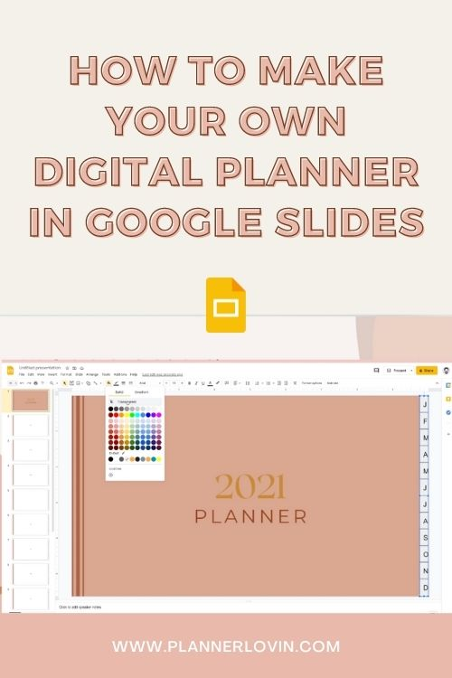

Everything is going digital these days and seems like everybody's getting on board with digital planning too!

The new year is just ahead - have you thought about getting a digital planner for yourself?

If you're in the market for a digital planner, here are a few [digital planners that I curated on Etsy](https://www.etsy.com/ca/people/ColorCoordinated/favorites/digital-planners-2021), but sometimes, it might be hard to find the perfect one to buy. If you're crafty, you might be interested in making your own! You can customize it perfectly to the way you want and the way you plan.

Follow along with this video to make your own digital planner in Google Slides!

https://www.youtube.com/watch?v=UnI2A5OwJpI

\[sc name="youtube-subscribe" \]\[/sc\]

Want to get the template from the video?

[Loading...](https://colorcodesigns.gumroad.com/l/undateddigitalplanner)

\[sc name="affiliate\_disclosure" \]\[/sc\]

## Pin it!

