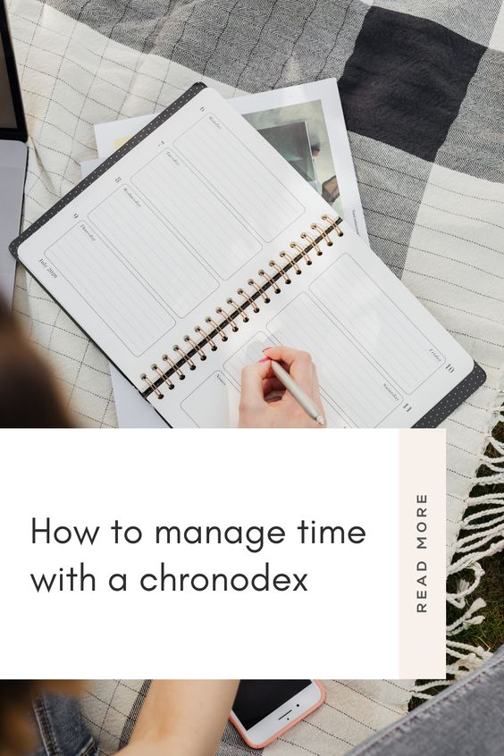
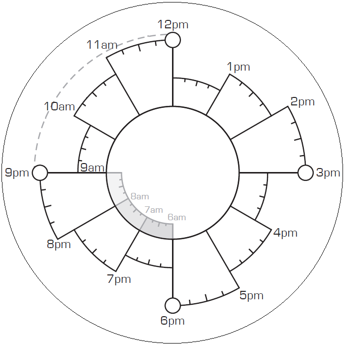
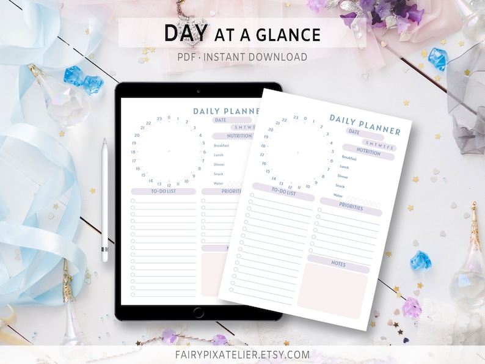
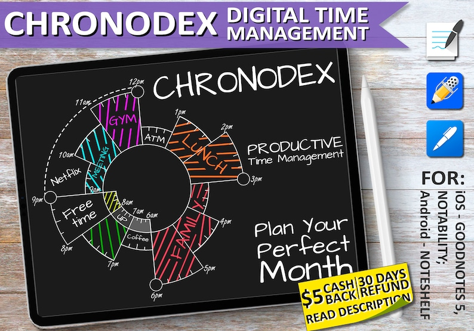
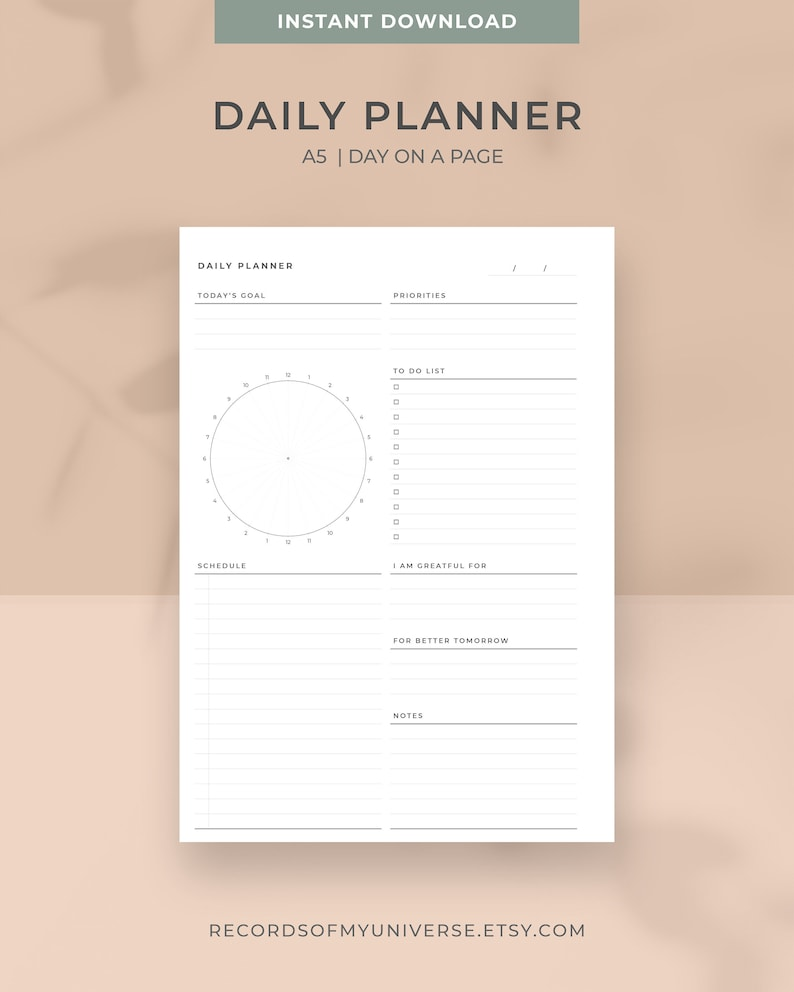
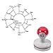

Today, let's talk about a tool that's as cool as its name sounds: the Chronodex. If you've been struggling with traditional planners or just want to try something new, this might be the game-changer you've been waiting for.

## What's a Chronodex, Anyway?

Imagine a clock and a planner had a baby. That's a Chronodex for you—a circular, clock-like diagram that helps you visualize your day in a 24-hour format. Instead of jotting down tasks in a linear list, you allocate them in a circle, much like the hands of a clock. It's a unique way to see how your day unfolds, and for visual thinkers, it's a dream come true.

## Why Should You Use a Chronodex?

Before we dive into the "how," let's talk about the "why." Traditional planners are great, but they're, well, linear. Life isn't always so straightforward. The Chronodex offers a more fluid, intuitive way to plan your day. You can see overlaps, free spaces, and how much time you're actually dedicating to different tasks. Plus, it's just fun to use. Coloring in those segments can be oddly satisfying, almost like a mini art project that helps you get stuff done.

<figure>

<figcaption>

**[Get it on Etsy](https://www.etsy.com/ca/listing/996275585/simple-24-hour-circle-us-letter-daily?ga_order=most_relevant&ga_search_type=all&ga_view_type=gallery&ga_search_query=24+hour+schedule+circle&ref=sr_gallery-1-7&organic_search_click=1)**

</figcaption>

</figure>

## Getting Started: The Basics

Alright, let's get down to business. First, you'll need to familiarize yourself with the layout. A typical Chronodex has a 24-hour clock divided into segments. Each segment represents an hour or half-hour of your day.

### Step 1: List Your Tasks

Start by listing all the tasks you need to accomplish. This could be anything from work assignments to personal errands.

### Step 2: Allocate Time

Next, allocate time slots for these tasks on your Chronodex. Use different colors or symbols to represent different activities. For example, you could use blue for work tasks, green for personal time, and red for errands.

### Step 3: Be Realistic

Remember, there are only 24 hours in a day. Be realistic about how much you can accomplish. Overloading your Chronodex will only lead to stress and disappointment.

### Step 4: Track and Tweak

As you go through your day, keep your Chronodex handy. Mark off tasks as you complete them. If you find that you've allocated too much or too little time for something, adjust it for the next day.

## Pro Tips for Chronodex Mastery

### Use Layers

One of the coolest things about a Chronodex is its flexibility. You can add layers to your planning. For instance, the innermost circle could be for work, the middle one for personal tasks, and the outer one for leisure activities. This way, you can see how balanced your day is at a glance.

<figure>

<figcaption>

[**Get it on Etsy**](https://www.etsy.com/ca/listing/787405421/goodnotes-planner-chronodex-ipad-planner?click_key=25e1a3a94f54ca176cf7e04ac2f9a36a25df69a6%3A787405421&click_sum=84c6365e&ga_order=most_relevant&ga_search_type=all&ga_view_type=gallery&ga_search_query=chronodex+templates+digital&ref=search_grid-1-16)

</figcaption>

</figure>

### Digital or Analog?

While the tactile experience of using pen and paper is irreplaceable for some, digital versions of Chronodexes are available. Apps often come with additional features like reminders, syncing across devices, and even analytics to review your time management skills.

<figure>

<figcaption>

[**Get it on Etsy**](https://www.etsy.com/ca/listing/1040728505/a5-minimal-daily-planner-template?ga_order=most_relevant&ga_search_type=all&ga_view_type=gallery&ga_search_query=time+management+circles&ref=sr_gallery-1-7&organic_search_click=1)

</figcaption>

</figure>

### Review and Reflect

At the end of the day or week, take a moment to review your Chronodex. What worked? What didn't? This reflection will help you plan more effectively in the future.

### Make It a Habit

Like any planning tool, the effectiveness of a Chronodex lies in consistent usage. Make it a part of your daily routine, and you'll soon wonder how you ever managed without it.

## Wrapping Up

So there you have it, folks! The Chronodex is more than just a fancy name; it's a powerful tool for time management that combines the best of visual planning with practical functionality. Whether you're a busy professional, a student juggling multiple responsibilities, or someone who just wants to make the most of their day, give the Chronodex a try. It might just make you feel like a time-traveling superhero, minus the cape.

## Get started with digital planning!

You can download your own digital planner below and test out digital planning for yourself! [Learn more about digital planning here](https://thebeigejournal.com/organization/digital-planning/how-to-start-digital-planning-in-2022-free-digital-planner/).  

\[sc name="gumroad\_freedigitalplanner" \]\[/sc\]

## Top Picks: Chronodex Planners on Amazon

So, you're sold on the idea of using a Chronodex, but where do you get one? Don't worry; I've got you covered. Here are some top picks for Chronodex planners available on Amazon.

### 1\. [Timeblock Planner](https://www.amazon.com/dp/B09WPP7RL5) - $6.99

  
This planner offers a unique time block notebook journal with Chronodex pages. It's affordable and perfect for those who are just starting out with Chronodex planning.

### 2\. [Wild Rose Timeblock Planner](https://www.amazon.com/dp/B09WWCGJ4W) - $6.99

  
If you're looking for something with a bit more flair, this Wild Rose edition offers the same functionality but with a touch of elegance in the design.

### 3\. [The Timeblock Planner](https://www.amazon.com/dp/B09WPP7RM6) - $6.99

  
Another great option for those who want a straightforward, no-frills Chronodex planner. It's simple, effective, and easy on the wallet.

### 4\. [Seasonstorm Time Planning Circle Self-Inking Stamp](https://www.amazon.com/dp/B0874TS94P) - $11.90

  
For those who prefer to customize their planners, this self-inking stamp allows you to add a Chronodex to any piece of paper. It's a versatile tool that can make any notebook a Chronodex planner.

### 5\. [Romantic Timeblock Planner](https://www.amazon.com/dp/B09WQ5BXLZ) - $6.99

  
This planner adds a romantic touch to your time management. It's perfect for those who want to combine functionality with aesthetics.

And that's a wrap! Whether you're a Chronodex newbie or a seasoned pro looking for a new planner, I hope this blog post has been helpful. Time management is an ongoing journey, and it's always good to have the right tools in your arsenal. Happy planning!

**Related Posts**
