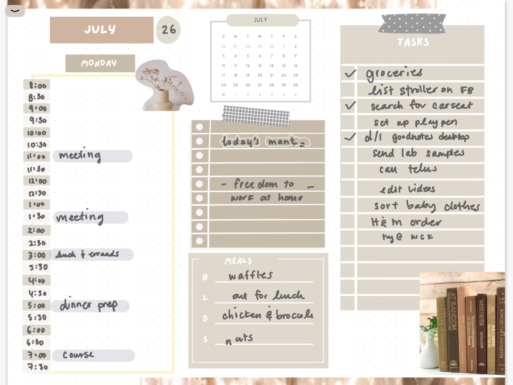
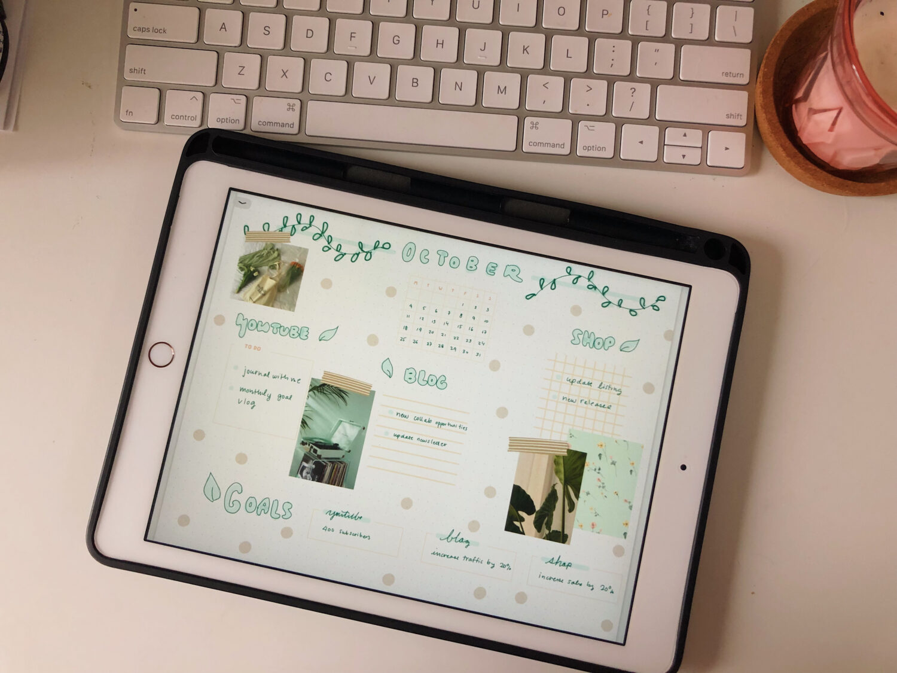
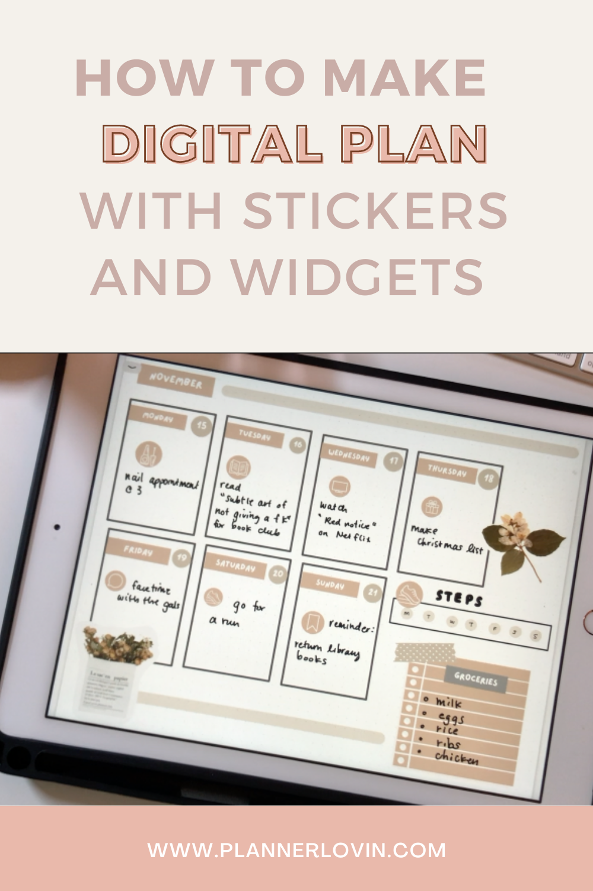

Have you planned using widgets before? What is a widget you might ask. Which it is a sticker that is it add onto your planner that helps you add a new section or tracker to your page. So simply put it it can be an additional sticker that you put to add a new section to your platter that isn’t already there.

I like using these widgets because I’m very fluid in my planning. Sometimes I can’t find a certain insert that fits all my needs on a day today or by week basis. Sometimes I need more sections and sometimes my days are just really boring and there’s nothing to note down. Having these widgets allow me to be flexible in my planner and how I plan my days. It also helps that I don’t have to commit to a certain insert or planner because I can just use these to help add whatever I need.

Here are a few of my spreads that I’ve used widgets.

## [If you’re interested in these widgets I have some listed in my shop!](https://www.etsy.com/ca/listing/1055737721/900-functional-digital-planning-stickers?ref=shop_home_feat_4)

https://www.youtube.com/watch?v=Fy5e12tVo7A&ab\_channel=createwithmny

## Pin It!

