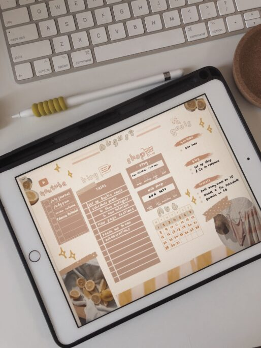

Have you planned using widgets before?

What is a widget you might ask. A widget is a sticker that is used in your planner that helps you add a new section or tracker to your page.

To simply put it, it can be an additional sticker that you put to add a new section to your planner that isn’t already there. Most of the time, these are functional stickers.

I like using these widgets because I like the flexibility in my planning. Sometimes I can’t find a certain insert that fits all my needs on a daily or by weekly basis. Sometimes I need more sections and sometimes my days are just really boring and there’s nothing to note down.

Having these widgets allow me to be flexible in my planner and how I plan my days. It also helps that I don’t have to commit to a certain insert or planner because I can just use these to help add whatever I need.

Here are a few of my spreads that I’ve used widgets.

If you’re interested in these widgets I have [some listed in my shop that you can take a look at](https://www.etsy.com/ca/listing/1055737721/900-functional-digital-planning-stickers?ref=shop_home_active_3)

[See this set on Etsy! 🛒](https://www.etsy.com/ca/listing/1055737721/900-functional-digital-planning-stickers?ref=shop_home_active_3)

## Watch on YouTube

https://youtu.be/Fy5e12tVo7A
