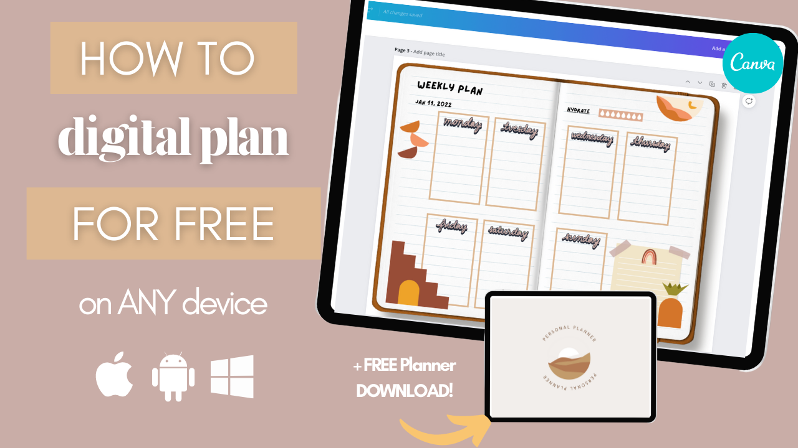
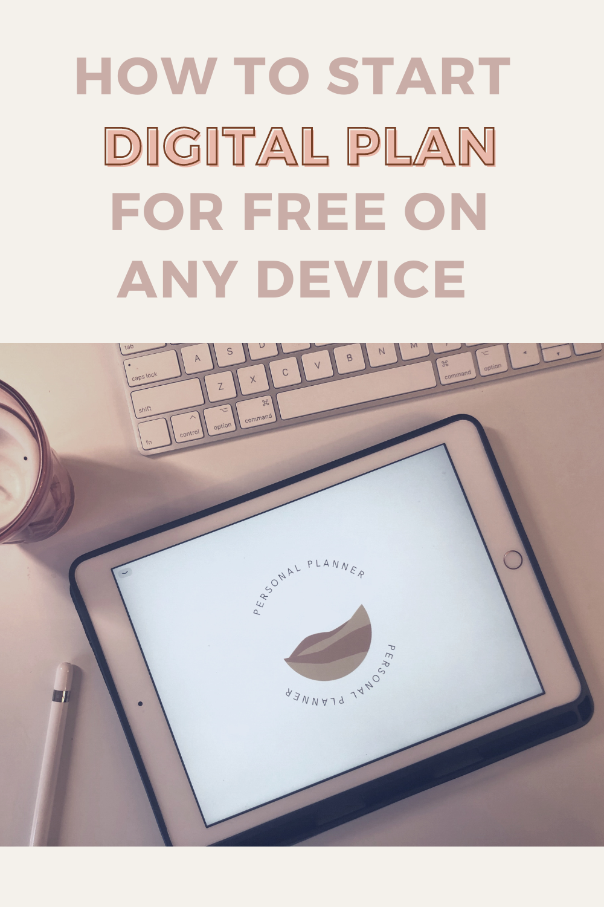

If you're just starting out in digital planning, you can actually start for FREE! The best thing is, you can do it on any device! You don't have to invest in an iPad or an Android tablet if you don't want to. You can do this on your laptop or even on your phone if you download the [Canva app](https://thebeigejournal.com/canva)!

I've decided to make a video about this, and you can watch it below.

Get started by signing up to [Canva](https://thebeigejournal.com/canva) and follow along with my video!

## Watch on YouTube

https://youtu.be/3B437iVyjsc

## Download the FREE digital planner to use in Canva

[Loading...](https://colorcodesigns.gumroad.com/l/beigepersonalplanner)

## Pin it

