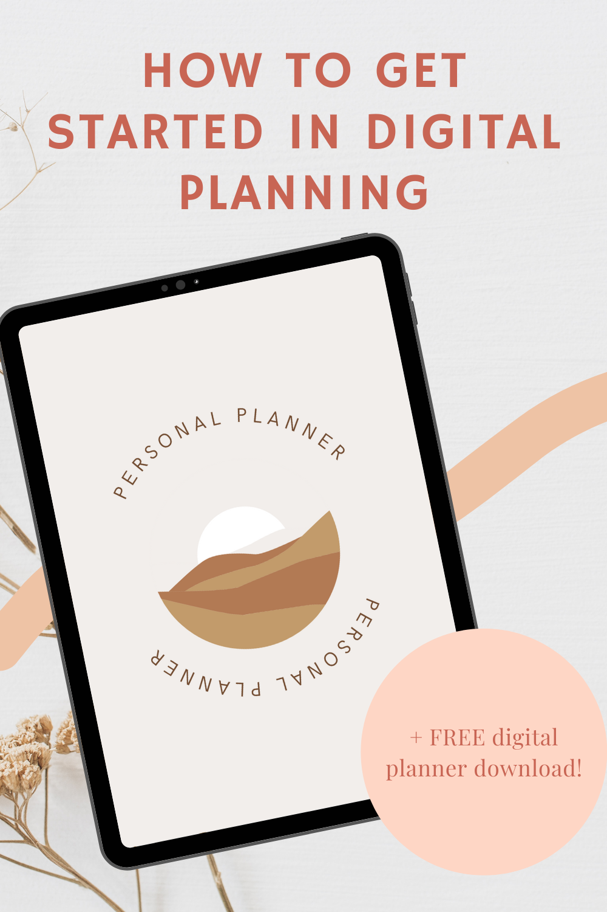

https://youtu.be/\_mSMu9z6EZc

The new year means setting new goals and plans. This year, if you're just starting in the world of digital planning, it can get a bit confusing.

- How do I choose my planner?

- What apps should I use?

- Where can I find planning resources?

Well, you've come to the right place, because this is a quick guide to get you started. **AND a free planner** for you to figure out if digital planning is for you at the end of this post! So let's get started!

## What is digital planning?

Digital planning in this case is using an iPad, tablet or computer to create a planner spread that can help your productivity. The most common way to digital plan is to use an iPad or tablet as a digital writing surface using a pen or stylus. You can read more about [how to get started in digital planning in this blog post](https://thebeigejournal.com/tutorials/how-to-start-using-a-digital-planner/).

## What apps do I use for digital planning?

The one app that most digital planners use is called [GoodNotes](https://www.goodnotes.com/). It is a note taking app on the iPad and it can sync to your computer. These note taking apps allow you to annotate/write on your planner which is in the format of a PDF file.

Here is a list of all the note-taking apps you can try:

- [GoodNotes](https://www.goodnotes.com/)

- [Zoomnotes](http://www.zoom-notes.com/)

- [Notability](https://notability.com/) (free)

- [Noteshelf](https://www.noteshelf.net/)

- [Xodo](https://www.xodo.com/app/#/) (free)

- [Collanote](https://apps.apple.com/us/app/collanote-note-journal-pdf/id1540956268) (free)

[Read my comparison between GoodNotes and Notability here](https://thebeigejournal.com/tutorials/digital-planning-101-notability-vs-goodnotes/)

## Where can I find planning resources?

Here! We have tutorials on our [YouTube channel](https://www.youtube.com/c/createwithmny) and a selection of [blog posts on digital planning](https://thebeigejournal.com/category/digital-planning/). We also have a [Freebie Library](https://thebeigejournal.com/digital-planner-freebies/) you can join!

I also have a [list of websites that offers](https://thebeigejournal.com/digital-planning/where-to-find-freebies-for-digital-planning/) freebies for you to try.

If you're looking for planners, [Etsy](http://www.etsy.com) is the best place to look. Lots of creators post their planners and stickers for sale on Etsy.

Try joining some [Facebook groups like this one](https://www.facebook.com/groups/2648178365203907) to ask a community of digital planners questions!

## In summary

Here is a list of items that will be helpful for digital planning:

- an iPad or tablet. Anything that you can use a stylus to write on

- a PDF annotation app

- a planner that is in PDF format with hyperlinks (but not necessary) [**See my Etsy favourites!**](https://thebeigejournal.com/etsy-planners)

- a [matte screen protector](https://amzn.to/3HMXB4U) (this helps with writing and prevents that stylus to slip around on the screen when you're writing) [Get this one from Amazon!](https://amzn.to/3HMXB4U)

- additional stickers that can add to your planner (in PNG, individually cropped format) **[See my Etsy favourites](https://www.etsy.com/ca/people/ColorCoordinated/favorites/winter-stickers?ref=profile)!**

## Other FAQs

#### Can I add and remove pages in my planner?

Yes! One thing to remember though, is if your planner is hyperlinked, do not delete a page that it might be linked it. These pages are usually separator pages, monthly pages, title pages, etc...

#### How do I add new fonts to my iPad

You can watch my [tutorial here](https://youtu.be/6dtE64LMNVA)!

## Download the FREE digital planner

\[sc name="gumroad\_freedigitalplanner" \]\[/sc\]

## Learn how to use this planner on YouTube

https://youtu.be/\_mSMu9z6EZc

## Pin it!

