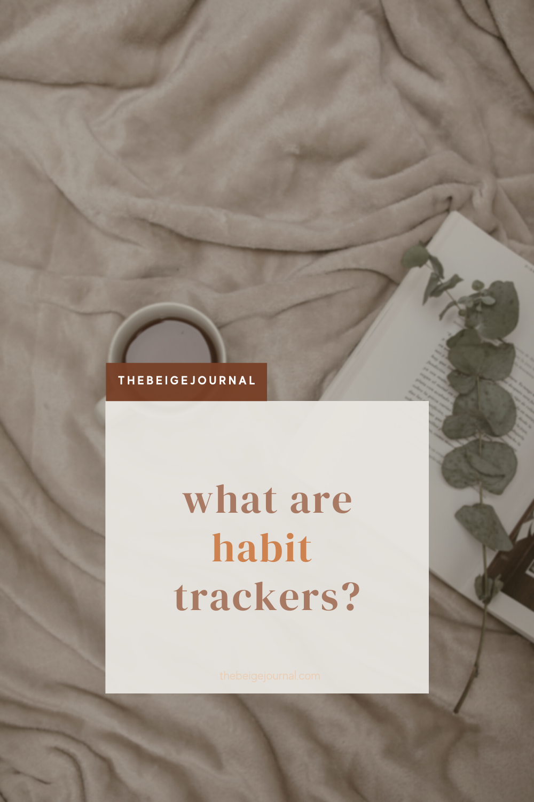

If you’re looking to get started in journaling, and don’t know where to start, don’t worry! This post will help you get started.

First of all, there are no rules for journaling, but it’s a great tool for self discovery.  All you need to get started is a paper or digital notebook!

**Here are my suggestions:**

- [Paper notebook](https://www.amazon.ca/Essentials-Large-Matrix-Notebook-Journal/dp/1441323716?keywords=dotted+notebook&qid=1642914510&s=office&sprefix=dotted+note%2Coffice-products%2C115&sr=1-1-spons&psc=1&spLa=ZW5jcnlwdGVkUXVhbGlmaWVyPUFTWE1OSDhHNUg3SDcmZW5jcnlwdGVkSWQ9QTAzOTE3MTVMMTNXNThSSVY5WlQmZW5jcnlwdGVkQWRJZD1BMDY0MzU4MFdJTldNS1pERlBMNCZ3aWRnZXROYW1lPXNwX2F0ZiZhY3Rpb249Y2xpY2tSZWRpcmVjdCZkb05vdExvZ0NsaWNrPXRydWU%3D&linkCode=li2&tag=fieldnotesyvrcan-20&linkId=b3758734416be0590d8dec30b1cb70b6&language=en_CA&ref_=as_li_ss_il)

- [Digital notebook](https://www.etsy.com/ca/listing/696344154/digital-notebook-digital-planner-blank?click_key=73bb5ec8269f8e440ac78415c605d18ae48a81df%3A696344154&click_sum=aa15e747&ref=shop_home_active_9)

## What is journaling?

Journaling is a great way to capture your thoughts.  Sometimes having too many things on your mind can bog you down and create unpleasant side effects like insomnia or anxiety.  Journaling helps unload all that stress from your mind and give you a fresh start to the day.

**Here are a few ways to journal.**

## 1\. Morning pages 

This method is from a book called “the Artist’s way”.  How it works is that you dedicate some time to writing three pages of longhand stream of consciousness writing in the morning.  This meant to help your brain dump your thoughts on to the paper.  

The most important part of this exercise is to get everything on to writing - no complete sentences - just let it flow!

Don’t sensor or analyze anything that you’re writing.  This helps you get out of your comfort zone.  

If you’re not up to doing this in the morning, anytime during the day would be a great time to do this too!

## 2\. Journaling to self

Have you ever felt confused, lost or stuck in your mind?

This method of journaling can help clear your thoughts when you have it down in writing.  You might even discover something new about yourself.  

You can get started by asking yourself some honest questions.  Here are a few examples  

- How do you feel at the moment?

- What’s going great in your life?
- What are you grateful for?

Don’t be afraid to keep it as honest as possible - don’t filter any of your thoughts on paper.  This might feel uncomfortable, but it’s and effective way to discover what you’re really feeling.

## 3\. Write a letter to someone

Ever been so angry or mad at someone and can’t get those negative feelings out of your system?  Well writing a letter to someone can help you work through your emotions. Don’t worry, they’re not going to read it.

The main point of this way of journaling is to write a letter of forgiveness - even if you don’t think they deserve forgiveness.  This allows you to let your feelings go and heal and forgive that person.

Go ahead, let all those negative feelings flow into writing and maybe you’ll feel better about it after!

## 4\. Organize your thoughts visually

This is probably the most common use of journaling.  Sometimes when you have too much on your mind, you start spinning in your thoughts.  

That is why having everything in writing is great for organizing you thoughts.  You can dump all your ideas into writing and connect them.

Making a mind map is a great way to plan everything you need to do and organize it visually.

## 5\. Scrapbooking

Lastly, a journal is great for being creative.  Scrapbooking is a great way to save mementos from travels, activities and memories.

You can treat this as a photo album of sorts and all stickers, washis and personal notes to it!

## Here are 25 journaling prompts to get you started

1. What does the perfect day look like to you?
2. Where do you see yourself in 1 year?
3. What are your goals for today? This week? This year?
4. What are your biggest struggles?
5. List your plans or non-plans to tackle those struggles.
6. Where is your favorite place in the world and why?
7. Describe the closest people in your life and what you love about them.
8. What do you love about yourself?
9. What are your predictions for the future of the world?
10. Describe your ideal lifestyle.
11. Journal 10 positive affirmations. 
12. Journal about your ideal partner/love interest.
13. Write about what happiness means to you.
14. What do you want to improve in your life?
15. What are your spiritual beliefs?
16. List your favorite inspirational quotes.
17. Journal some creative ideas or projects.
18. What would you like to manifest in your life?
19. Write about your happiest memories.
20. Journal some ideas to help lift your mood when feeling down.
21. Write out some life goals.
22. What are you most grateful for?
23. What does love mean to you?
24. Journal what to “let go of”- worries, things out of your control, etc.
25. How can you make the world a better place and be a force of good?

## Download to keep a copy in your journal!

[Loading...](https://plannerlovin.gumroad.com/l/fhiaz)

## Join our newsletter for freebies and inspiration!

\[mailerlite\_form form\_id=3\]
