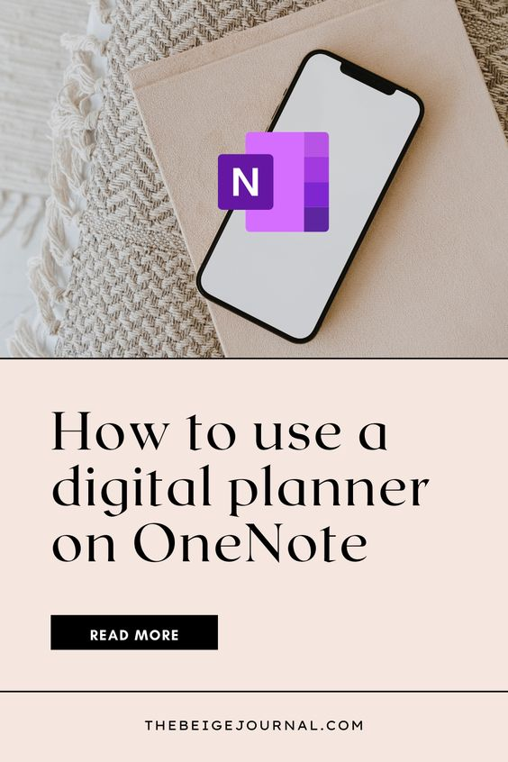
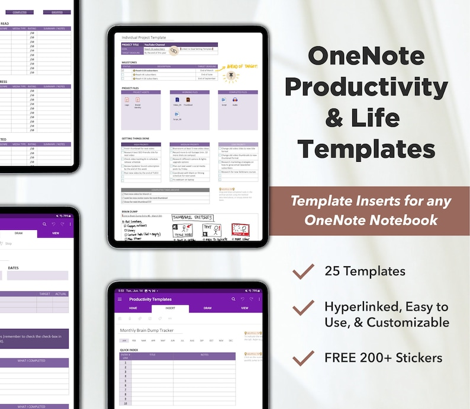
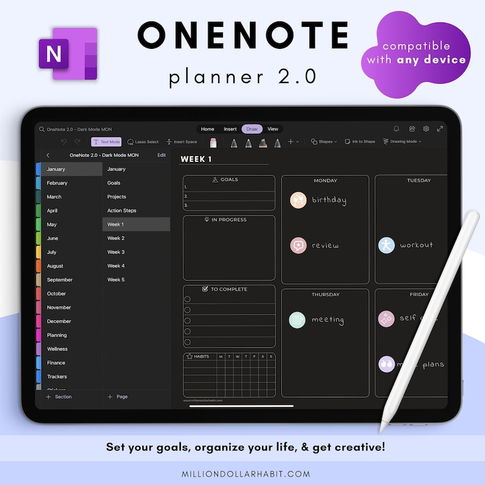
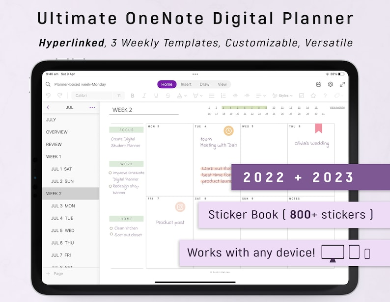
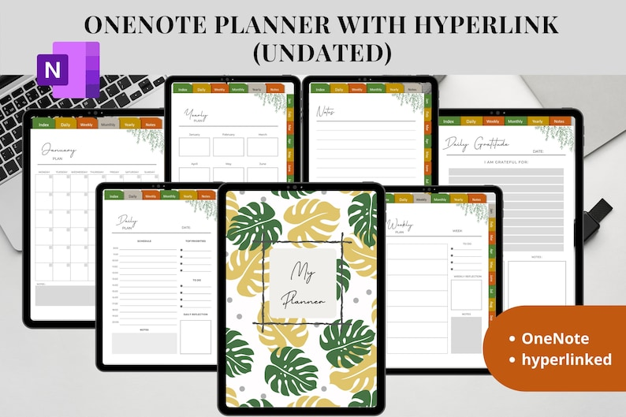
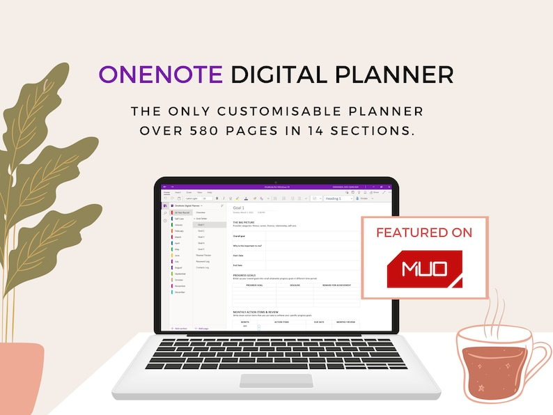
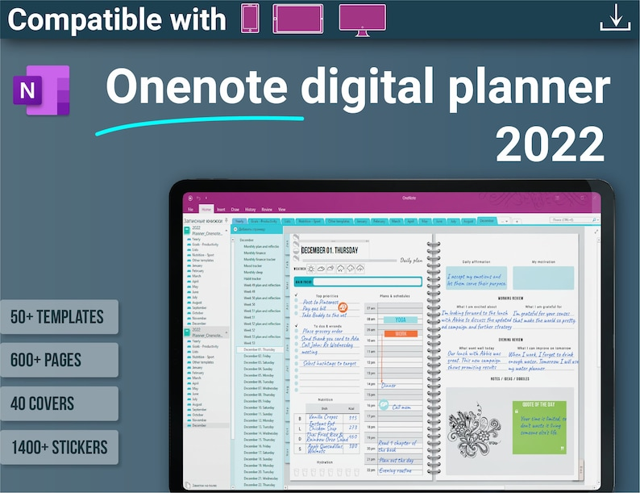
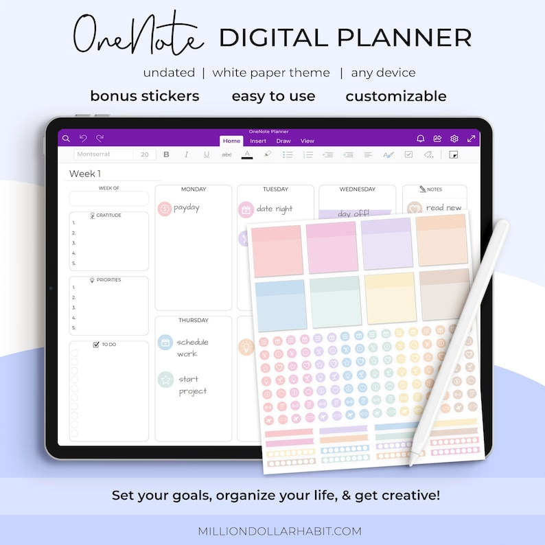
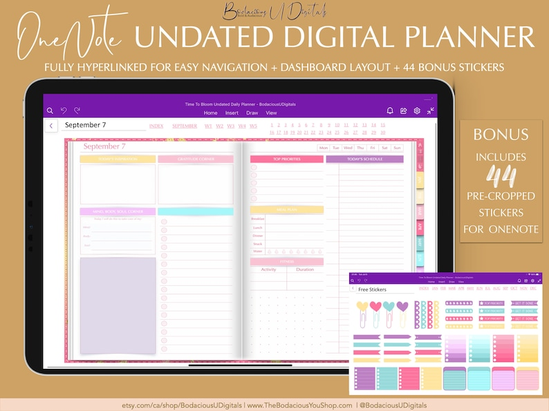
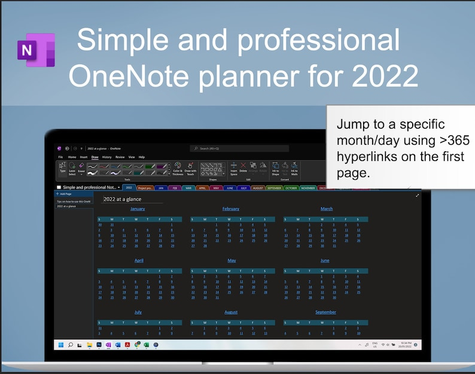

OneNote is a digital note-taking tool that can help you plan and organize your life. Whether you're a student, an entrepreneur, or just someone looking for a better way to keep track of your tasks and ideas, OneNote has everything you need to streamline your planning process. In this post, we'll explore the key features of OneNote and how you can use them to take your digital planning to the next level.

## Create Notebooks and Pages

OneNote is organized into notebooks, and each notebook is made up of pages. To start using OneNote for planning, you should create a new notebook specifically for your planning. Within this notebook, create pages for each area of your life that you want to plan. For example, you might have a page for work tasks, a page for personal tasks, and a page for your grocery list.

## Make Use of Tagging

OneNote lets you tag pages and sections to help you categorize and organize your notes. To make the most of this feature, create tags that correspond to the different areas of your life that you're planning. For example, you could create tags for work, personal, and grocery. Then, when you create a new note or task, you can tag it with the appropriate category.

## Take Notes in a Variety of Formats

OneNote offers a variety of ways to take notes, including typing, handwriting, drawing, and audio recording. This makes it a versatile tool for planning and taking notes. If you prefer to type, you can type out your notes, lists, and tasks. If you prefer to handwrite, you can use the drawing feature to jot down notes. And if you need to capture an audio recording, you can do so right in OneNote.

## Use the Task List Feature

OneNote has a built-in task list feature that makes it easy to keep track of your to-do items. To use this feature, simply create a bullet list of items and then check them off as you complete them. OneNote will also keep track of the date and time that you completed each task, so you can see at a glance how productive you've been.

## What are OneNote Templates?

OneNote templates are pre-designed pages that you can use to quickly and easily set up your digital planning in OneNote. They are created by designers and developers, and they come in a variety of styles, designs, and formats to suit your personal taste and needs.

## Use OneNote Templates from Etsy

OneNote templates from Etsy provide a quick and easy way to get started with digital planning. These templates are pre-designed pages that you can use to jump-start your planning process. They come in a variety of styles and designs to suit your personal taste, and they're often customizable so you can make them your own.

One of the benefits of using OneNote templates is that they save you time and effort in setting up your own pages. Simply download the template you like, open it in OneNote, and start using it right away. With templates, you don't have to worry about figuring out how to organize your notes and tasks; the template takes care of that for you.

Another benefit of using OneNote templates is that they provide a structured framework for your planning. This makes it easier to keep track of your tasks and stay on track, and it helps you be more productive and efficient.

## Does OneNote support PDF templates?

Yes, OneNote supports PDF templates. You can import a PDF template into OneNote and use it as a reference while taking notes.

In conclusion, OneNote is a powerful digital planning tool that can help you keep track of your tasks, ideas, and notes. By using the key features we've outlined in this post, you can take your digital planning to the next level and achieve your goals more efficiently. Start using OneNote today and see for yourself just how powerful it can be!

**Check out these OneNote Planners on Etsy!**

<figure>

<figcaption>

**[Get it here](https://www.etsy.com/ca/listing/1259360187/productivity-planner-life-planner?ga_order=most_relevant&ga_search_type=all&ga_view_type=gallery&ga_search_query=onenote+planner&ref=sr_gallery-1-28&pop=1&organic_search_click=1)**

</figcaption>

</figure>

<figure>

<figcaption>

[**Get it here**](https://www.etsy.com/ca/listing/1082578085/onenote-blackout-digital-planner-dark?ga_order=most_relevant&ga_search_type=all&ga_view_type=gallery&ga_search_query=onenote+planner&ref=sr_gallery-1-24&pro=1&organic_search_click=1)

</figcaption>

</figure>

<figure>

<figcaption>

**[Get it here](https://www.etsy.com/ca/listing/876565215/digital-planner-onenote-2022-2023?ga_order=most_relevant&ga_search_type=all&ga_view_type=gallery&ga_search_query=onenote+planner&ref=sr_gallery-1-21&pro=1&organic_search_click=1)**

</figcaption>

</figure>

<figure>

<figcaption>

**[Get it here](https://www.etsy.com/ca/listing/1069482064/onenote-planner-hyperlinked-one-note?ga_order=most_relevant&ga_search_type=all&ga_view_type=gallery&ga_search_query=onenote+planner&ref=sr_gallery-1-33&organic_search_click=1)**

</figcaption>

</figure>

<figure>

<figcaption>

**[Get it here](https://www.etsy.com/ca/listing/976649691/onenote-daily-planner-ultimate-digital?ga_order=most_relevant&ga_search_type=all&ga_view_type=gallery&ga_search_query=onenote+planner&ref=sr_gallery-1-34&organic_search_click=1)**

</figcaption>

</figure>

<figure>

<figcaption>

**[Get it here](https://www.etsy.com/ca/listing/1197849474/one-note-planner-template-onenote?ga_order=most_relevant&ga_search_type=all&ga_view_type=gallery&ga_search_query=onenote+planner&ref=sr_gallery-1-47&pro=1&organic_search_click=1)**

</figcaption>

</figure>

<figure>

<figcaption>

**[Get it here](https://www.etsy.com/ca/listing/901775955/onenote-digital-planner-undated-onenote?ga_order=most_relevant&ga_search_type=all&ga_view_type=gallery&ga_search_query=onenote+planner&ref=sr_gallery-1-48&pro=1&organic_search_click=1)**

</figcaption>

</figure>

<figure>

<figcaption>

**[Get it here](https://www.etsy.com/ca/listing/1047570551/onenote-dashboard-layout-digital-planner?ga_order=most_relevant&ga_search_type=all&ga_view_type=gallery&ga_search_query=onenote+planner&ref=sr_gallery-2-5&organic_search_click=1)**

</figcaption>

</figure>

<figure>

<figcaption>

**[Get it here](https://i.etsystatic.com/33991175/r/il/fd6d22/3612193588/il_794xN.3612193588_k0mo.jpg)**

</figcaption>

</figure>

<figure>

<figcaption>

**[Get it here](https://www.etsy.com/ca/listing/876565215/digital-planner-onenote-2022-2023?ga_order=most_relevant&ga_search_type=all&ga_view_type=gallery&ga_search_query=onenote+planner&ref=sr_gallery-1-7&pro=1&organic_search_click=1)**

</figcaption>

</figure>
