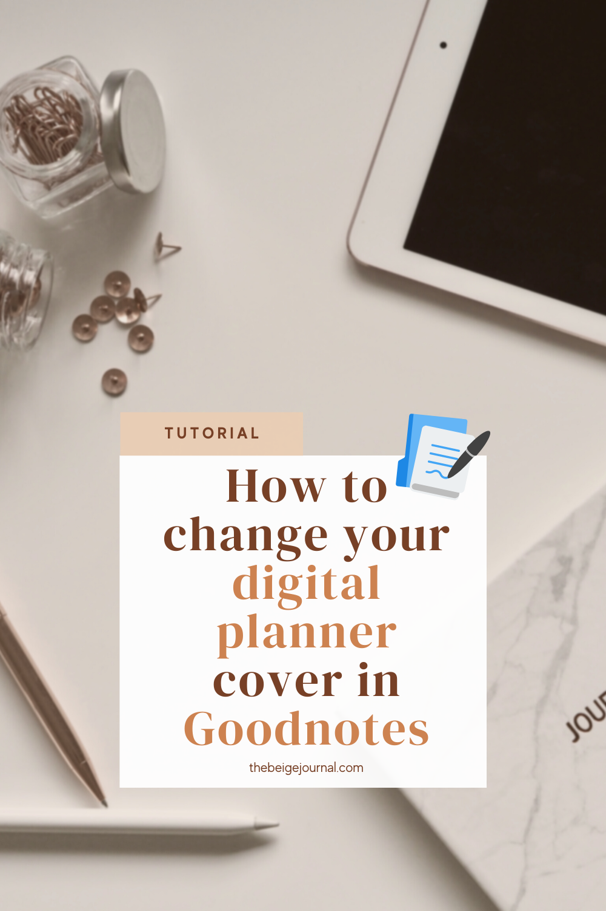

The second month of the year and I have lots of ideas!!

I’ve been trying to scale back and trying to keep my content alive - if that’s even possible.  So in order to do this, I’ve tried out a lot of new software this month!

Well, enough talk, let's dig into our income report for 2022.

Here are a few things I’ll cover in this report

- Monthly traffic/ followers
- Breakdown of income
- Summary of what I did this month
- Goals for next month

## **Monthly Traffic**

**February traffic**

Blog: 4,636 views

Pinterest: 742 followers

Youtube: 746 subscribers

Instagram: 2116 followers (something that I’m not actively growing)

## **Income**

- Etsy shop: $43.21

- Affiliates: $75.74

- Adsense: $36.80

## **Expense**

\* read about all the tools I use in the section below!

- [Canva Pro](https://thebeigejournal.com/Canva): $8.50
- [Mailerlite](https://thebeigejournal.com/mailerlite): $20
- Content: $13.75
- [Tailwind](https://thebeigejournal.com/tailwind): $13.00

Total: $100.50

## **What did I do to grow in February?**

This month I haven’t been creating much new content.  I was going to switch advertising publisher, but my site was a bit messy and was rejected.  So this kicked me into overdrive trying to clean up my website to be more readable and organized.

## **Tools I use**

I’m a big advocate for using free software for as long as possible! Here are the tools you can start using for free!

[Canva](http://canva) - for all my designing needs.  They also provide scheduling on social media so I don’t have to export all my designs!  It really streamlines things when I don’t have to download and upload again and my designs are all in one place!  

[Tail](http://tailwind)[wind](http://tailwind) - Pinterest has been THE most recommended social media for bloggers to get into, so I’ve been using Tailwind for my pinterest scheduling and designing.  This tool helps me create all my monthly pins in less than 30 mins!  It’s such a time saver when you’re expected to create fresh pins (which means different/ new images) all the time!

[Mailerlite](https://thebeigejournal.com/mailerlite) - from all the email marketing platforms I’ve used, Mailerite has been the easiest and most versatile one I’ve used.  It’s also very generous with their free tier so you don’t have to pay while you’re growing your list.  On their free plan, you also have lots of features that you normally won’t get from other platforms like the use of RSS feeds and automation for your emails.

## **Goals for next month**

Continue to grow my traffic.  I’m getting more and more strapped for time because of my kids, so I really want to find the most optimal way to grow my blog and business.  I’ve heard lots of good things about 

### Spend more time on Pinterest

I’ve heard lots of good things about Pinterest, and after all these years, I’ve never really dug deep into its benefits.  So I’ll be spending more time using Pinterest next month!

### Streamline + schedule

I’ll do my best to schedule more things ahead of time and build a process for all things I need to get done!  I always say this, but I have a shiny object syndrome, so sometimes I get distracted and work on something new and exciting instead of focusing on what works!

I hope you enjoyed my income report this month!

If you want to see more of this, sign up for my newsletter below so you don’t miss out on my updates!

\[mailerlite\_form form\_id=4\]
