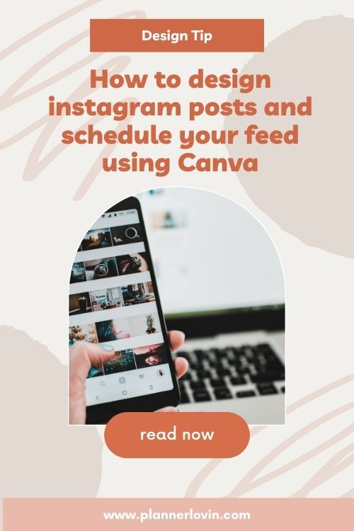

Learn how you can create instagram posts on Canva and then schedule it to your Instagram right on a platform. This feature has saved me a lot of time in the past and I don't think this is a feature that a lot of people know about!

[Instagram](https://www.instagram.com/createw.mny/) // [Youtube](https://www.youtube.com/channel/UCSRJASK0JGPuJ2N7fP93qfg) // [Etsy Shop](https://bit.ly/2JIx1Bw)

Watch along on Youtube!

https://www.youtube.com/watch?v=5uYNrSc1DpY

Subscribe for more videos and templates!

**Watch my Youtube video for the full tutorial!**

Other videos you might be interested in:

<iframe width="560" height="315" src="https://www.youtube.com/embed/videoseries?list=PLxW9RDSbnnXU6YA3yAr8MOaMfnR7urXPh" title="YouTube video player" frameborder="0" allow="accelerometer; autoplay; clipboard-write; encrypted-media; gyroscope; picture-in-picture" allowfullscreen></iframe>

\[sc name="affiliate\_disclosure" \]\[/sc\]

## Pin it!

