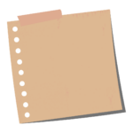
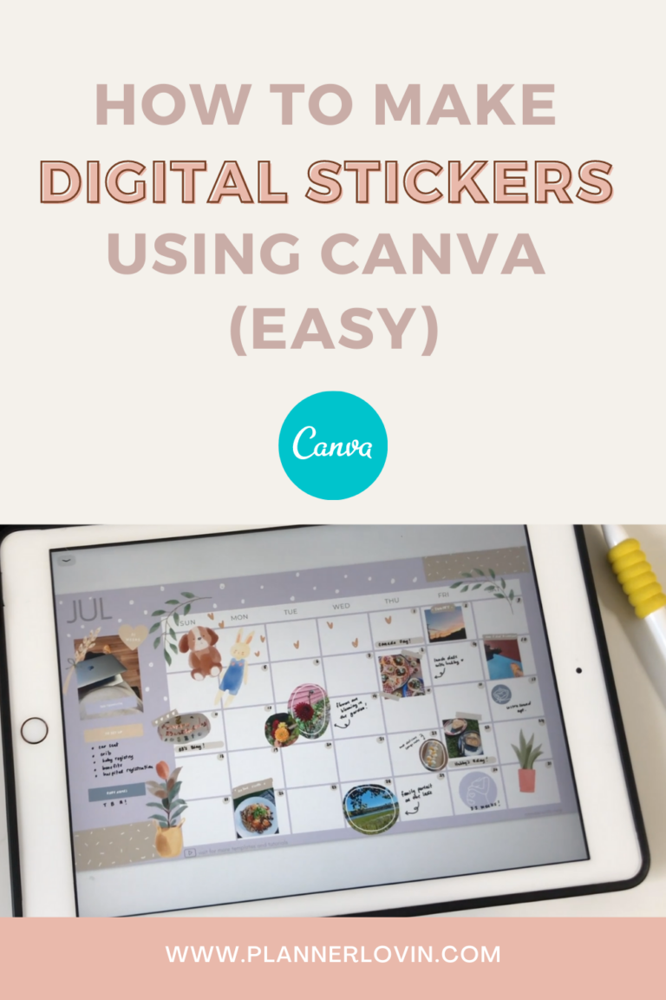

This week I'll be going through how I make digital stickers in [**Canva**](https://bit.ly/38hNrdS).

> [  
> ](https://www.google.com/search?q=What+is+Canva+and+how+does+it+work?&sxsrf=AOaemvJ-3nm8DpScKKyYcO1AVoFxwhxnkw:1630174581057&tbm=isch&source=iu&ictx=1&fir=PjRutWCaByk2MM%252C8vBegO_sQHUC6M%252C_&vet=1&usg=AI4_-kRG9PR5Pp8s7zthHqIprBA-3LjxTQ&sa=X&ved=2ahUKEwjy7szGqdTyAhUpEzQIHeWlDmcQ9QF6BAgTEAE#imgrc=PjRutWCaByk2MM)[Canva](https://bit.ly/38hNrdS) is a **free graphic design platform** that allows you to easily create invitations, business cards, flyers, lesson plans, Zoom backgrounds, and more using professionally designed templates. You can even upload your own photos and add them to Canva's templates using a drag and drop interface.

I'm currently using the [PRO version](https://bit.ly/38hNrdS) which has a lot more features than the free version.

Some of these feature include:

- Brand Kit management
- Magic Resize
- Design and Photo folders
- Download designs with transparent backgrounds
- Canva Animator
- Remove backgrounds from images
- And a massive library of images that are included in the Canva Pro plan

What's great about Canva is you can sign up for FREE without any long term commitment and test everything out and create LOTS of free resources for your own planner or planner business.

**You can find my free stickers below!**

**Watch along on Youtube!**

[Instagram](https://www.instagram.com/createw.mny/) // [Youtube](https://www.youtube.com/channel/UCSRJASK0JGPuJ2N7fP93qfg) // [Etsy Shop](https://www.etsy.com/ca/shop/ColorCoordinated)

https://www.youtube.com/watch?v=fDiPzmXJ76Q&ab\_channel=createwithmny

\[sc name="youtube-subscribe" \]\[/sc\]

\[sc name="youtube-about" \]\[/sc\]

## Frees Sticker Downloads

<figure>

<figcaption>

**[Download](https://drive.google.com/drive/folders/180U8laSqYccggVYWe2hBzAQT_DjVLaaW?usp=sharing)**

</figcaption>

</figure>

<figure>

<figcaption>

**[Download](https://drive.google.com/drive/folders/133UrnKbodJAendhN6umGzuUJR7SNOPvA?usp=sharing)**

</figcaption>

</figure>

\[sc name="affiliate\_disclosure" \]\[/sc\]

## Pin it!

