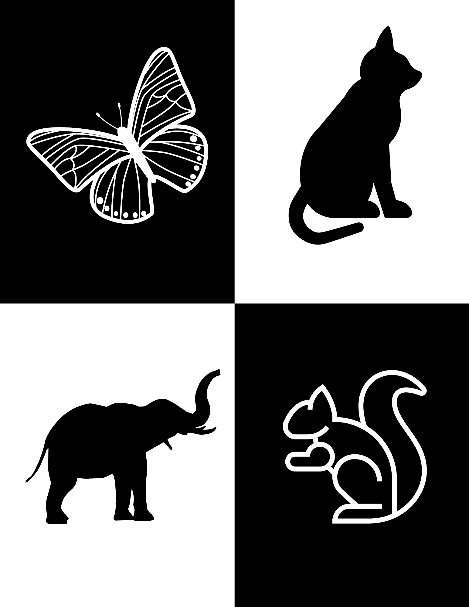

If you're anything like me, the start of a new year fills you with a mix of excitement and a bit of dread. Excitement for all the possibilities and a slight dread at the thought of getting everything organized. This year, I've discovered a game-changer for all of us trying to get our lives in order – digital planners, specifically designed for the iPad and optimized for GoodNotes. Let me take you through why this might just be the thing you need to kickstart your year right!

## **The Evolution of Planning**

Remember the days of paper planners? I sure do. I've gone through my fair share of them, each promising to be the one that would finally get me organized. But let’s be real, they often ended up half-filled, gathering dust on a shelf. That's until I discovered digital planners. These are not your average calendar apps. They're customizable, eco-friendly, and oh-so-convenient. Imagine having your planner with you at all times without the bulk of a physical book. That's the beauty of going digital.

## **Why an iPad and GoodNotes?**

So why an iPad and why GoodNotes, you ask? Well, the iPad's versatility as a tablet is unparalleled – it's lightweight, portable, and its battery life is a dream. And when paired with GoodNotes, it becomes a powerhouse for organization. GoodNotes offers this wonderful ability to mimic the feel of writing on paper while providing the flexibility of digital. Plus, you can easily erase mistakes, rearrange pages, and never run out of space. It’s like having a magic notebook that never ends!

## **Getting Started with Your Digital Planner**

Getting started might seem daunting, but trust me, it’s simpler than you think. First, choose a planner that suits your style and needs. There are so many out there – daily, weekly, monthly layouts, planners with goal-setting pages, habit trackers, you name it. Once you've got your planner, import it into GoodNotes. This app lets you add, delete, and move pages around. You can even bookmark pages for quick access. It's like having a personal assistant in your iPad.

[Shop our digital planners](https://thebeigejournal.com/shop)

##   
**Customizing Your Digital Planner**

This is where the fun begins! Customizing your digital planner is so satisfying. You can choose different colors, add stickers, and even create your own templates. I love adding inspirational quotes and personal photos to mine. It’s not just about planning your day; it's about creating a space that’s uniquely yours. GoodNotes has a variety of tools that let you play around with fonts, colors, and images. You’re basically an artist with a planner as your canvas.

## **Maximizing Productivity with Your Digital Planner**

Now, onto the crux of the matter – productivity. A digital planner, no matter how fancy, is only as good as how you use it. Start by setting clear goals for what you want to achieve. Break down these goals into smaller, manageable tasks, and schedule them. I love using the daily and weekly views for this. Remember, the key is consistency. It’s about making small, daily choices that align with your goals. And before you know it, you’re not just planning; you’re doing.

## **Advanced Features and Tricks for Power Users**

Once you get the hang of it, there are some advanced features in GoodNotes that can take your planning to the next level. You can link different pages within your planner, create hyperlinked indexes, and even integrate your planner with other apps through split-screen mode. And let’s not forget about handwriting recognition – GoodNotes can convert your handwritten notes to text, which is a lifesaver for quickly searching through your entries.

## **Overcoming Common Challenges**

Transitioning to a digital planner isn't without its challenges. One of the biggest hurdles can be just getting used to a new system. It takes time to build a habit, so be patient with yourself. If you miss a day or two, don’t sweat it. Just pick up where you left off. And if you're not tech-savvy, that's okay too. The beauty of digital planners is that they're designed to be user-friendly. Take it one step at a time, and you'll be a pro before you know it.

## Download our free planner!

\[sc name="gumroad\_freedigitalplanner" \]\[/sc\]
