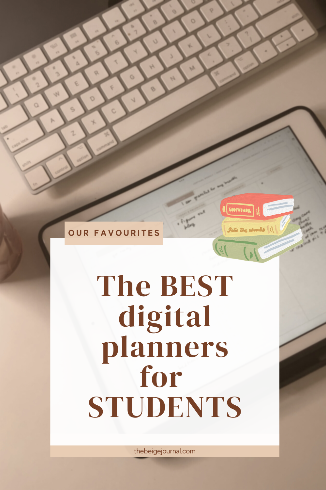
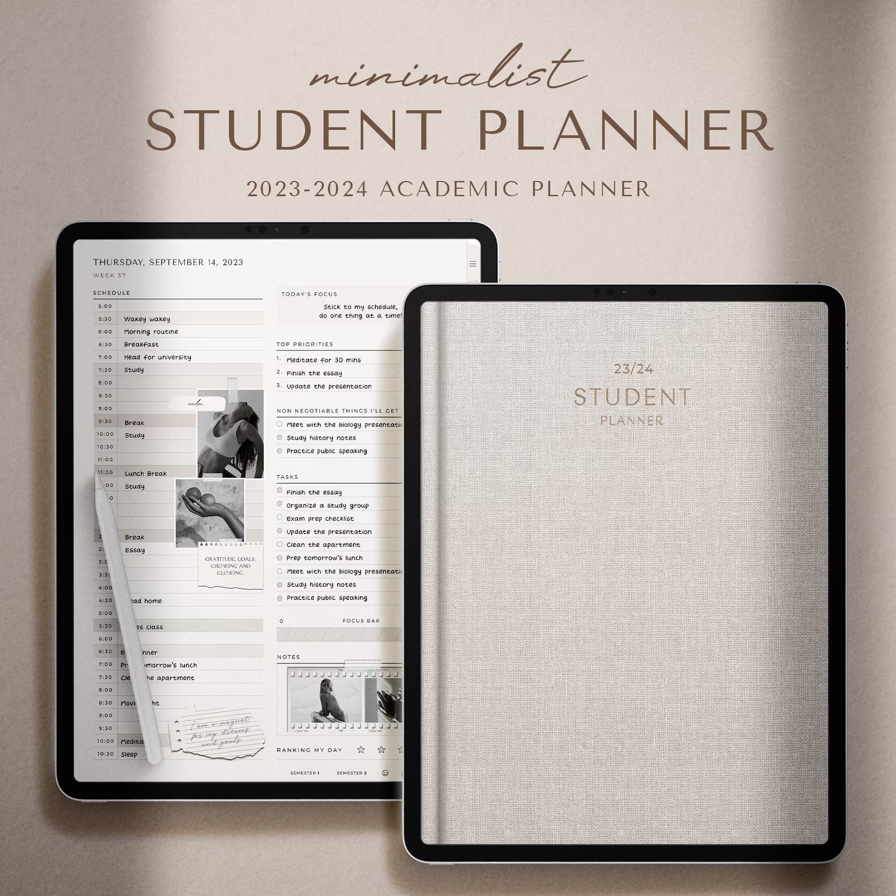
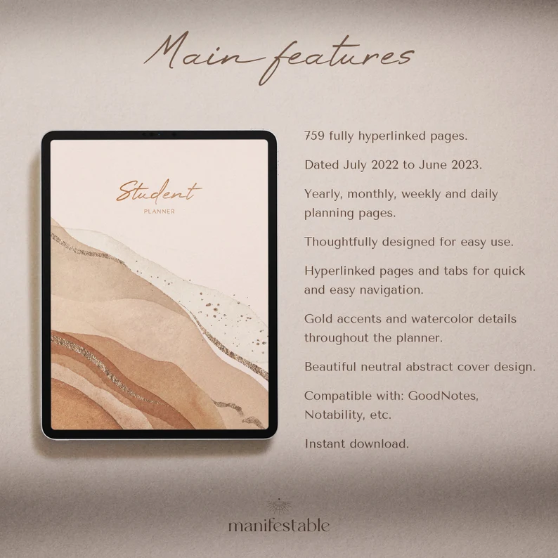
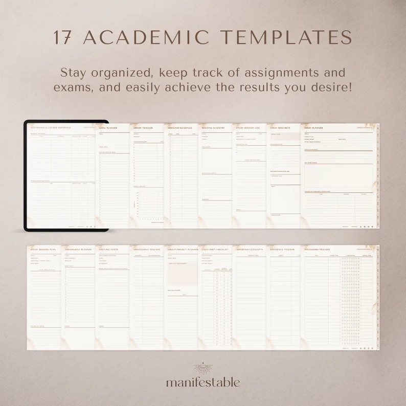

Keeping up with coursework, assignments, and exams as a student can be a difficult task. With so much to remember, it's easy to become overwhelmed and fall behind. This is where digital student planners come into play.

These tools can help you stay organised, manage your time effectively, and never miss another deadline again. We've compiled a list of the best digital planners for students in this blog post.

These planners are designed to make your academic life easier and more manageable, with customizable templates and seamless syncing capabilities.

So, whether you're in high school or college, keep reading to find the best digital planner to help you stay on track and succeed in your academic pursuits.

<figure>

<figcaption>

Digital study planner template, undated digital student planner, iPad Pro assignment tracker, goodnotes nurse college academic planner

</figcaption>

</figure>

[Buy on Etsy](https://www.etsy.com/ca/listing/1103467729/digital-study-planner-template-undated?ga_order=most_relevant&ga_search_type=all&ga_view_type=gallery&ga_search_query=student+digital+planner&ref=sr_gallery-1-13&bes=1&organic_search_click=1)

<figure>

<figcaption>

2022-2023 Digital Student Planner - Dated Academic GoodNotes Template - Notebook, Assignment Tracker, Project & Essay Planner - Dash Planner

</figcaption>

</figure>

[Buy on Etsy](https://www.etsy.com/ca/listing/709003351/2022-2023-digital-student-planner-dated?ga_order=most_relevant&ga_search_type=all&ga_view_type=gallery&ga_search_query=student+digital+planner&ref=sr_gallery-1-16&pro=1&sts=1&organic_search_click=1)

<figure>

<figcaption>

Student Digital Planner, GoodNotes Planner, Academic Planner, Notability Planner, iPad Planner for School, DATED 2023 2024

</figcaption>

</figure>

[Buy on Etsy](https://www.etsy.com/ca/listing/1030674707/student-digital-planner-goodnotes?ga_order=most_relevant&ga_search_type=all&ga_view_type=gallery&ga_search_query=student+digital+planner&ref=sr_gallery-1-18&pro=1&sts=1&organic_search_click=1)

<figure>

<figcaption>

Undated Student Goodnotes planner, Any Year Notability Digital Planner, Academic Ipad planner, Education Planner, Collanote Planner

</figcaption>

</figure>

[Buy on Etsy](https://www.etsy.com/ca/listing/1045920648/undated-student-goodnotes-planner-any?ga_order=most_relevant&ga_search_type=all&ga_view_type=gallery&ga_search_query=student+digital+planner&ref=sr_gallery-1-36&pro=1&sts=1&organic_search_click=1)

<figure>

<figcaption>

Digital Student Planner for College School UNDATED Black, Academic diary, Digital academic Planner, iPad, tablet planner, GoodNotes Planner

</figcaption>

</figure>

[Buy on Etsy](https://www.etsy.com/ca/listing/1359316903/digital-student-planner-for-college?ga_order=most_relevant&ga_search_type=all&ga_view_type=gallery&ga_search_query=academic+planner&ref=sr_gallery-1-14&pro=1&sts=1&organic_search_click=1)

<figure>

<figcaption>

Digital Student Planner | Academic Planner 2022-2023 | College Planner | Study Planner for Goodnotes, Notability | School iPad Planner

</figcaption>

</figure>

[Buy on Etsy](https://www.etsy.com/ca/listing/1284376906/digital-student-planner-academic-planner?ga_order=most_relevant&ga_search_type=all&ga_view_type=gallery&ga_search_query=digital+planner+student&ref=sr_gallery-1-6&bes=1&sts=1&organic_search_click=1)

Finally, digital student planners can be game changers for everyone who wants to stay prepared and on top of their studies.

Digital planners make it easier than ever to manage your academic life with their configurable templates, syncing capabilities, and variety of features.

There is a digital planner to suit your needs whether you are in high school, college, or seeking a post-graduate degree.

So, Instead of feeling overwhelmed by coursework, assignments, and tests, invest in a digital student planner today and take control of your academic life.

## Try digital planning for free!

\[sc name="gumroad\_freedigitalplanner" \]\[/sc\]
