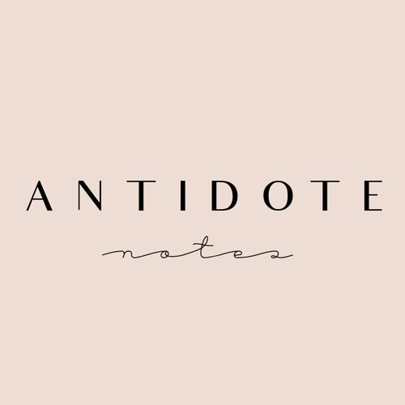
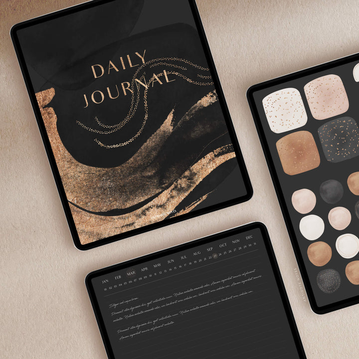
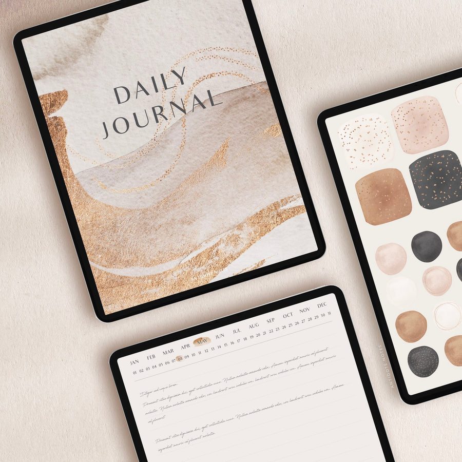
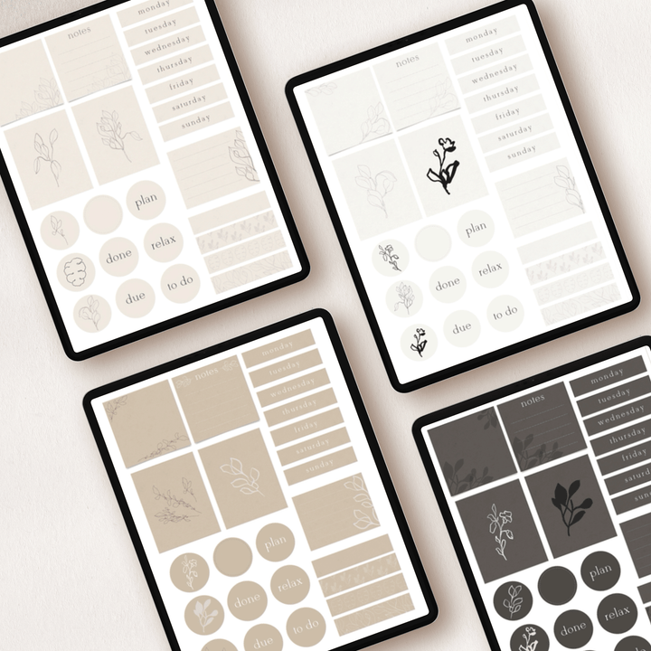
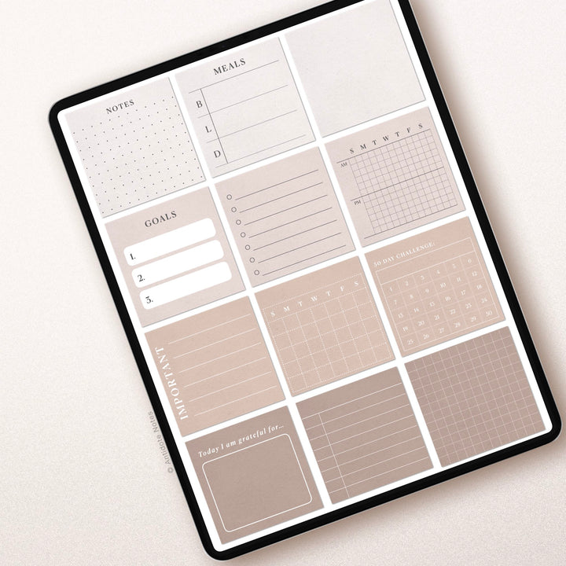
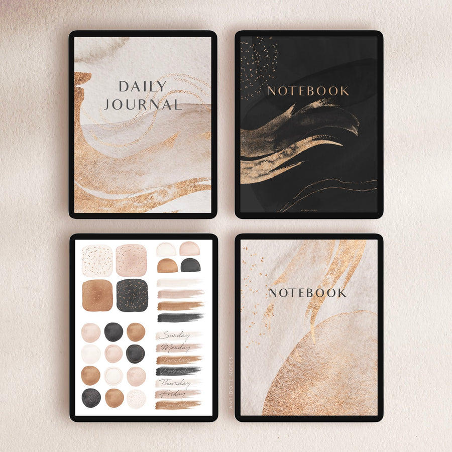
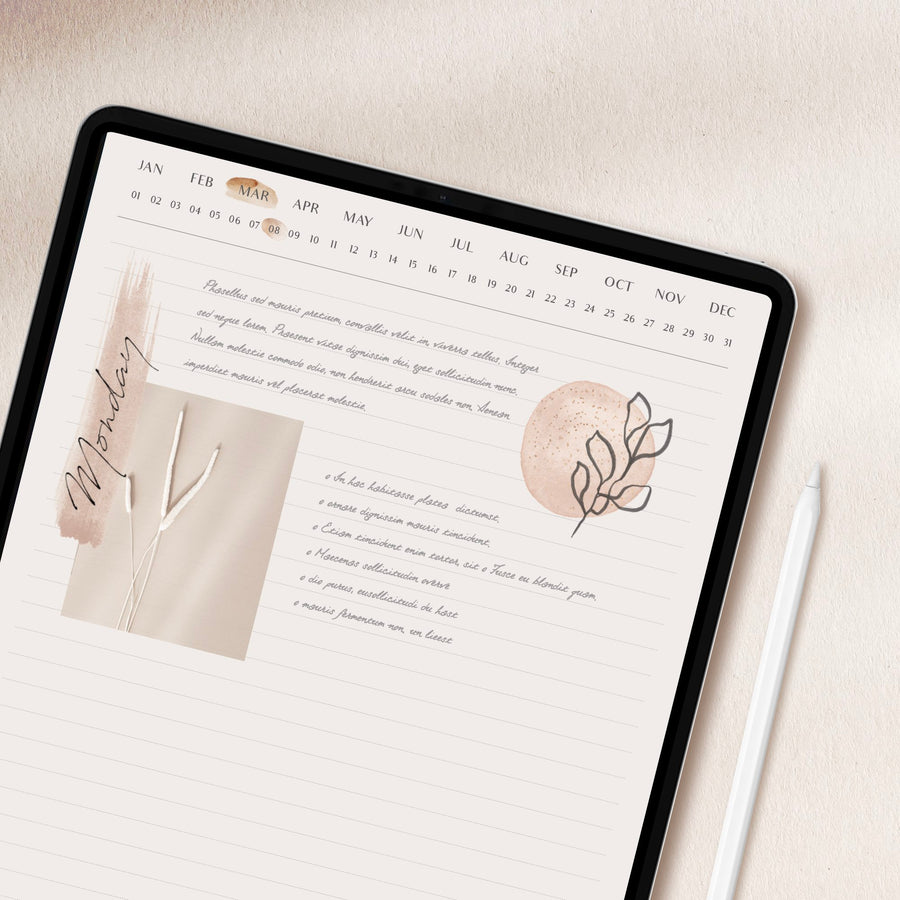

## What's the story behind your shop?

Hi! I'm Cass, the digital planner addict behind Antidote Notes.

My story began when I started creating my own planners during my research career. The demands of organising experiments, writing papers and just generally juggling life became overwhelming.

I quickly found that scribbling notes on random bits of paper was just. not. working.

Enter digital planning!

I found that the antidote to stress was a little daily dose of planning. I knew that I wanted to use the skills I learned from a research career to create logical and beautiful products to help others live with intention, so they can spend more time doing what they love.

## Where can we find your shop?

[Etsy Shop](https://www.etsy.com/shop/AntidoteNotes)

[Website](https://antidotenotes.co/)

## What kind of items do you sell in your shop?

Digital

## What is the inspiration behind your designs?

I create every planner, journal and notebook keeping three core values in mind;

1\. Design - logical layouts and intelligent links make planning easy.

2\. Simplicity - minimalist page design and no overcrowding with features makes our planners light and easy to use so you can focus on the important tasks.

3\. Beauty - I believe that the best planners are not only functional but also beautiful as these are the ones you want to keep using every single day!

I get so much motivation and inspiration from the amazing feedback I get from my customers. It's such a nice, warm feeling knowing that I've helped someone (even just a little bit!).

## What is your favourite planning/journaling tip?

Practice! Just plan a little every day, it takes a while to get used to digital planning but once you do, you're hooked! (Also don't worry about messy handwriting, embrace it!)

## Do you have a coupon code for our readers to try your product and freebies?

Yes! Get 10% off your first order when you sign up to The Antidote newsletter! You'll also get monthly freebies and exclusive sales! Sign up here: [https://bit.ly/3owFNmz](https://bit.ly/3owFNmz)

## Find them on social!

[Instagram](https://www.instagram.com/antidotenotes/)

* * *
