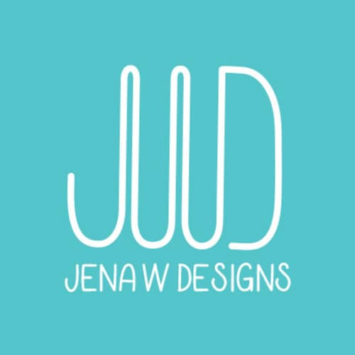
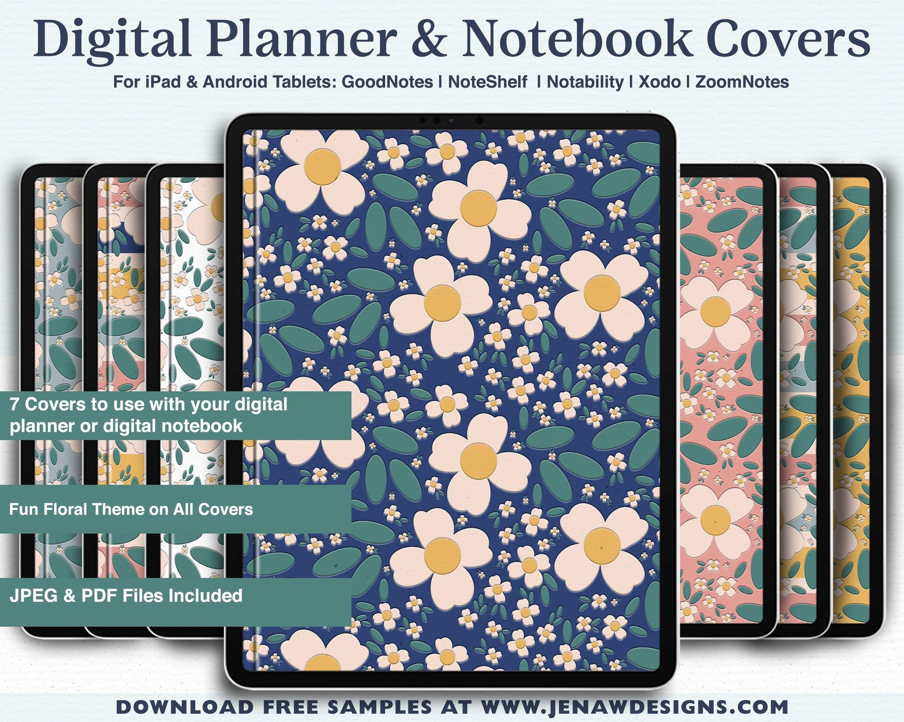
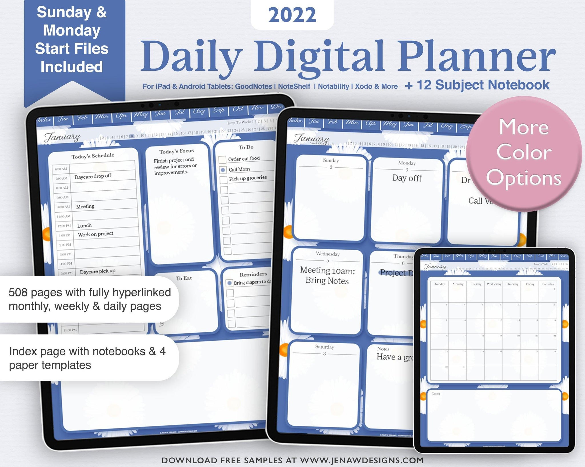
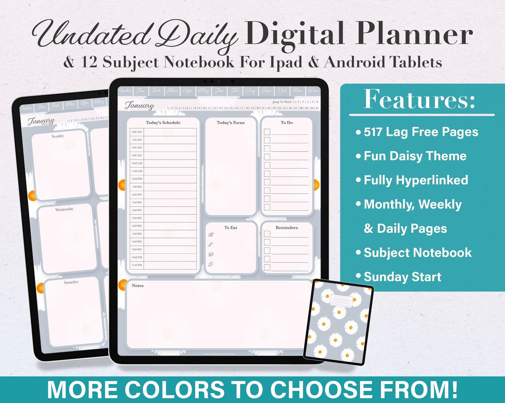

## What's the story behind your shop?

I discovered digital planning right before becoming a stay at home mom. I have a background in graphic design and decided to try creating my own planner as a nap time project. I haven’t stopped since!

## Where can we find your shop?

[Etsy Shop](https://www.etsy.com/shop/DesignsbyJenaW)

[Website](http://www.jenawdesigns.com)

## What kind of items do you sell in your shop?

Digital, Printable

## What is the inspiration behind your designs?

I love color! I like to use color in a fun way while still maintaining a clean and functional layout.

## What is your best seller?

Currently my 2022 Daily Digital Planner in Rich Boho. My Rainbow notebook is my all time best seller.

## What is your favourite planning/journaling tip?

Planning is a such a personal thing-plan in a way that works for you!

## Do you have a coupon code for our readers to try your product?

Yes! Use code: PLANNER15 for 15% off on both my website & Etsy

## Do you offer freebies for our readers to try?

[Yes! I have free samples of my planners here](https://www.jenawdesigns.com/collections/free-product-samples)

## Find them on social!

[Instagram](https://www.instagram.com/jenawdesigns/)

* * *
